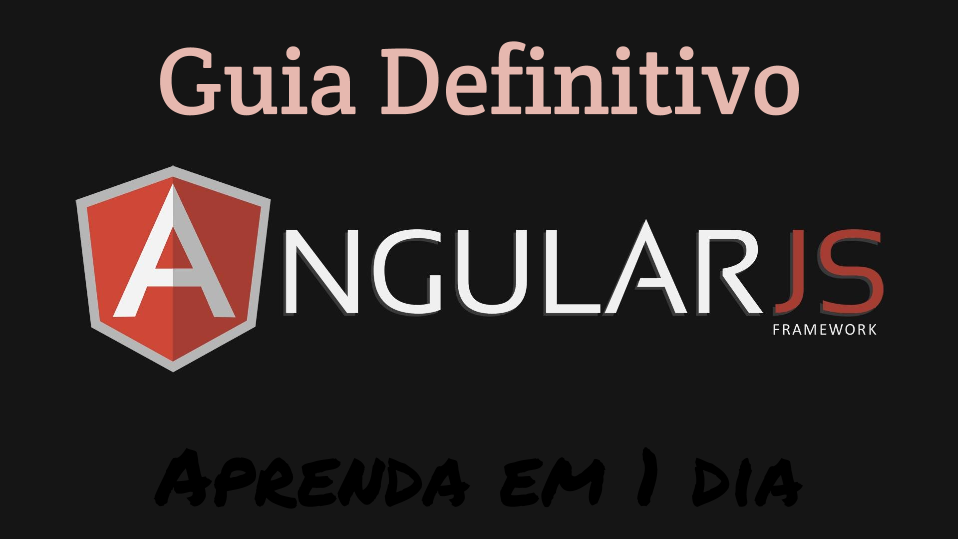

##O que é AngularJS?

Angular é um framework client-side MVC/MVVM feito em JavaScript, essencial para modernas *single page web applications - SPA* (aplicações em uma página) e até mesmo sites. É um grande salto para o futuro do HTML e para o que o HTML5 traz, e é um sopro de ar fresco quando se está lidando com a web moderna. Este post é um curso completo *do início ao fim*, feito a partir de minhas experiências, conselhos e melhores práticas, aprendidas usando-o.

## Terminologia

Angular tem uma curva de aprendizagem de curto prazo, mas devemos nos familiarizar com a terminologia e "pensamento MVC". MVC significa Model-View-Controller (Modelo-Visão-Controlador). 

### MVC

Você provavelmente ouviu sobre MVC, usado em várias linguagens de programação com o sentido de estruturação/arquiteturação de aplicações/softwares. Aqui está o significado de cada uma das partes:


<strong>Model (Modelo):</strong> é a estrutura de dado atrás de uma parte específica da aplicação, usualmente portada em JSON. Leia sobre JSON antes de iniciar com Angular, pois é essencial para a comunicação do seu servidor e 'view'. Por exemplo, um grupo de 'IDs de usuário' pode seguir o seguinte modelo:

```javascript

{
	"users": [{
		"name": "Joe Bloggs",
		"id": "82047392"
	}, {
		"name": "John Doe",
		"id": "65198013"
	}]
}

```

Você vai então pegar esta informação ou do servidor via XHR (XMLHttpRequest), com jQuery você conhece isto como o método `$.ajax` e com os envólucros (wraps) do Angular como `$http`, ou isto vai ser escrito no seu código enquanto a página é parseada (de um banco de dados). Você pode então enviar atualizações para seu modelo e pegá-las de volta.

<strong>View (Visão):</strong> O 'view' é simples, ele é seu HTML e/ou saída renderizada. Usando um framework MVC, você irá pegar os dados do 'Model' que atualiza seu 'View' e mostrar as informações relevantes em seu HTML.

<strong>Controller (Controlador):</strong> Ele faz o que diz na embalagem, controla coisas. Mas que coisas? Dados. 'Controllers' são seu acesso direto do servidor para o 'view', seu intermediário, atualizando os dados em tempo real via comunicadores entre o servidor e o cliente.


<h3>Criação de Um Projeto AngularJS (mínimo essencial)</h3>

Primeiro, nós precisamos de fato configurar o essencial para um projeto Angular. Há certas coisas para se observar antes de começarmos, que geralmente consiste em uma declaração `ng-app` para definir sua aplicação, um *Controller* para conversar com sua 'View', e alguma ligação DOM e inclusão do Angular. Aqui temos o mínimo essencial:

Um pouco de HTML com declarações `ng-*`:

```html

<div ng-app="myApp">
	<div ng-controller="MainCtrl">
		<!-- controlador lógico -->
	</div>
</div>

```

Um módulo Angular e um controlador:

```javascript

var myApp = angular.module('myApp', []);

myApp.controller('MainCtrl', ['$scope', function ($scope) {
	// Controlador mágico 
}]);

```

Antes de aprofundarmos, nós precisamos criar um *módulo Angular* na qual toda nossa lógica será acoplada. Há várias formas de declarar módulos, e você pode encadear toda sua lógica assim (Eu não gosto deste método):

```javascript

angular.module('myApp', [])
.controller('MainCtrl', ['$scope', function ($scope) {...}])
.controller('NavCtrl', ['$scope', function ($scope) {...}])
.controller('UserCtrl', ['$scope', function ($scope) {...}]);

```

Criar um módulo global provou ser a melhor maneira em projetos Angular que eu trabalhei. A falta de ponto e vírgula e o fechamento acidental do encadeamento é notoriamente contraproducente (improdutivo) e frequentemente nos leva a erros de compilação desnecessários. Faça assim:

```javascript

var myApp = angular.module('myApp', []);
myApp.controller('MainCtrl', ['$scope', function ($scope) {...}]);
myApp.controller('NavCtrl', ['$scope', function ($scope) {...}]);
myApp.controller('UserCtrl', ['$scope', function ($scope) {...}]);

```

Para cada novo arquivo que eu criar, eu simplemente pego o namespace e automaticamente estamos conectados com a aplicação. Sim, eu estou criando novos arquivos para cada Controller, Diretiva, *Factory* e tudo mais (você vai me agradecer por isto). Concatene-os e envie o script único no DOM dinamicamente usando algo como Grunt.


<h3>Controladores</h3>

Agora que você compreendeu o conceito do MVC e a configuração básica, vamos verificar a implementação do Angular e como você pode trabalhar com Controladores.

Pegando o exemplo acima, nós podemos fazer um 'baby-step' (passo de bebê) em como inserir alguns dados no DOM a partir de um controlador. O Angular usa um estilo de template com sintaxe <i>{{ handlebars }}</i> para conversar com o seu HTML. O HTML (preferencialmente) não deve conter textos físicos ou códigos pesados, para que se faça o melhor do Angular. Aqui temos um exemplo de inserção de uma simples String no DOM.

```html

<div ng-app="myApp">
	<div ng-controller="MainCtrl">
		{{ text }}
	</div>
</div>

```

```javascript

var myApp = angular.module('myApp', []);

myApp.controller('MainCtrl', ['$scope', function ($scope) {
	$scope.text = 'Olá, fã de Angular =)';
}]);

```

E o resultado ao vivo: [http://jsfiddle.net/toddmotto/mN7QB/light/](http://jsfiddle.net/toddmotto/mN7QB/light/)

A regra chave aqui é o conceito de `$scope`, que você irá ligar com todas as suas funções dentro dos controladores específicos. O `$scope` se refere ao atual elemento/área do DOM (não, não é o mesmo que `this`), e encapsula um escopo inteligente e capaz de manter os dados e a lógica completamente situados dentro dos elementos. Isso traz ao JavaScript escopos públicos/privados para o DOM, o que é fantástico.

O conceito de `$scope` pode ser assustador no começo, mas é a sua conexão com o DOM e com o servidor (e dados estáticos se você também os tiver)! A demonstração lhe deu a ideia básica de como você pode inserir dados no DOM.

Vamos conferir uma estrutura mais representativa em que teremos hipoteticamente dados recuperados do servidor para mostrar detalhes do login de usuários. Por agora vou usar dados estáticos, mais a frente irei lhe mostrar como buscar dados JSON dinâmicos.

Primeiro vamos configurar o JavaScript:

```javascript

var myApp = angular.module('myApp', []);

myApp.controller('UserCtrl', ['$scope', function ($scope) {
	
	//Criando o namespace user details
	//Que nos ajudará no visual do DOM
	$scope.user = {};
	$scope.user.details = {
		"username": "Todd Motto",
		"id": "89101112"
	}; 

}]);

```

Agora portando isso para o DOM para mostrarmos estes dados:

```html

<div ng-app="myApp">
	<div ng-controller="UserCtrl">
		<p class="username">Bem-vindo, {{ user.details.username }}</p>
		<p class="id">ID do usuário: {{ user.details.id }} </p>
	</div>
</div>

```

Resultado: http://jsfiddle.net/eo_op/xJdWk/

É importante lembrar que os Controladores são somente para <i>dados</i>, e funções (funções de evento também) que conversem com o servidor e insiram/busquem dados JSON. Manipulação DOM <strong>não</strong> deve ser feita aqui, então deixe seu kit jQuery de fora. Diretivas são para manipulação do DOM, e será o próximo tópico.

<strong>Dica profissional:</strong> por toda a documentação do Angular (até o momento que escrevo isso), seus exemplos mostram essa forma de se criar Controladores:

```javascript

	var myApp = angular.module('myApp', []);

	function MainCtrl ($scope) {
		//...
	}

```

... NÃO FAÇA ISSO!!! Isto expõem todas as suas funções no escopo global e não as deixam ligadas de uma boa maneira com sua aplicação. Também faz com que você não consiga minificar seu código ou faça testes facilmente. Não polua o namespace global e deixe os controladores DENTRO de sua aplicação.

<h3>Diretivas</h3>

Uma diretiva (confira meu post em [Diretivas a partir de scripts/plugins existentes](http://toddmotto.com/creating-an-angularjs-directive-from-one-of-your-existing-plugins-scripts/)) em sua forma mais simples é um pequeno pedaço de HTML modelado, preferencialemente usado múltiplas vezes durante a aplicação onde é necessária. É uma maneira simples de injetar o DOM na sua aplicação sem nenhum esforço, realizando interações DOM personalizadas. Diretivas, no entanto, não são simples, há uma incrível curva de aprendizado para conquistá-las totalmente, porém a próxima etapa irá deixá-lo pronto para começar.

Então para o quê as diretivas são usadas? Várias coisas. Incluir componentes DOM, por exemplo, abas ou elementos de navegação - realmente depende do uso que sua aplicação faz da interface do usuário (UI - User Interface). Se você já brincou com `ng-show` ou `ng-hide`, elas são diretivas (embora não injetem no DOM).

Para este exercício, irei deixar isso realmente simples e criar um tipo de botão customizado (chamado customButton) que injeta alguma marcação que eu odeio ter que ficar escrevendo. Há várias maneiras de definir Diretivas no DOM, elas podem se parecer com isso:

```html

<!-- 1: como uma declaração de atributo -->
<a custom-button>Click me</a>

<!-- 2: como um elemento personalizado -->
<custom-button>Click me</custom-button>

<!-- 3: como uma classe (usado para compatibilização nos IE antigos) -->
<a class="custom-button">Click me</a>

<!-- 4: como um comentário (não é boa para este exemplo, entretanto) -->
<!-- directive: custom-button -->

```

Eu prefiro usá-las como um atributo, elementos customizados estão vindo no futuro do HTML5 junto com Web Components, mas os relatórios do Angular com eles mostram vários erros em navegadores antigos.

Agora que você sabe como declarar e onde as Diretivas são usadas/injetadas, vamos criar o botão personalizado. Novamente, eu vou ligar o namespace global da minha aplicação como `myApp`, sendo esta a diretiva na sua forma mais simples:

```javascript

myApp.directive('customButton', function () {
	return {
		link: function (scope, element, attrs) {
			// Manipulação e Eventos no DOM aqui!
		}
	};
});

```

Eu defini minha diretiva usando o método `.directive()`, e a chamei 'customButton'. **Quando você capitaliza uma letra no nome da diretiva, ela deve ser separada com hífen no DOM (como mostrado acima)**.

Uma diretiva simplesmente retorna a si mesma como um objeto (Object) e assume um número de parâmetros. O mais importante para mim, de se dominar primeiro é, <i>restrict, replace, transclude, template e templateUrl</i>, e para nós a propriedade <i>link</i>. Vamos adicionar as outras propriedades: 

```javascript

myApp.directive('customButton', function () {
	return {
		restrict: 'A',
		replace: true,
		transclude: true,
		template: '<a href="" class="myawesomebutton" ng-transclude>' + 
					'<i class="icon-ok-sign"></i>' + 
					'</a>',
		link: function (scope, element, attrs) {
			// Manipulação e Eventos DOM aqui!
		}
	};
});

```

<strong>Saída:</strong> http://jsfiddle.net/toddmotto/VC4H2/light/

Inspecione o elemento e veja as marcações adicionais que foram injetadas. Sim, eu sei, não há icone incluso por que eu não inclui o 'Font Awesome', mas você viu como funciona. Agora vamos para as explicações das propriedades das Diretivas:

* **restrict:** isso remonta a utilização. Como iremos restringir o uso dos elementos? Se você estiver usando um projeto que necessite dar suporte ao IE legado, você provavelmente precisará de declarações de atributos/classes. Restringindo com 'A' significa que você restringiu isso como atributo. 'E' para elemento, 'C' para classe e 'M' para comment. Como padrão temos 'EA'. Sim, você pode restringir para múltiplos casos de uso.

* **replace**: Isto substitui a marcação no DOM que define a diretiva, como usado no exemplo, você irá notar como o DOM inicial é substituído com o 'template' (modelo) da Diretiva.

* **transclude**: Simplificando, usando *transclude* você permite que conteúdo existente no DOM seja copiado dentro da diretiva.

* **template**: Um template (como acima) permite que você declare uma marcação a ser injetada. É uma boa ideia usar isto para minúsculo pedaços de HTML somente. Templates injetados são todos compilados pelo Angular, isto significa que você pode declarar as tags de template *handlebars* `{{ }}` dentro deles também para ligação.

* **templateUrl**: Similar ao template, mas mantido em seu próprio arquivo ou tag script. Você pode fazer isso para especificar um modelo de URL, que você vai querer usar para manipular pedaços de HTML que requerem manter-se em seu próprio arquivo, somente especificando o caminho e nome do arquivo, preferencialmente mantidos dentro dos próprios diretórios <i>templates</i>:

```javascript

myApp.directive('customButton', function () {
	return {
		templateUrl: 'templates/customButton.html'
		// coisas da diretiva...
	};
});

```

E dentro do seu arquivo (nome do arquivo não é sensitivo a todos):

```html

<!-- dentro do customButton.html -->
<a href="" class="myawesomebutton" ng-transclude>
	<i class="icon-ok-sign"></i>
</a>

```

O que é realmente bom em se fazer isso, é que o navegador irá efetivamente <i>cachear</i> o arquivo HTML, bravo! A outra alternativa que não utiliza o cache é declarar o template dentro da tag `<script>`:

```html

<script type="text/ng-template" id="customButton.html">
	<a href="" class="myawesomebutton" ng-transclude>
		<i class="icon-ok-sign"></i>
	</a>
</script>

```

Você irá dizer ao Angular que há um `ng-template` e irá dar a ele um ID. O Angular irá então buscar pelo `ng-template` ou o arquivo `.html`. Eu prefiro criar arquivos `.html` por serem fáceis de lidar, melhorarem o desempenho e manter o DOM muito limpo, pois você pode acabar com 1 ou 100 diretivas, e irá querer ser capaz de navegar entre elas facilmente.


<h3>Serviços (Services)</h3> 

Serviços geralmente são um ponto confuso. A partir de experiência e pesquisa, eles nos dão mais um padrão de projeto estilizado do que diferenças com mais funcionalidade. Você deve usar os Services para singletons, e Factories para funções mais complexas como Objetos Literais e casos de uso mais complicados.

Aqui temos um exemplo de Service que multiplica dois números:

```javascript

myApp.service('Math', function () {
	this.multiply = function (x,y) {
		return x * y;
	};
});

```

Você pode então usar um Controlador assim:

```javascript

myApp.controller('MainCtrl', ['$scope', function ($scope) {
	var a = 12;
	var b = 24;

	//saída 288
	var result = Math.multiply(a, b);
}]);

```

Sim, multiplicação é muito fácil e não precisa de um Service, mas você entendeu a essência.

Quando você criar um Service (ou Factory), você vai precisar de usar a injeção de dependência para dizer ao Angular que ele precisa ligar seu novo serviço - caso contrário você terá um erro de complicação e seu Controlador irá quebrar. Você deve ter notado na uma parte <i>function ($scope)</i> dentro da declaração do Controlador agora, e isso é a simples injeção de dependência. Você também irá notar ['$scope'] antes da function ($scope), irei voltar nisso mais tarde. Aqui está como usar injeção de dependência para dizer ao Angular que você precisa do Service:

```javascript

myApp.controller('MainCtrl', ['$scope', 'Math', function ($scope, Math) {
	var a = 12;
	var b = 24;

	// saída 288
	var result = Math.multiply(a, b);
}]);

```

<h3>Factories</h3> 

Vindo dos Services os Factories se tornam mais simples, nós podemos criar Objetos Literais dentro de um Factory ou simplesmente fornecer métodos mais profundos:

```javascript

myApp.factory('Server', ['$http', function($http) {
	return {
		get: function (url) {
			return $http.get(url);
		},
		post: function (url) {
			return $http.post(url);
		}
	};
}]);

```

Aqui eu estou criando um wrapper(empacotador) para XMLHttpRequest(XHR) do Angular. Depois da injeção de dependência dentro do Controlador, o uso é simples:

```javascript

myApp.controller('MainCtrl', ['$scope', 'Server', function ($scope, Server) {
	var jsonGet = 'http://myserver/getURL';
	var jsonPost = 'http://myserver/postURL';
	Server.get(jsonGet);
	Server.post(jsonPost);
}]);

```

Se você quiser consultar o servidor para mudanças, você pode então configurar Server.poll(jsonPoll), ou talvez se você estiver usando um Socket você pode configurar Server.socket(jsonSocket). Isso abrirá portas para você modularizar código assim como criar ferramentas para você usar e manter o código dentro dos Controladores minimamente.

<h3>Filters (Filtros)</h3> 

Filters são usados em conjunto com arrays de dados e também saídas de loops. Se você estiver em um loop de dados e quiser filtrar coisas específicas, você está no lugar certo, você pode também usar os Filters para filtrar o que um usuário escreveu dentro de um input por exemplo. Temos algumas formas de user os Filters, dentro dos Controladores ou como um método definido. Aqui está a utilização por método, que você pode usar globalmente:

```javascript

myApp.filter('reverse', function () {
	return function (input, uppercase) {
		var out = '';
		for (var i = 0; i < input.length; i += 1) {
			out = input.charAt(i) + out;
		}
		if (uppercase) {
			out = out.toUpperCase();
		}
		return out;
	}
});

//Controlador incluso para fornecer dados
myApp.controller('MainCtrl', ['$scope', function ($scope) {
	$scope.greeting = 'Todd Motto';
}]);

```

Uso no DOM:

```html

<div ng-app="myApp">
	<div ng-controller="MainCtrl">
		<p>No filter: {{ greeting }}</p>
		<p>Reverse: {{ greeting | reverse }}</p>
	</div>
</div>

```

Saída: http://jsfiddle.net/toddmotto/pmh4s/light/

Utilizando dentro de um ng-repeat:

```html

<ul>
	<li ng-repeat="number in myNumbers | filter:oddNumbers">{{ number }}</li>
</ul>

```

E aqui temos um exemplo rápido real de um Filter dentro de um Controlador:

```javascript

myApp.controller('MainCtrl', ['$scope', function ($scope) {
	
	$scope.numbers = [10, 25, 35, 45, 60, 80, 100];

	$scope.lowerBound = 42;

	//Fazendo os Filters
	$scope.greaterThanNum = function (item) {
		return item > $scope.lowerBound;
	};

}]);

```

E seu uso dentro de um ng-repeat:

```html

<li ng-repeat="number in numbers | filter:greaterThanNum">
	{{ number }}
</li>

```

Saída: http://jsfiddle.net/toddmotto/cZbCf/light/

Essa é a parte principal atrás do AngularJS e sua API, mas estamos apenas na parte rasa sobre o assunto, porém isso já é mais que suficiente para você começar a construir sua aplicação com Angular.

<h2>Two-way data-binding (Duas vias de ligação de dados)</h2> 

Quando eu ouvi sobre two-way data-binding (duas vias para ligação de dados), eu não entendi realmente o que isso seria. Two-way data-binding é melhor descrita como um ciclo completo de sincronismo de dados: atualiza o Model e atualiza o View, atualiza o View e atualiza o Model. Isso significa que o dado se mantém sincronizado sem precisar de exageros. Se eu ligar um ng-model com um <input> e começar a escrever, isso criará (ou atualizará se já existente) um modelo ao mesmo tempo.

Aqui eu criei um input e o liguei ao modelo chamado 'myModel', assim eu posso então usar a sintaxe de chaves para refletir este modelo e ele será atualizado no View no mesmo momento:

```html

<div ng-app="myApp">
	<div ng-controller="MainCtrl">
		<input type="text" ng-model="myModel" placeholder="Start typing...">
		<p>Meu modelo de dado: {{ myModel }}</p>
	</div>
</div>

```

```javascript

myApp.controller('MainCtrl', ['$scope', function ($scope) {
	//Captura o modelo de dado
	//e/ou inicializa-o com a string existente
	$scope.myModel = '';
}]);

```

Resultado: http://jsfiddle.net/toddmotto/qrr3q/light/


<h2>XHR/Ajax/$http chamadas e ligação JSON</h2>

Você pegou a ideia quando começamos a inserir dados para o $scope, e uma noção superficial de como os Models e two-way data-binding funcionam, então agora é hora de simular alguma chamada XHR real com um servidor. Para websites, isto não é necessário se você tiver uma requisição Ajax específica, isso é principalmente focado em levar dados para uma aplicação web.

Quando você está desenvolvendo localmente, você possivelmente está usando algo como Java, ASP, .NET, PHP ou qualquer outra coisa que rode em um servidor local. Se você estiver se comunicando com um banco de dados local ou realmente usando o servidor como uma API para comunicar-se com outro recurso, usaremos a mesma configuração.

Digite 'dollar http'. Seu melhor amigo a partir de agora. O método $http é um belo wrapper do Angular para acessar dados do servidor, e de tão fácil você pode fazer isso de olhos fechados. Aqui temos um simples exemplo de uma requisição 'GET', que (você adivinhou) pega dados vindos do servidor. Sua sintaxe é muito parecida com jQuery por isso sua transição será bem suave:

```javascript

myApp.controller('MainCtrl', ['$scope', '$http' function ($scope, $http) {
	$http({
		method: 'GET',
		url: '//localhost:9000/someurl'
	});
}]);

```  

O Angular então retorna algo chamado <i>promise</i>, que é uma maneira muito mais eficiente e legível de manusear os callbacks. Promises são encadeados nas funções em que são iniciados a partir da notação por ponto <i>myPromise().</i> Como experado, nós recebemos respostas de erro ou sucesso.

```javascript

myApp.controller('MainCtrl', ['$scope', '$http', function ($scope, $http) {
	$http ({
		method: 'GET',
		url: '//localhost:9000/someUrl'
	})
	.success (function (data, status, headers, config) {
		//recuperação de dados bem sucedida
	})
	.error (function (data, status, headers, config) {
		//alguma erro ocorreu :(
	});
}]);

```

Muito bom e legível. Aqui é onde nós fundimos a View com o servidor pela ligação a um Model ou atualizamos os dados do Model no DOM. Vamos assumir uma configuração e enviar um username ao DOM, via uma chamada Ajax.

Idealmente, nós devemos configurar primeiro um modelo para nosso JSON, que será transportado quando nós ligarmos nossos dados. Vamos deixá-lo simples, isso será como um 'cara do back-end' irá configurar como uma API irá alimentar sua aplicação, sendo por você esperado o seguinte:

```javascript

{
	"user": {
		"name": "Todd Motto",
		"id": "80138731"
	}
}

```  

Isso significa que iremos receber um Objeto retornado do servidor (com um apelido que chamaremos 'dado' [você verá que o dado é passado dentro dos nossos manuseadores promise]), e temos que entrar em dado.usuarioPropriedade. Dentro de dado.usuarioPropriedade, nós temos name e id. Acessá-los é fácil, nós precisamos de procurar por <i>data.user.name</i> que nós retornará 'Todd Motto'. Agora vamos buscar isso!

O JavaScript (cheque as notações para saber o que está acontecendo aqui):

```javascript

myApp.controller ('UserCtrl', ['$scope', '$http', function ($scope, $http) {
		
		//crie um Objeto user
		$scope.user = {};

		//Inicialize um modelo como uma string vazia
		$scope.user.username = '';

		//Nós precisamos fazer uma chamada e um get
		//o nome do usuário
		$http ({
			method: 'GET',
			url: '//localhost:9000/someUrlForGettingUsername'
		})
		.success (function (data, status, headers, config) {
			//Veja aqui, nós estamos agora atribuindo este username
			//ao nosso Model existente!
			$scope.user.username = data.user.name;
		})
		.error (function (data, status, headers, config) {
			// algum erro aconteceu :(
		});
}]);

```

E agora no DOM, nós podemos fazer o seguinte:

```html

<div ng-controller="UserCtrl">
	<p>{{ user.username }}</p>
</div>

```

Isso irá imprimir o username. Agora nós vamos ir além para entender "declarative data-binding" (ligação de dados declarativos) que é onde as coisas ficam realmente empolgantes.

<h2>Declarative Data-Binding (Ligação de Dados Declarativos)</h2>

A filosofia do Angular é criar HTML dinâmico que seja rico em funcionalidade e faça muitos trabalhos perfeitamente que você nunca experaria no lado do cliente da web. Isto é exatamente o que eles entregam.

Vamos imaginar que nós fizemos uma requisição Ajax para pegar uma lista de emails e sua linha Assunto, dados foram enviados e nós queremos renderizá-los no DOM. Ai é onde os queixos caem diante o poder do Angular. Primeiro nós vamos precisar de configurar um Controlador para Emails:

```javascript

myApp.controller ('EmailCtrl', ['$scope', function ($scope) {
	
	// crie um Objeto emails
	$scope.emails = {};

	// simulando dados que nós iremos receber de volta do servidor
	// este é um ARRAY de OBJETOS
	$scope.emails.messages = [{
		"from": "Steve Jobs",
		"subject": "I think I'm holding my phone wrong :/",
		"sent": "2013-10-01T08:05:59Z"
	},{
		"from": "Ellie Goulding",
        "subject": "I've got Starry Eyes, lulz",
        "sent": "2013-09-21T19:45:00Z"
    },{
        "from": "Michael Stipe",
        "subject": "Everybody hurts, sometimes.",
        "sent": "2013-09-12T11:38:30Z"
    },{
        "from": "Jeremy Clarkson",
        "subject": "Think I've found the best car... In the world",
        "sent": "2013-09-03T13:15:11Z"
	}];
}]);

```

Agora precisamos conectar isso dentro do nosso HTML. Aqui é onde nós vamos usar as ligações declarativas (declarative binding) para declarar o que a aplicação irá fazer para criar nosso primeiro pedaço de HTML dinâmico. Vamos usar a diretiva do Angular <i>ng-repeat</i> embutida, que vai iterar sobre os dados e renderizar uma saída sem absolutamente nenhum callback ou mudança de estado, é tudo de graça:

```html

<ul>
	<li ng-repeat="message in emails.messages">
		<p>From: {{ message.from }}</p>
		<p>Subject: {{ message.subject }}</p>
		<p>{{ message.sent | date:'MMM d, y h:mm:ss a' }}</p>
	</li>
</ul>

```

Resultado: http://jsfiddle.net/toddmotto/TAVQc/light/

Eu também coloquei sorrateiramente um <i>filtro de dados (data filter)</i> para você poder ver como renderizar datas no padrão UTC.

Aprofunde na suite de diretivas ng-* do Angular para liberar todo o poder das ligações declarativas, pois lhe mostra como juntar os pontos do servidor do Model ao View e renderizar dados.

<h2>Funções de Escopo</h2>

Como continuação das ligações declarativas, funções de escopo são o próximo nível na criação de uma aplicação com alguma funcionalidade. Aqui temos uma função básica de deletar um de nossos dados no email:

```javascript

myApp.controller ('MainCtrl', ['$scope', function ($scope) {
	$scope.deleteEmail = function (index) {
		$scope.emails.messages.splice (index, 1)
	};
}]);

```

<strong>Dica profissional:</strong>É importante pensar sobre deletar dados do Model. Você não está deletando elementos ou outra coisa real relacionada ao DOM, Angular é um framework MVC e vai manusear tudo isto para você com sua "two-way binding" (ligação de duas vias) e o mundo livre de callback, você somente precisa configurar seu código de forma inteligente para deixá-lo responder aos seus dados.

Ligar funções ao escopo também ocorre através das Diretivas ng-*, agora usaremos a Diretiva ng-click:

```html

<a ng-click="deleteEmail($index)">Delete Email</a>

```

Esta é uma forma diferente para os manipuladores de click inline, por várias razões. Esse assunto será abordado em breve. Você vai ver que eu também estou passando o $index, e o Angular reconhece o item que você quer deletar (quanto código e quanta lógica salvas pra você!).

Resultado (delete alguns emails!): http://jsfiddle.net/toddmotto/BgZmt/light/

<h2>Métodos DOM Declarativos</h2>   

Agora nós vamos entrar nos métodos DOM, eles são Diretivas e simulam funcionalidades no DOM que você tem normalmente que escrever mais códigos e lógicas para tal. Um grande exemplo disto pode ser um simples navegador que alterna (toggle). Usando ng-show e um simples ng-click configurados, nós podemos criar um perfeito "toggling nav":

```html

<a href="" ng-click="toggle = !toggle">Toggle Nav</a>
<ul ng-show="toggle">
	<li>Link 1</li>
	<li>Link 2</li>
	<li>Link 3</li>
</ul>

```

Aqui é onde entramos com MVVM, você irá notar que não um Controlador sendo introduzido aqui, nós entraremos nesta questão do MVVM em breve.

Resultado (vamos alternar!): http://jsfiddle.net/toddmotto/ZUyW5/light/

<h2>Expressões</h2>

Uma das minhas partes favoritas do Angular, a qual você usualmente usa JavaScript para fazer e escreve muito código repetitivo.

Você já fez isso?

```javascript

elem.onclick = function (data) {
	if (data.length === 0) {
		otherElem.innerHTML =  "Sem dados";
	} else {
		otherElem.innerHTML = "Meus dados";
	}
};

```

Isso pode ser potencialmente um callback vindo de uma requisição GET, e você vai alterar o DOM baseado no estado do dado. Angular lhe dá isso gratuitamente também, e você será capaz de fazer isto inline sem escrever qualquer código JavaScript!

```html

<p>{{ data.length > 0 && 'Meus dados' || 'Sem dados' }}</p>

```

Isto irá atualizar a si mesmo dinamicamente sem callbacks como suas aplicações com polls/fetches de dados. Se não tiver dados, ele lhe dirá - se tiver dados, também. Temos muitos casos de uso para isso e o Angular manuseia todos automaticamente via 'two-way binding' (ligação de duas vias) magicamente.   

Resultado : http://jsfiddle.net/eo_op/yPcwt/5/

<h2>Exibições Dinâmicas e Roteamento</h2>

A filosofia por trás das aplicações single-page (e também websites!). Você tem um header (cabeçalho), footer (rodapé), sidebar (barra lateral) e o conteúdo no meio magicamente injeta um novo conteúdo baseado na sua URL.

O Angular torna esta configuração leve de ser feita, o que chamamos de <i>exibições dinâmicas</i>. Exibições dinâmicas injetam Views específicas baseado no URL, através do $routeProvider. Uma simples configuração:

```javascript

myApp.config (['$routeProvider', function ($routeProvider) {
	
	/**
	* $routeProvider
	*/

	$routeProvider
	.when ('/', {
		templateUrl: 'views/main.html'
	})
	.otherwise ({
		redirectTo: '/'
	});

}]);

```

Você verá que 'when' (quando) a URL é '/' (i.e. a raiz do site), você irá querer injetar o <i>main.html</i>. É uma boa ideia chamar sua View inicial main.html e não index.html pois você já tem uma página index.html na configuração da sua single page app. Adicionar mais Views baseadas na sua URL é muito simples:

```javascript

myApp.config (['$routeProvider', function ($routeProvider) {

	/*
	* $routeProvider
	*/
	$routeProvider
	.when ('/', {
		templateUrl: 'views/main.html'
	})
	.when ('/emails', {
		templateUrl: 'views/emails.html'
	})
	.otherwise ({
		redirectTo: '/'
	});

}]);

```

Nós podemos então ter emails.html simplesmente carregado com nosso HTML que gerá nossa lista de email. Você cria uma aplicação muito sofisticada com pouco esfoço neste ponto.

Há muito mais sobre o serviço $routeProvider que é muito valioso de se conhecer, mas isto já irá lhe tirar da inércia. Coisas como interceptadores $http que irão disparar eventos quando uma chamada Ajax estiver em andamento, onde podemos mostrar alguns 'spinners' (símbolo de "carregando") enquanto estamos carregando os novos dados.

<h2>Dados Estáticos Globais</h2> 

O GMail manuseia muito destes dados iniciais escrevendo JSON dentro da página (click com o botão direito - Ver Código Fonte). Se você quiser colocar dados instantaneamentes na sua página, isto irá acelerar o tempo de renderizãção e o Angular vai iniciar rapidamente.

Quando desenvolvo nossos aplicativos, as tags Java são colocadas no DOM e quando renderizadas, o dado é mandado para o backend. [Eu tenho experiência zero com Java, então se você for perguntar isso, sim você pode usar qualquer linguagem no seu servidor]. Aqui vamos ver como escrever JSON na sua página e então passar isso para um Controlador para uso de ligação imediata:

```html

<!-- inside index.html (bottom of page ofc) -->
<script>
window.globalData = {};
globalData.emails = <javaTagHereToGenerateMessages>;
</script>

```

Minha suposta tag Java vai então renderizar o dado enquanto a página analisa e o Angular vai renderizar seus emails instantâneamente. Somente alimente seus dados dentro de um Controlador:

```javascript

myApp.controller ('EmailCtrl', ['$scope', function ($scope) {
	
	$scope.emails = {};

	// Atribua os dados iniciais
	$scope.emails.messages = globalData.emails;

}]);

```

<h2>Minificação</h2>

Vou falar um pouco sobre minificação de código Angular. Você provavelmente já experimentou um pocuo até este ponto e talvez passou seu código por um minificador - e talvez encontrou um erro!

Minificar seu código AngularJS é simples, você precisa de especificar seu conteúdo de injeção de dependências em um array antes da função:

```javascript

myApp.controller ('MainCtrl',
['$scope', 'Dependency,' 'Service', 'Factory', 
function ($scope, Dependency, Service, Factory) {
	
	// código

}]);

```

Uma vez minificado:

```javascript

myApp.controller ('MainCtrl', 
['$scope', 'Dependency', 'Service', 'Factory', 
function (a,b,c,d) {
	
	// a = $scope
	// b = Dependency
	// c = Service
	// d = Factory

	// $scope alias usage
	a.someFunction = function () {...};

}]);

```

Somente lembre-se de manter seus injetores na ordem que aparecem, ou provavelmente irá causar uma dor de cabeça para você e sua equipe.

<h2>Diferenças entre MVC e MVVM</h2>

Estamos fechando o gigantesco artigo sobre AngularJS, e vou sucintamente cobrir as diferenças do MVC/MVVM que o Angular se orgular:

MVC: fala com o Controlador, Mode-View-Controller

MVVM: encapsula ligações de dados declarativas que tecnicamente conversam entre si. Model-View-View-Model. O Modelo conversa com o View, e o View pode falar com o Model. A 'two way data-binding' do Angular permite que você os mantenha sincronizados sem que você precise fazer nada. Isto também lhe permite escrever lógica sem um Controlador!

Um rápido exemplo disto, você pode criar um ng-repeat sem um Controlador fornecendo dados:

```html

<li ng-repeat="number in [1,2,3,4,5,6,7,8,9]">
	{{ number }}
</li>

```

Para um teste rápido tudo bem, porém eu sempre recomendo um Controlador quando as coisas se esclarecerem.

Resultado: http://jsfiddle.net/toddmotto/C9GHF/light/


<h2>HTML Web Components</h2>

Você vai provalmente ser apanhado nessa questão, mas o AngularJS permite que você crie elementos customizados:

```html

<myCustomElement></myCustomElement>

``` 

Isso realmente leva a web para o futuro do HTML5. O HTML5 introduziu os Web Components e o elemento <template>, que o Angular usa hoje em dia. Web Components compreendem elementos customizáveis completamente com injeção dinâmica de JavaScript para população do View e isto é incrivelmente empolgante.

<h2>Comentários de Escopo</h2>

Eu penso que estes comentários são realmente uma bela adição ao nosso fluxo de trabalho, em vez de declarar pedaços de HTML com comentários deste tipo:

```html

<!-- header -->

<header>
	Stuff
</header>

<!-- /header -->

```

Quando introduzimos o Angular, comece a pensar sobre Views e Escopos, não o DOM! Escopos são de fato fechados, ou seja, a menos que você deliberadamente compartilhe os dados entre os controladores, seu dado está inacessível em outros lugares. Eu estabeleço minhas áreas de escopo e isso vem a ser uma real ajuda.

```html

<!-- scope: MainCtrl -->
<div class="content" ng-controller="MainCtrl">

</div>
<!-- /scope: MainCtrl -->

```

<h2>Debugando o AngularJS</h2>

Temos uma incrível extensão no Chrome que os garotos da Google recomendam para desenvolvimento e debugging (depuração) com o Angular, é chamada de Batarang e você pode pegá-la [aqui](https://chrome.google.com/webstore/detail/angularjs-batarang/ighdmehidhipcmcojjgiloacoafjmpfk). 

Code feliz =)

<h2>Leitura Adicional</h2>

Aprenda Como criar sua [própria Diretiva](http://toddmotto.com/creating-an-angularjs-directive-from-one-of-your-existing-plugins-scripts) a partir de um script customizado ou plugin.
