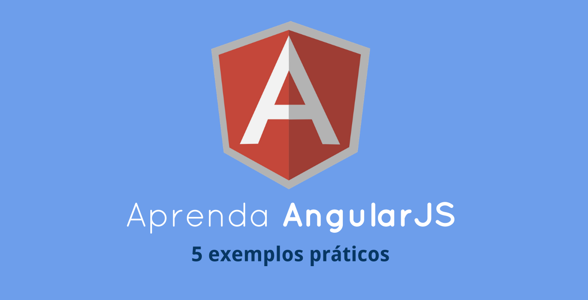

Você provavalemente ouviu sobre [AngularJS](http://angularjs.org/) - o empolgante framework open source desenvolvido pela Google, que muda a maneira que pensamos sobre as aplicações web. Temos muita coisa escrita sobre isso, mas eu ainda não encontrei algo que fosse escrito para desenvolvedores que preferem exemplos rápidos e práticos. Isto muda hoje. Abaixo você irá encontrar o básico da construção de blocos de aplicativos Angular - Models (Modelos), Views (Vistas), Controllers (Controladores), Services (Serviços) e Filters (Filtros) - explicados em 5 exemplos práticos que você pode <strong>editar diretamente no navegador*</strong>. Se você preferir abri-los no seu editor de códigos favorito, pegue o arquivo zip.

<strong>Notas do tradutor:</strong> Caso deseje fazer as alterações no navegador (junto onde se apresenta o artigo), vá para o artigo original. Irei deixar também disponíveis no CodePen os códigos com os comentários traduzidos.

Faça o download do código fonte dos exemplos com os comentários em português [aqui](https://doc-0g-1g-docs.googleusercontent.com/docs/securesc/f8bvcjen03911q1dff7brgoos9hvboh6/0i1jlajnp9aicdcbtk1pj9jqfm7aka3f/1382529600000/18036872927410112600/18036872927410112600/0B-ok-PijFYOPRDA4UXM4eWdmY2s?e=download&h=16653014193614665626&nonce=f19cr1b0jlu9m&user=18036872927410112600&hash=6ddugak9eqqiijugnojj0e7569jp74ef) 

Complementar a este artigo, leia o [Guia Definitivo de como aprender AngularJS](https://github.com/eoop/traduz-ai/blob/master/angularjs/001-guia-definitivo-para-aprender-angularjs.md#guia-definitivo-para-aprender-angularjs-em-um-dia) , pois nele encontramos melhores práticas para o desenvolvimento das aplicações Angular. Se você iniciar por este tutorial mais direto, recomendo que você o veja e depois refaça todos os exemplos embasados nas melhores práticas mostradas no Guia Definitivo. Ex: criar um namespace para aplicação, evitando as variáveis globais. 

<strong>Link para arquivo zip:</strong> [link](http://demo.tutorialzine.com/2013/08/learn-angularjs-5-examples/angularjs-examples.zip)

<h2>O que é AngularJS?</h2>

De forma básica, AngularJS é um framework que liga seu HTML (views) com objetos JavaScript (models). Quando seus modelos mudam, a página é atualizada automaticamente. O contrário também é válido - um modelo, associado com um campo de texto, é atualizado quando o conteúdo do campo é alterado. O Angular manuseia toda essa 'cola' do código, então você não precisa atualizar manualmente o HTML ou escutadores (listeners) para os eventos, como você faz com jQuery. Como aliás, nenhum destes exemplos incluem jQuery!

Para usar o AngularJS, você tem que incluí-lo na sua página antes do fechamento da tag body. [Google's CDN](https://developers.google.com/speed/libraries/devguide#angularjs) é recomendado para um carregamento mais rápido:


```html

<script src="https://ajax.googleapis.com/ajax/libs/angularjs/1.0.7/angular.min.js"></script>

```

O AngularJS lhe dá um grande número de [Diretivas](http://docs.angularjs.org/guide/directive) que permitem a associação de elementos HTML com os Modelos. Elas são atributos que iniciam com <strong>ng-</strong> e podem ser adicionadas a qualquer elemento. O mais importante atributo que você deve incluir em qualquer página, se você for usar o Angular, é o <strong>ng-app</strong>:

```html

<body ng-app>

```

Isso pode ser adicionado a um elemento que engloba o resto da página, como o elemento body ou uma div externa. O Angular olha para ele quando a página é carregada e automaticamente analisa todas as Diretivas que enxerga nos elementos filhos.

Chega de teoria! Agora vamos ver algum código.

<h2>Menu de Navegação</h2>

Para o primeiro exemplo, nós vamos construir um menu de navegação que destaca a entrada selecionada. O exemplo usa somente Diretivas do Angular, e é a mais simples aplicação possível de uso do framework. Click em no botão "Edit" para ver o código fonte. Ele está pronto para experimentação! 

* para testar no browser, vá para o artigo original *

* Link para codepen com comentários traduzidos > [aqui](http://codepen.io/eoop/pen/FJeLu)

No código acima, nós estamos usando as Diretivas Angular para definir e ler a variável <strong>ativa</strong>. Quando isso muda, causa no HTML uma atualização automática. Na terminologia Angular, esta variável é chamada um modelo. Está disponível para todas as diretivas no escopo atual, e pode ser acessada nos seus controladores (mais sobre estes no próximo exemplo).

Se você já utilizou templates JavaScript antes, você é familiar com a sintaxe {{var}}. Quando o framework vê esta string, ele a substitui com o conteúdo da variável. Essa operação é repetida toda hora que a variável for modificada.

<h2>Editor Inline</h2>

Para nosso segundo exemplo, nós vamos criar um simples editor inline - clicando no parágrafo vamos mostrar um tooltip (dica) com um campo de texto. Nós vamos usar um controlador que vai inicializar os modelos e declarar 2 métodos para alternar a visibilidade do tooltip. Controladores são funções regulares do JavaScript que são executadas automaticamente pelo Angular, e que são associadas com sua página usando a diretiva `ng-controller`:

* para testar no browser, vá para o artigo original *

* Link para codepen com comentários traduzidos > [aqui](http://codepen.io/eoop/pen/hbLKi) 

Quando a função controladora é executada, ela pega o objeto especial $scope como um parâmetro, adicionando propriedades ou funções para torná-los disponíveis para o View. Usando o ng-model ligado no campo de texto, faz com que o Angular atualize esta variável quando o valor do campo muda (fazendo com que re-renderizemos o parágrafo com o valor).

<h2>3. Formulário de Pedido</h2>

Neste exemplo, nós vamos criar um formulário com um preço total atualizado em tempo real, usando outra das úteis propriedades do Angular - os [Filtros](http://docs.angularjs.org/guide/dev_guide.templates.filters). Filtros permitem que você modifique os modelos e possa os encadear juntos usando o caracter barra vertical `|`. No exemplo ebaixo, eu estou usando o [currency filter](http://docs.angularjs.org/api/ng.filter:currency), para tornar um número em um preço corretamente formatado, completo com um símbolo dólar e centavos. Você pode facilmente criar seus próprios filtros, como você verá no exemplo #4.

* para testar no browser, vá para o artigo original *

* Link para codepen com comentários traduzidos > [aqui](http://codepen.io/eoop/pen/Jnbjf) 

A ligação [`ng-repeat`](docs http://docs.angularjs.org/api/ng.directive:ngRepeat) é outra propriedade útil do framework. Ela permite que você faça um loop em um array de item e gere um marcador para eles. Quando um item é deletado, isso é atualizado de forma inteligente.

<strong>Nota:</strong> Para uma versão completa, veja este tutorial http://tutorialzine.com/2013/05/quick-tip-convert-backbone-to-angularjs/, que foi baseado neste [outro](http://tutorialzine.com/2013/04/services-chooser-backbone-js/), escrito com Backbone.js. 

<h2>4. Busca Instantânea</h2>

Este exemplo vai permitir aos usuários filtrarem uma lista de itens digitando dentro de um campo de texto. Este é um outro ponto onde o Angular brilha, e é um perfeito caso de uso para escrever um filtro customizado. Para fazer isso entretanto, nós primeiro temos que transformar nossa aplicação em um módulo.

Módulos são uma forma de se organizar aplicações JavaScript dentro de componentes auto-suficientes que podem ser combinados de formas novas e interessantes. O Angular depende desta técnica para o isolamento do código e requer que sua aplicação siga isso antes de criar um filtro. Há apenas duas coisas que você precisa fazer para tornar sua aplicação um módulo:

1. Usar a função `angular.module("name", [])` chamada em seu JS. Isso irá instanciar e retornar um novo módulo;

2. Passar o nome do módulo como valor da diretiva `ng-app`.

Criando um filtro que é tão simples com chamar o método `filter()` no objeto retornado pelo módulo `angular.module ("name", [])`

* Para testar no browser, vá para o artigo original *

* Link para codepen com comentários traduzidos > [aqui](http://codepen.io/eoop/pen/sBkte) 

Filtros seguem a filosofia do AngularJS - cada pedaço de código que você escreve deve ser auto-suficiente, testável e reutilizável. Você pode usar este filtro em todas as suas Views e até mesmo combiná-lo com outros através do encadeamento.

<h2>5. Grade Alternável</h2>

Outra interação UI (user interface) popular é mudar entre modelos diferentes de layout (grid ou lista) *grid = grade* com o click de um botão. Isto é muito fácil de se fazer no Angular. Em adição, eu vou introduzir outro importante conceito - <strong>Services</strong>. Eles são objetos que podem ser usados em sua aplicação para se comunicar com o servidor, uma API ou outra fonte de dados. No nosso caso, nós vamos escrever um serviço que comunica com [API do Instagram](http://instagram.com/developer/) e retorna um array com as mais populares fotos do momento.

Note que para este código funcionar, teremos que incluir um arquivo adicional Angular.js na página:

```html

<script src="http://ajax.googleapis.com/ajax/libs/angularjs/1.0.7/angular-resource.min.js"></script>

```

Isso inclui o módulo ngResource http://docs.angularjs.org/api/ngResource.$resource para um simples trabalho com API's AJAX (o módulo é exposto como a variável $resource no código). Este arquivo é automaticamente incluso no editor abaixo.

* para testar no browser, vá para o artigo original *

* Link para codepen com comentários traduzidos > [aqui](http://codepen.io/eoop/pen/aJmvg) 

Services são totalmente auto-suficientes, tornando possível escrever diferentes implementações sem que isso afete o resto do seu código. Por exemplo, durante o teste, você pode preferir retornar um array hard-coded (com código inserido diretamente no seu programa) para acelerar seus testes.

<h2>Leitura Adicional</h2> 

Se você tiver alcançado este ponto, você já compreendeu o básico do desenvolvimento com AngularJS. Entretanto, há muito mais a se aprender se você quiser se tornar um profissional. Aqui temos uma lista de recursos que vão ajudá-lo nesta questão:

<ul>
	<li>[AngularJS Home Page](http://angularjs.org/) </li>
	<li>[AngularJS Guide](http://docs.angularjs.org/guide/overview) </li>
	<li>[Tutorial Oficial do AngularJS](http://docs.angularjs.org/tutorial)</li>
	<li>[Lista de muitos e muitos recursos, vídeos e tutoriais](https://github.com/jmcunningham/AngularJS-Learning)</li>
</ul>


