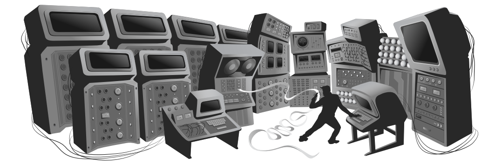

# Introdução

Esse livro é sobre como fazer com que os computadores façam exatamente o que você quer que eles façam. Hoje em dia, os computadores são tão comuns quanto as chaves de fenda, mas possuem uma complexidade escondida que os torna mais difíceis de se operar e entender. Para muitos, eles continuam sendo não muito familiares e ameaçadores.



Nós encontramos duas maneiras efetivas para aproximar o espaço vazio que existe na comunicação entre nós, organismos biológicos com um talento para o raciocínio espacial e social, e os computadores, que não possuem sentimentos e são apenas manipuladores de dados. A primeira delas, é baseada em usar nosso senso do mundo físico e construir interfaces que simulam esse mundo, permitindo manipular estruturas na tela com os nossos dedos. Isso funciona muito bem para interações casuais com a máquina.

Entretanto, ainda não encontramos uma maneira boa de usar a abordagem de apontar e clicar para comunicar ao computador as coisas que o designer da interface não previu. Para interfaces mais gerais, como instruir o computador a executar tarefas arbitrárias, tivemos mais sorte com uma abordagem que utiliza nosso talento para linguagem: ensinar uma linguagem à maquina.

As linguagens humanas possibilitam que palavras e frases sejam combinadas de diferentes maneiras, nos permitindo falar diferentes coisas. As linguagens de computador, normalmente menos flexíveis em sua gramática, seguem um princípio similar.

O uso da computação casual se tornou cada vez mais popular nos últimos vinte anos e as interfaces baseadas em linguagens, que era a forma na qual as pessoas interagiam com os computares, foram amplamente substituídas por interfaces gráficas. Mesmo assim, elas continuam por aí, basta saber onde procurá-las. Uma linguagem específica chamada JavaScript está presente em praticamente todos os navegadores e, por isso, está disponível em quase todos os aparelhos.

Esse livro tem o objetivo de familiarizá-lo o suficiente com essa linguagem para que você seja capaz de fazer com que o computador faça o que você quiser.

## Sobre Programação

> Eu não esclareço aqueles que não têm vontade de aprender, nem desperto aqueles que não estão ansiosos para dar uma explicação a si mesmos. Se eu mostrei um lado de um quadrado e eles não conseguem chegar nos outros três, eu não deveria passar pelos mesmos pontos novamente.
>
> — Confúcio

Antes de explicar o JavaScript, irei introduzir também os princípios básicos de programação. Programação é de fato difícil. As regras fundamentais são geralmente simples e claras. Entretanto, programas construídos em cima dessas regras tendem a se tornar complexos, introduzindo suas próprias regras e complexidades adicionais. De certa forma, você estará construindo o seu próprio labirinto e, talvez, possa acabar se perdendo nele.

Haverá momentos de frustração quando estiver lendo esse livro e, se você é novo em programação, haverá uma grande quantidade de material para ser digerido. Durante a leitura, muitos desses conceitos serão _combinados_ de várias formas, forçando-o a fazer novas conexões.

Fica a seu critério saber qual o nível de esforço necessário. Quando estiver passando por dificuldades para acompanhar o livro, não tire conclusões imediatas sobre sua própria capacidade. Você estará bem, apenas não desista. Tire um tempo de descanso, releia algum material anterior e _sempre_ certifique-se de que leu e entendeu os programas apresentados nos exemplos e nos exercícios. Aprender é um trabalho árduo, mas tudo o que for aprendido será completamente seu e ajudará com que o aprendizado posterior seja ainda mais fácil.

> O programador é um criador de universos nos quais ele é o único responsável. Universos com complexidades totalmente ilimitadas podem ser criados na forma de programas de computador.
>
> — Joseph Weizenbaum, Computer Power and Human Reason

Um programa pode ser considerado muitas coisas. Ele é um pedaço de texto digitado por um programador, a força que direciona o computador a fazer o que ele faz e, também, os dados contidos na memória do computador, controlando as ações executadas nessa mesma memória. Analogias que tentam comparar programas aos objetos que conhecemos, normalmente tendem a ser insuficientes. Uma dessas comparações superficiais é com uma máquina, com várias partes separadas que normalmente estão relacionadas e, para fazer com que a máquina toda funcione, precisamos considerar a maneira nas quais essas partes estão conectadas e como cada uma contribui para a operação da máquina como um todo.

Um computador é uma máquina construída para atuar como um hospedeiro para essas máquinas imateriais. Os computadores por si sós, conseguem apenas fazer coisas fáceis e pouco complicadas. A razão deles serem tão úteis, é que eles conseguem executar essas coisas em uma velocidade incrivelmente rápida. Um programa pode combinar uma grande quantidade dessas coisas simples a fim de executar coisas mais complicadas.

Para alguns de nós, escrever programas de computador é um fascinante jogo. Um programa é uma construção do pensamento. Não possui custos de construção, é leve e cresce facilmente com a digitação feita por nossas mãos.

Entretanto, se não formos cuidadosos, o tamanho e a complexidade de um programa pode crescer e ficar fora de controle, confundindo, até mesmo, a pessoa que o criou. Manter os programas sob controle é o maior desafio da programação. Quando um programa funciona, é lindo. A arte de programar é, basicamente, a habilidade de controlar a complexidade. Um ótimo programa é suave e simples em sua própria complexidade.

Muitos programadores acreditam que essa complexidade é melhor gerenciada usando, em seus programas, apenas um pequeno conjunto de técnicas bem entendidas. Eles criaram uma série de regras rígidas ("boas práticas") recomendando a forma que os programas deveriam ter. Os mais zelosos entre eles, vão considerar como _maus programadores_ aqueles que saem dessa pequena zona de segurança.

Quanta hostilidade em relação à riqueza da programação, tentar reduzi-la a algo simples e previsível, colocando um tabu em todos os estranhos e bonitos programas. A dimensão das técnicas de programação é enorme e fascinante em sua diversidade e, ainda assim, amplamente inexplorada. É certamente muito perigoso atrair programadores inexperientes nesses tipos de confusões, entretanto, você deve seguir com cautela e manter o seu senso comum em relação a elas. Conforme você aprende, sempre haverá novos territórios e desafios a serem explorados. Programadores que se recusam a continuar explorando irão estagnar, esquecer da alegria que é programar e acabarão ficando entediados com as coisas que constroem.

## Porque linguagens importam?

No início, quando a computação nasceu, não haviam linguagens de programação. Os programas eram parecidos com algo assim:

```
00110001 00000000 00000000
00110001 00000001 00000001
00110011 00000001 00000010
01010001 00001011 00000010
00100010 00000010 00001000
01000011 00000001 00000000
01000001 00000001 00000001
00010000 00000010 00000000
01100010 00000000 00000000
```

Esse é um programa que soma os números de 1 a 10 e imprime o resultado: `1 + 2 + … + 10 = 55`. Ele poderia ser executado em qualquer máquina simples. Para programar os computadores antigos, era necessário configurar longos conjuntos de chaves na posição correta ou, então, fazer perfurações em cartões que eram usados para alimentar o computador. Você provavelmente deve estar imaginando como tedioso e propenso a erros esse procedimento era. Até para escrever programas simples precisava de muita habilidade e disciplina. Os programas mais complexos eram praticamente inimagináveis de serem criados.

É claro que inserir esses padrões "arcanos" de bits (zeros e uns) dava ao programador a profunda sensação de ser um poderoso mago, e isso devia significar alguma coisa em relação ao sentimento de satisfação em seu trabalho.

Cada linha do programa anterior contém uma única instrução e poderia ser escrito assim:

```
1. Armazene o número 0 na posição de memória 0.
2. Armazene o número 1 na posição de memória 1.
3. Armazene o valor contido na posição de memória 1 na posição de memória 2.
4. Subtraia o número 11 do valor contido na posição de memória 2.
5. Se o valor contido na posição de memória 2 for o número zero, continue com a instrução número 9.
6. Adicione o valor contido na posição de memória 1 na posição de memória 0.
7. Adicione o número 1 ao valor contido na posição de memória 1.
8. Continue com a instrução número 3.
9. Imprima o valor contido na posição de memória 0.
```

Embora isso seja mais legível do que aquela sopa de bits, ainda assim continua bastante desagradável. Ajudaria um pouco usar nomes ao invés de números para as instruções e posições de memória.

```
 Coloque 0 em "total".
 Coloque 1 em "count".
[loop]
 Coloque "compare” em "count".
 Subtraia 11 de "compare".
 Se "compare” for zero, continue no [fim].
 Adicione "count” em "total".
 Adicione 1 em "count".
 Continue no [loop].
[fim]
 Imprima "total".
```

Você consegue perceber como esse programa funciona? As duas primeiras linhas informam os valores iniciais de duas posições na memória: `total` será usado para construir o resultado do cálculo e `count` manterá a referência ao número que nós atualmente estamos olhando. As linhas que utilizam `compare` são provavelmente as mais estranhas. O programa deseja verificar se `count` é igual a 11 para decidir se precisa parar a sua execução. Devido ao fato de que nossa máquina hipotética é bastante primitiva, ela pode apenas testar se um número é zero e tomar uma decisão baseada nesse fato. Por isso, ela usa o espaço de memória chamado `compare` para calcular o valor de `count - 11` e tomar a decisão baseada no valor desse resultado. As próximas duas linhas adicionam o valor de `count` ao resultado e incrementa uma unidade em `count` toda vez que o programa decide que `count` ainda não é o valor 11.

Aqui temos o mesmo programa em JavaScript:

```js
var total = 0, count = 1;
while (count <= 10) {
  total += count;
  count += 1;
}
console.log(total);
// → 55
```

Essa versão nos dá algumas melhorias. A mais importante delas é o fato de que não é mais necessário especificar a forma que desejamos que o programa salte para o início ou fim. A construção `while` é responsável por cuidar disso, continuando a execução do bloco (envolvido pelas chaves) abaixo dela enquanto a condição de execução que foi informada continua válida. Essa condição é dada por `count <= 10`, que significa "`count` é menor ou igual a 10". Nós não precisamos criar um valor temporário e compará-lo a zero, que era um detalhe não muito interessante. Parte do poder das linguagens de programação é o fato de que elas tomam conta desses detalhes não muito interessantes para nós.

No final do programa, logo depois que a construção `while` finalizou a sua execução, a operação `console.log` é aplicada ao resultado final para que ele seja o nosso dado de saída.

Por fim, aqui está um exemplo de como o programa seria se tivéssemos disponíveis as operações `range` (intervalo) e `sum` (soma), que criariam uma coleção de números em um intervalo definido e calcularia a soma de uma coleção de números respectivamente:

```js
console.log(sum(range(1, 10)));
// → 55
```

A moral de toda essa história é que o mesmo programa pode ser expresso de formas curtas e longas, legíveis ou não. A primeira versão do programa era extremamente complicada e obscura, enquanto que a última versão é praticamente legível usando a linguagem natural: `log` (imprima) a `sum` (soma) de um `range` (intervalo) de números de 1 a 10. Iremos aprender em [capítulos posteriores](./04-estruturas-de-dados.md) como construir operações como `sum` e `range`.

Uma boa linguagem de programação ajuda o programador permitindo-o conversar em alto nível com o computador sobre as ações que ele deve realizar. Ela também ajuda a omitir detalhes não muito interessantes, fornece blocos convenientes usados na construção dos programas (tais como `while` e `console.log`) e permite que você defina seus próprios blocos de construção (tais como `sum` e `range`), fazendo com que esses blocos sejam facilmente agrupados.

## O que é JavaScript?

O JavaScript foi introduzido em 1995 como uma forma de adicionar programas às páginas web do navegador Netscape. A linguagem, desde então, foi adotada por todos os outros grandes navegadores web que possuem interfaces gráficas. Ele tornou as aplicações modernas possíveis, fazendo com que você não tenha que recarregar a página inteira quando for necessário realizar interações diretas com a aplicação. Além disso, ele é usado em páginas web mais tradicionais, fornecendo diferentes maneiras de criar interatividade e inteligência.

É importante observar que o JavaScript não tem praticamente nada a ver com a linguagem de programação Java. O nome parecido foi inspirado por considerações de marketing ao invés do bom senso. Quando o JavaScript foi introduzido, a linguagem Java estava sendo fortemente divulgada e ganhando bastante popularidade. Assim, alguém pensou que poderia ser uma boa ideia tentar aproveitar um pouco desse sucesso. Hoje, estamos presos a esse nome.

Depois que o JavaScript foi adotado fora do Netscape, um documento padrão foi escrito para descrever a maneira na qual a linguagem deveria funcionar, garantindo que as diferentes partes dos softwares que afirmavam suportar JavaScript estavam, de fato, falando sobre a mesma linguagem. Esse documento é chamado de padrão ECMAScript, nomeado pela organização internacional Ecma, que foi responsável pela padronização. Na prática, os termos ECMAScript e JavaScript podem ser usados como sinônimos, pois são dois nomes para a mesma linguagem.

Existem aqueles que irão falar coisas _terríveis_ sobre a linguagem JavaScript. Muitas dessas coisas são verdades. Quando fui obrigado a escrever algo em JavaScript pela primeira vez, rapidamente comecei a odiá-lo, pois a linguagem aceitava praticamente tudo que eu digitava e interpretava de uma forma que era completamente diferente de como eu queria. É evidente que isso estava muito relacionado ao fato de que eu não tinha a mínima ideia do que eu estava fazendo. Porém, existe um grande problema nisso: O JavaScript é ridiculamente liberal em relação ao que ele permite. A ideia por trás desse design era a de que isso deveria fazer com que o JavaScript fosse fácil para iniciantes. Na realidade, isso acaba fazendo com que seja bastante difícil encontrar problemas nos seus programas, pois o sistema não aponta onde eles estão.

Mesmo assim, essa flexibilidade também tem suas vantagens. Ela dá espaço para muitas técnicas que são impossíveis de serem realizadas em linguagens mais rígidas e, como você verá em breve (por exemplo no [Capítulo 10](./10-modulos.md)), ela pode ser usada para superar algumas das limitações do JavaScript. Após aprender corretamente e trabalhar por um tempo com a linguagem, aprendi a realmente _gostar_ do JavaScript.

Existem diversas versões do JavaScript. A versão 3 do ECMAScript era a versão que tinha amplamente mais suporte na época em que o JavaScript estava em ascensão para se tornar dominante, aproximadamente entre os anos 2000 e 2010. Durante esse período, a ambiciosa versão 4 estava sendo desenvolvida, incluindo planos de melhorias radicais e extensões para a linguagem. Porém, mudar de forma radical uma linguagem viva e amplamente usada acabou provando ser politicamente muito difícil e, por isso, a versão 4 foi abandonada em 2008, fazendo com que a versão 5, bem menos ambiciosa, fosse lançada em 2009. Nós estamos, atualmente, em um ponto em que todos os grandes navegadores suportam a versão 5, que será a versão que iremos usar nesse livro. A versão 6 ainda está no processo para ser finalizada, e alguns navegadores já estão suportando algumas de suas novas funcionalidades.

Navegadores web não são as únicas plataformas nas quais o JavaScript é usado. Alguns bancos de dados, como MongoDB e CouchDB, usam o JavaScript como sua linguagem de script e consulta. Muitas plataformas para desktop, tanto quanto as de programação no servidor, sendo o mais notável o projeto Node.js (que é o assunto do [Capítulo 20](./20-nodejs.md)), estão fornecendo um poderoso ambiente para programar JavaScript fora do navegador.

## Código, e o que fazer com ele

Código é o texto que compõe os programas. Muitos capítulos desse livro contêm uma boa quantidade de código. Na minha experiência, ler e escrever código são partes indispensáveis do aprendizado da programação, então, tente não apenas olhar rapidamente os exemplos. Leia-os com atenção e entenda-os. Isso pode ser mais lento e confuso no início, mas prometo que você irá rapidamente pegar o jeito. O mesmo é verdade para os exercícios. Não assuma que você os entendeu até você escrever, de fato, uma solução que funcione.

Eu recomendo que você teste suas soluções dos exercícios em um interpretador JavaScript real. Dessa forma, você receberá _feedback_ imediato sobre o funcionamento, ou não, do que você fez. Além disso, espero que você fique tentado a experimentar coisas novas e ir além dos exercícios.

Quando estiver lendo esse livro no seu navegador, você pode editar e executar todos os programas dos exemplos clicando neles.

Se quiser executar os programas desse livro em um ambiente externo ao ambiente do livro, alguns cuidados devem ser tomados. Muitos exemplos são independentes e funcionam em qualquer ambiente que suporte JavaScript. Entretanto, o código usado nos últimos capítulos são escritos para executar em um ambiente específico (em alguns casos no navegador e em outros Node.js), sendo apenas possível executá-los neles. Além disso, muitos capítulos definem programas grandes, sendo que algumas partes dos códigos que aparecem nesses programas dependem umas das outras ou, então, de arquivos externos. O ambiente de execução do site fornece links para arquivos _Zip_ que contêm todos os scripts e dados necessários para executar o código de um dado capítulo.

## Visão geral desse livro

Esse livro contém três partes. Os primeiros onze capítulos falam sobre a linguagem JavaScript em si. Em seguida, os próximos oito capítulos são relacionados aos navegadores web e como o JavaScript é usado para programar neles. Por fim, os últimos dois capítulos são dedicados ao Node.js, que é outro ambiente no qual é possível programar usando JavaScript.

No decorrer do livro, haverá cinco _projetos_ que descrevem exemplos de programas maiores, dando o gosto da programação real de fato. Iremos trabalhar, em ordem, construindo uma [simulação de vida artificial](./07-pratica-vida-eletronica.md), uma [linguagem de programação](./11-pratica-linguagem-de-programacao.md), uma [plataforma de jogo](./15-projeto-plataforma-de-jogo.md), um [programa de pintura](./19-projeto-um-programa-de-pintura.md) e, por último, um [website dinâmico](./21-projeto-website-de-compartilhamento-de-habilidades.md).

A parte correspondente à linguagem começa com quatro capítulos que introduzem as estruturas básicas do JavaScript. Serão introduzidas estruturas de controle (tais como a palavra `while` que foi mostrada nessa introdução), funções (escrever suas próprias operações) e estrutura de dados. Após isso, você será capaz de escrever programas simples. Em seguida, os capítulos [5](./05-funcoes-de-ordem-superior.md) e [6](./06-a-vida-secreta-dos-objetos.md) irão introduzir técnicas para usar funções e objetos a fim de escrever código mais abstrato e manter a complexidade sob controle.

Após o [primeiro projeto](./07-pratica-vida-eletronica.md), a primeira parte do livro continua com os capítulos sobre [manipulação e conserto de erros](./08-erros-e-manipulacao-de-erros.md), [expressões regulares](./09-expressoes-regulares.md) (uma ferramenta importante para trabalhar com dados de texto) e [modularidade](./10-modulos.md), que é uma outra arma contra a complexidade. O [segundo projeto](./11-pratica-linguagem-de-programacao.md) conclui a primeira parte do livro.

## Convenções Tipográficas

Nesse livro, os textos escritos em fonte `mono-espaçada` representarão elementos de programas. Algumas vezes serão fragmentos autossuficientes e em outras, apenas referências para alguma parte de um programa próximo. Programas (os quais você já viu alguns) são escritos assim:

```js
function fac(n) {
  if (n == 0)
    return 1;
  else
    return fac(n - 1) * n;
}
```

Algumas vezes, para mostrar a saída que um programa produz, o resultado esperado será escrito após o mesmo, com duas barras e uma seta na frente.

```js
console.log(fac(8));
// → 40320
```

Boa Sorte!
