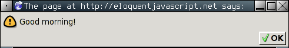
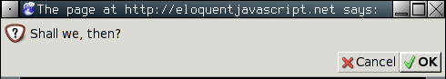
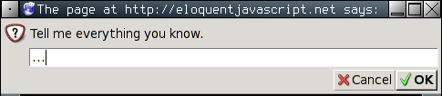
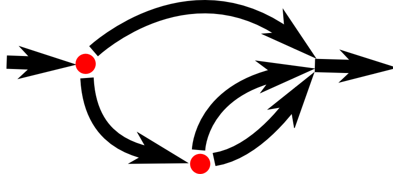

# Estrutura do Programa

> O meu coração vermelho brilha nitidamente sob minha pele e ele têm que administrar 10cc de JavaScript para fazer com que eu volte (Eu respondi bem a toxinas no sangue). Cara, esse negócio vai chutar os pêssegos de direita para fora!

> - _why, Why's (Poignant) Guide to Ruby

Este é o ponto onde nós começamos a fazer coisas que podem realmente ser chamadas de programação. Nós vamos expandir nosso domínio da linguagem JavaScript para além dos substantivos e fragmentos de sentenças que nós vimos anteriormente, para o ponto onde poderemos realmente expressar algo mais significativo.

## Expressões e Afirmações

No [Capítulo 1](./01-valores-tipos-operadores.md) nós criamos alguns valores e então aplicamos operadores para obter novos valores. Criar valores desta forma é uma parte essencial de todo programa JavaScript, mas isso é somente uma parte. Um fragmento de código que produz um valor é chamado de *expressão*. Todo valor que é escrito literalmente (como `22` ou `"psychoanalysis"`) é uma expressão. Uma expressão entre parênteses é também uma expressão, e também um operador binário aplicado a duas expressões, ou um unário aplicado a uma.

Isso mostra parte da beleza da interface baseada na linguagem. Expressões podem ser encadeadas de forma semelhante às subfrases usadas na linguagem humana - uma subfrase pode conter sua própria subfrase, e assim por diante. Isto nos permite combinar expressões para expressar computações complexas arbitrariamente.

Se uma expressão corresponde a um fragmento de sentença, uma *afirmação*, no JavaScript, corresponde a uma frase completa em linguagem humana. Um programa é simplesmente uma lista de afirmações.

O tipo mais simples de afirmação é uma expressão com um ponto e vírgula depois dela. Este é o programa:

```javascript
1;
!false;
```

É um programa inútil, entretanto. Uma expressão pode ser apenas para produzir um valor, que pode então ser usado para fechar a expressão. Uma declaração vale por si só, e só equivale a alguma coisa se ela afeta em algo. Ela pode mostrar algo na tela - que conta como mudar algo - ou pode mudar internamente o estado da máquina de uma forma que vai afetar outras declarações que irão vir. Estas mudanças são chamadas *efeitos colaterais*. As afirmações nos exemplos anteriores somente produzem o valor `1` e `true` e então imediatamente os jogam fora novamente. Não deixam nenhuma impressão no mundo. Quando executamos o programa, nada acontece.

## Ponto e vírgula

Em alguns casos, o JavaScript permite que você omita o ponto e vírgula no fim de uma declaração. Em outros casos ele deve estar lá ou coisas estranhas irão acontecer. As regras para quando ele pode ser seguramente omitido são um pouco complexas e propensas a erro. Neste livro todas as declarações que precisam de ponto e vírgula vão sempre terminar com um. Eu recomendo a você fazer o mesmo em seus programas, ao menos até você aprender mais sobre as sutilezas envolvidas em retirar o ponto e vírgula.

## Variáveis

Como um programa mantém um estado interno? Como ele se lembra das coisas? Nós vimos como produzir novos valores com valores antigos, mas isso não altera os valores antigos, e o valor novo deve ser imediatamente usado ou vai ser dissipado. Para pegar e guardar valores, o JavaScript fornece uma coisa chamada *variável*.

```javascript
var caught = 5 * 5;
```

E isso nos dá um segundo tipo de declaração. A palavra especial (palavra-chave) `var` indica que esta sentença vai definir uma variável. Ela é seguida pelo nome da variável e, se nós quisermos dá-la imediatamente um valor, por um operador `=` e uma expressão.

A declaração anterior criou uma variável chamada `caught` e a usou para armazenar o valor que foi produzido pela multiplicação 5 por 5.

Depois de uma variável ter sido definida, seu nome pode ser usado como uma expressão. O valor da expressão é o valor atual mantido pela variável. Aqui temos um exemplo:

```javascript
var ten = 10;
console.log(ten * ten);
// 100
```

Nomes de variáveis podem ser quase qualquer palavra, menos as reservadas para palavras-chave (como `var`). Não pode haver espaços incluídos. Dígitos numéricos podem também ser parte dos nomes de variáveis - `catch22` é um nome válido, por exemplo - mas um nome não pode iniciar com um dígito numérico. O nome de uma variável não pode incluir pontuação, exceto pelos caracteres `$` e `_`.

Quando uma variável aponta para um valor, isso não significa que estará ligada ao valor para sempre. O operador `=` pode ser usado a qualquer hora em variáveis existentes para desconectá-las de seu valor atual e então apontá-las para um novo:

```javascript
var mood = "light";
console.log(mood);
// light 
mood = "dark";
console.log(mood);
// dark
```

Você deve imaginar variáveis como tentáculos, ao invés de caixas. Elas não *contêm* valores; elas os *agarram* - duas variáveis podem referenciar o mesmo valor. Somente os valores que o programa mantém tem o poder de ser acessado por ele. Quando você precisa se lembrar de algo, você aumenta o tentáculo para segurar ou recoloca um de seus tentáculos existentes para fazer isso.

Quando você define uma variável sem fornecer um valor a ela, o tentáculo fica conceitualmente no ar - ele não tem nada para segurar. Quando você pergunta por um valor em um lugar vazio, você recebe o valor `undefined`.


Um exemplo. Para lembrar da quantidade de dólares que Luigi ainda lhe deve, você cria uma variável. E então quando ele lhe paga 35 dólares, você dá a essa variável um novo valor.

```javascript

var luigisDebt = 140;
luigisDebt = luigisDebt - 35;
console.log(luigisDebt);
// 105

```

## Palavras-chave e Palavras Reservadas

Palavras que tem um significado especial, como `var`, não podem ser usadas como nomes de variáveis. Estas são chamadas *keywords* (palavras-chave). Existe também algumas palavras que são reservadas para uso em futuras versões do JavaScript. Estas também não são oficialmente autorizadas a serem utilizadas como nomes de variáveis, embora alguns ambientes JavaScript as permitam. A lista completa de palavras-chave e palavras reservadas é um pouco longa:

`break` `case` `catch` `continue` `debugger` `default` `delete` `do` `else` `false` `finally` `for` `function` `if` `implements` `in` `instanceof` `interface` `let` `new` `null` `package` `private` `protected` `public` `return` `static` `switch` `throw` `true` `try` `typeof` `var` `void` `while` `with` `yield` `this`

Não se preocupe em memorizá-las, mas lembre-se que este pode ser o problema quando algo não funcionar como o esperado.

## O Ambiente

A coleção de variáveis e seus valores que existem em um determinado tempo é chamado de `environment` (ambiente). Quando um programa inicia, o ambiente não está vazio. Ele irá conter no mínimo o número de variáveis que fazem parte do padrão da linguagem. E na maioria das vezes haverá um conjunto adicional de variáveis que fornecem maneiras de interagir com o sistema envolvido. Por exemplo, em um navegador, existem variáveis que apontam para funcionalidades que permitem a você inspecionar e influenciar no atual carregamento do website, e ler a entrada do mouse e teclado da pessoa que está usando o navegador.

## Funções

Muitos dos valores fornecidos no ambiente padrão são do tipo `function` (função). Uma função é um pedaço de programa envolvido por um valor. Este valor pode ser aplicado a fim de executar o programa envolvido. Por exemplo, no ambiente do navegador, a variável `alert` detém uma função que mostra uma pequena caixa de diálogo com uma mensagem. É usada da seguinte forma:

```javascript
alert("Good morning!");
```



Executar uma função é denominado *invocar*, *chamar* ou *aplicar* uma função. Você pode chamar uma função colocando os parênteses depois da expressão que produz um valor de função. Normalmente você irá usar o nome da variável que contém uma função diretamente. Os valores entre os parênteses são passados ao programa dentro da função. No exemplo, a função `alert` usou a `string` que foi passada como o texto a ser mostrado na caixa de diálogo. Os valores passados para funções são chamados de `arguments` (argumentos). A função `alert` precisa somente de um deles, mas outras funções podem precisar de diferentes quantidades ou tipos de argumentos.

## A Função `console.log`

A função `alert` pode ser útil como saída do dispositivo quando experimentada, mas clicar sempre em todas estas pequenas janelas vai lhe irritar. Nos exemplos passados, nós usamos `console.log` para saída de valores. A maioria dos sistemas JavaScript (incluindo todos os navegadores modernos e o Node.js), fornecem uma função `console.log` que escreve seus argumentos como texto na saída do dispositivo. Nos navegadores, a saída fica no console JavaScript. Esta parte da interface do `browser` fica oculta por padrão, mas muitos browsers abrem quando você pressiona `F12`, ou no Mac, quando você pressiona `Command + option + I`. Se isso não funcionar, busque no menu algum item pelo nome de *web console* ou *developer tools*.

Quando rodarmos os exemplos ou seu próprio código nas páginas deste livro, o `console.log` vai mostrar embaixo o exemplo, ao invés de ser no console JavaScript.

```javascript
var x = 30;
console.log("o valor de x é ", x);
// o valor de x é 30
```

Embora eu tenha afirmado que nomes de variáveis não podem conter pontos, `console.log` claramente contém um ponto. Eu não tinha mentido para você. Esta não é uma simples variável, mas na verdade uma expressão que retorna o campo `log` do valor contido na variável `console`. Nós vamos entender o que isso significa no capítulo 4.

## Retornando Valores

Mostrar uma caixa de diálogo ou escrever texto na tela é um efeito colateral. Muitas funções são úteis por causa dos efeitos que elas produzem. É também possível para uma função produzir um valor, no caso de não ser necessário um efeito colateral. Por exemplo, temos a função `Math.max`, que pega dois números e retorna o maior entre eles:

```javascript
console.log(Math.max(2, 4));
```

Quando uma função produz um valor, é dito que ela _retorna_ (`return`) ele. Em JavaScript, tudo que produz um valor é uma expressão, o que significa que chamadas de função podem ser usadas dentro de expressões maiores. No exemplo abaixo, uma chamada para a função `Math.min`, que é o oposto de `Math.max`, é usada como uma das entradas para o operador de soma:

```javascript
console.log(Math.min(2, 4) + 100);
```

O próximo capítulo explica como nós podemos escrever nossas próprias funções.

## `prompt` e `confirm`

O ambiente fornecido pelos navegadores contém algumas outras funções para mostrar janelas. Você pode perguntar a um usuário uma questão Ok/Cancel usando `confirm`. Isto retorna um valor booleano: `true` se o usuário clica em OK e `false` se o usuário clica em *Cancel*.

```javascript
confirm("Shall we, then?");
```



`prompt` pode ser usado para criar uma questão "aberta". O primeiro argumento é a questão; o segundo é o texto que o usuário inicia. Uma linha do texto pode ser escrita dentro da janela de diálogo, e a função vai retornar isso como uma string.

```javascript
prompt("Tell me everything you know.", "...");
```



Estas duas funções não são muito usadas na programação moderna para web, principalmente porque você não tem controle sobre o modo que a janela vai aparecer, mas elas são úteis para experimentos.

## Fluxo de Controle

Quando seu programa contém mais que uma declaração, as declarações são executadas, previsivelmente, de cima para baixo. Como um exemplo básico, este programa tem duas declarações. A primeira pergunta ao usuário por um número, e a segunda, que é executada posteriormente, mostra o quadrado deste número:

```javascript
var theNumber = Number(prompt("Pick a number", ""));
alert("Your number is the square root of " + theNumber * theNumber);
```

A função `Number` converte o valor para um número. Nós precisamos dessa conversão pois o resultado de `prompt` é um valor do tipo `string`, e nós queremos um número. Existem funções similares chamadas `String` e `Boolean` que convertem valores para estes tipos.

Aqui podemos ver uma representação bem trivial do fluxo de controle em linha reta:


## Execução Condicional

Executar declarações em ordem linear não é a única opção que temos. Uma alternativa é a _execução condicional_, onde escolhemos entre duas rotas diferentes baseado em um valor booleano, como ilustra a seguir:


A execução condicional é escrita, em JavaScript, com a palavra-chave `if`. No caso mais simples, nós queremos que algum código seja executado se, e somente se, uma certa condição existir. No programa anterior, por exemplo, podemos mostrar o quadrado do dado fornecido como entrada apenas se ele for realmente um número.

```js
var theNumber = Number(prompt("Pick a number", ""));
if (!isNaN(theNumber))
  alert("Your number is the square root of " +
        theNumber * theNumber);
```

Com essa modificação, se você fornecer "queijo" como argumento de entrada, nenhuma saída será retornada.

A palavra-chave `if` executa ou não uma declaração baseada no resultado de uma expressão Booleana. Tal expressão é escrita entre parênteses logo após a palavra-chave e seguida por uma declaração a ser executada.

A função `isNaN` é uma função padrão do JavaScript que retorna `true` apenas se o argumento fornecido for `NaN`. A função `Number` retorna `NaN` quando você fornece a ela uma string que não representa um número válido. Por isso, a condição se traduz a "a não ser que `theNumber` não seja um número, faça isso".

Você frequentemente não terá código que executa apenas quando uma condição for verdadeira, mas também código que lida com o outro caso. Esse caminho alternativo é representado pela segunda seta no diagrama. A palavra-chave `else` pode ser usada, juntamente com `if`, para criar dois caminhos distintos de execução.

```js
var theNumber = Number(prompt("Pick a number", ""));
if (!isNaN(theNumber))
  alert("Your number is the square root of " +
        theNumber * theNumber);
else
  alert("Hey. Why didn't you give me a number?");
```

Se tivermos mais que dois caminhos a escolher, múltiplos pares de `if`/`else` podem ser "encadeados". Aqui temos um exemplo:

```js
var num = Number(prompt("Pick a number", "0"));

if (num < 10)
  alert("Small");
else if (num < 100)
  alert("Medium");
else
  alert("Large");
```

O programa irá primeiramente verificar se `num` é menor que 10. Se for, ele escolhe esse caminho, mostra "Small" e termina sua execução. Se não for, ele escolhe o caminho `else`, que contém o segundo `if`. Se a segunda condição (< 100) for verdadeira, o número está entre 10 e 100, e "Medium" será mostrado. Caso contrário, o segundo e último `else` será escolhido.

O esquema de setas para este programa parece com algo assim:



## Loops While e Do

Considere um programa que imprime todos os números pares de 0 a 12. Uma forma de escrever isso é:

```js
console.log(0);
console.log(2);
console.log(4);
console.log(6);
console.log(8);
console.log(10);
console.log(12);
```

Isso funciona, mas a ideia de escrever um programa é fazer com que algo seja _menos_ trabalhoso, e não o contrário. Se precisarmos de todos os números pares menores do que 1.000, essa abordagem seria inviável. O que precisamos é de uma maneira de repetir código. Essa forma de fluxo de controle é chamada de _laço de repetição_ (loop).


O fluxo de controle do loop nos permite voltar a um mesmo ponto no programa onde estávamos anteriormente e repeti-lo no estado atual do programa. Se combinarmos isso a uma variável contadora, conseguimos fazer algo assim:

```js
var number = 0;
while (number <= 12) {
  console.log(number);
  number = number + 2;
}
// → 0
// → 2
//   … etcetera
```

Uma declaração que inicia com a palavra-chave `while` cria um loop. A palavra `while` é acompanhada por uma expressão entre parênteses e seguida por uma declaração, similar ao `if`. O loop continua executando a declaração enquanto a expressão produzir um valor que, após convertido para o tipo Booleano, seja `true`.

Nesse loop, queremos imprimir o número atual e somar dois em nossa variável. Sempre que precisarmos executar múltiplas declarações dentro de um loop, nós as envolvemos com chaves (`{` e `}`). As chaves, para declarações, são similares aos parênteses para as expressões, agrupando e fazendo com que sejam tratadas como uma única declaração. Uma sequência de declarações envolvidas por chaves é chamada de _bloco_.

Muitos programadores JavaScript envolvem cada `if` e loop com chaves. Eles fazem isso tanto para manter a consistência quanto para evitar que seja necessário adicionar ou remover chaves quando houver alterações posteriores no número de declarações. Nesse livro, para sermos mais breves, iremos escrever sem chaves a maioria das declarações compostas por uma única linha. Fique a vontade para escolher o estilo que preferir.

A variável `number` demonstra uma maneira na qual variáveis podem verificar o progresso de um programa. Toda vez que o loop se repete, `number` é incrementado por `2`. No início de cada repetição, ele é comparado com o número `12` para decidir se o programa terminou de executar todo o trabalho esperado.

Como um exemplo de algo que seja útil, podemos escrever um programa que calcula e mostra o valor de 2¹⁰ (2 elevado à décima potência). Nós usamos duas variáveis: uma para armazenar o resultado e outra para contar quantas vezes multiplicamos esse resultado por 2. O loop testa se a segunda variável já atingiu o valor 10 e então atualiza ambas as variáveis.

```js
var result = 1;
var counter = 0;
while (counter < 10) {
  result = result * 2;
  counter = counter + 1;
}
console.log(result);
// → 1024
```

O contador pode também iniciar com `1` e checar o valor com `<= 10`, mas por razões que iremos ver no [Capítulo 4](./04-estruturas-de-dados.md#user-content-indexação-de-arrays), é uma boa ideia se acostumar a usar a contagem iniciando com zero.

O loop `do` é uma estrutura de controle similar ao `while`. A única diferença entre eles é que o `do` sempre executa suas declarações ao menos uma vez e inicia o teste para verificar se deve parar ou não apenas após a primeira execução. Para demonstrar isso, o teste aparece após o corpo do loop:

```js
do {
  var name = prompt("Who are you?");
} while (!name);
console.log(name);
```

Esse programa irá forçar você a informar um nome. Ele continuará pedindo até que seja fornecido um valor que não seja uma string vazia. Aplicar o operador `!` faz com que o valor seja convertido para o tipo Booleano antes de negá-lo, e todas as strings exceto `""` convertem para `true`.

## Indentando Código

Você deve ter reparado nos espaços que coloco em algumas declarações. No JavaScript, eles não são necessários e o computador irá aceitar o programa sem eles. De fato, até as quebras de linhas são opcionais. Se você quiser, pode escrever um programa inteiro em uma única linha. O papel da indentação dentro dos blocos é fazer com que a estrutura do código se destaque. Em códigos complexos, onde temos blocos dentro de blocos, pode se tornar extremamente difícil distinguir onde um bloco começa e o outro termina. Com a indentação adequada, o formato visual do programa corresponde ao formato dos blocos contidos nele. Gosto de usar dois espaços para cada bloco, mas essa preferência pode variar — algumas pessoas usam quatro espaços e outras usam caracteres "tab".

## Loops For

Vários loops seguem o padrão visto nos exemplos anteriores do `while`. Primeiramente uma variável "contadora" é criada para monitorar o progresso do loop. Em seguida, temos o loop `while` que contém uma expressão de teste que normalmente checa se o contador alcançou algum limite. O contador é atualizado no final do corpo do loop, permitindo acompanhar o progresso.

Por esse padrão ser muito comum, o JavaScript e linguagens similares fornecem uma forma um pouco mais curta e compreensiva chamada de loop `for`.

```js
for (var number = 0; number <= 12; number = number + 2)
  console.log(number);
// → 0
// → 2
//   … etcetera
```

Esse programa é equivalente ao exemplo anterior que imprime números pares. A única diferença é que todas as declarações relacionadas ao "estado" do loop estão agora agrupadas.

Os parênteses após a palavra-chave `for` devem conter dois pontos e vírgulas. A parte anterior ao primeiro ponto e vírgula _inicializa_ o loop, normalmente definindo uma variável. A segunda parte é a expressão que _verifica_ se o loop deve continuar ou não. A parte final _atualiza_ o estado do loop após cada iteração. Na maioria dos casos, essa construção é menor e mais clara que a do `while`.

Aqui está o código que calcula 2¹⁰ usando `for` ao invés de `while`:

```js
var result = 1;
for (var counter = 0; counter < 10; counter = counter + 1)
  result = result * 2;
console.log(result);
// → 1024
```

Repare que mesmo não abrindo o bloco com `{`, a declaração no loop continua indentada com dois espaços para deixar claro que ela "pertence" à linha anterior a ela.

## Quebrando a execução de um Loop

Ter uma condição que produza um resultado `false` não é a única maneira que um loop pode parar. Existe uma declaração especial chamada `break` que tem o efeito de parar a execução e sair do loop em questão.

Esse programa ilustra o uso da declaração `break`. Ele encontra o primeiro número que é, ao mesmo tempo, maior ou igual a 20 e divisível por 7.

```js
for (var current = 20; ; current++) {
  if (current % 7 == 0)
    break;
}
console.log(current);
// → 21
```

Usar o operador resto (`%`) é uma maneira fácil de testar se um número é divisível por outro. Se for, o resto da divisão entre eles é zero.

A construção do `for` nesse exemplo não contém a parte que checa pelo fim do loop. Isso significa que o loop não vai parar de executar até que a declaração `break` contida nele seja executada.

Se você não incluir a declaração `break` ou acidentalmente escrever uma condição que sempre produza um resultado `true`, seu programa ficará preso em um _loop infinito_. Um programa preso em um loop infinito nunca vai terminar sua execução, o que normalmente é uma coisa ruim.

Se você criar um loop infinito em algum dos exemplos destas páginas, você normalmente será perguntado se deseja interromper a execução do script após alguns segundos. Se isso não funcionar, você deverá fechar a aba que está trabalhando, ou em alguns casos, fechar o navegador para recuperá-lo.

A palavra-chave `continue` é similar ao `break`, de modo que também influencia o progresso de um loop. Quando `continue` é encontrado no corpo de um loop, o controle de execução pula para fora do corpo e continua executando a próxima iteração do loop.

## Atualizando variáveis sucintamente

Um programa, especialmente quando em loop, muitas vezes precisa de atualizar uma variável para armazenar um valor baseado no valor anterior dessa variável.

```javascript
counter = counter + 1;
```

O JavaScript fornece um atalho para isso:

```javascript

counter += 1;

```

Atalhos similares funcionam para outros operadores, como `result *= 2` para dobrar o `result` ou `counter -= 1` para diminuir um.

Isto nos permite encurtar nosso exemplo de contagem um pouco mais:

```javascript
for (var number = 0; number <= 12; number += 2)
	console.log(number);
```

Para `counter += 1` e `counter -= 1`, existem equivalentes mais curtos: `counter++` e `counter--`

## Resolvendo um valor com `switch`

É comum que o código fique assim:

```javascript
if (variable == "value1") action1();
else if (variable == "value2") action2();
else if (variable == "value3") action3();
else defaultAction();
```

Há um construtor chamado `switch` que se destina a resolver o envio de valores de uma forma mais direta. Infelizmente, a sintaxe JavaScript usada para isso (que foi herdada na mesma linha de linguagens de programação, C e Java) é um pouco estranha - frequentemente uma cadeia de declarações `if` continua parecendo melhor. Aqui está um exemplo:

```javascript
switch (prompt("What is the weather like?")) {
  case "rainy":
    console.log("Remember to bring an umbrella.");
    break;
  case "sunny":
    console.log("Dress lightly.");
  case "cloudy":
    console.log("Go outside.");
    break;
  default:
    console.log("Unknown weather type!");
    break;
}
```

Dentro do bloco aberto pelo `switch`, você pode colocar qualquer número de rótulo no `case`. O programa vai pular para o rótulo correspondente ao valor que `switch` fornece, ou para `default` se nenhum valor for encontrado. Então ele começa a executar as declarações, e continua a passar pelos rótulos, até encontrar uma declaração `break`. Em alguns casos, como no exemplo `case "sunny"`, pode ser usado para compartilhar algum código entre os `cases` (ele recomenda "ir lá fora" para ambos os tempos `sunny` e `cloudy`). Mas tenha cuidado: é fácil esquecer de um `break`, o que fará com que o programa execute código que você não gostaria de executar.

## Capitalização

Nomes de variáveis não podem conter espaços, no entanto é muito útil usar múltiplas palavras para descrever claramente o quê a variável representa. Estas são praticamente suas escolhas para escrever nomes de variáveis com várias palavras:

```
fuzzylittleturtle
fuzzy_little_turtle
FuzzyLittleTurtle
fuzzyLittleTurtle
```

O primeiro estilo é difícil de ler. Pessoalmente, eu gosto de usar sublinhados, embora esse estilo seja um pouco doloroso de escrever. O padrão das funções em JavaScript, e o da maioria dos programadores JavaScript, é seguir o último estilo - eles capitalizam toda palavra exceto a primeira. Não é difícil se acostumar com coisas pequenas assim, e o código com estilos de nomenclaturas mistas pode se tornar desagradável para leitura, então vamos seguir esta convenção.

Em alguns casos, como a função `Number`, a primeira letra da variável é capitalizada também. Isso é feito para marcar a função como um construtor. O que é um construtor será esclarecido no [capítulo 6](./06-a-vida-secreta-dos-objetos.md). Por enquanto, o importante é não ser incomodado por esta aparente falta de consistência.

## Comentários

Frequentemente, o código puro não transmite todas as informações necessárias que você gostaria que tivessem para leitores humanos, ou ele se transmite de uma forma tão enigmática que as pessoas realmente não conseguem entendê-lo. Em outras ocasiões, você está apenas se sentindo poético ou quer anotar alguns pensamentos como parte de seu programa. Os comentários são para isto.

O comentário é um pedaço de texto que é parte de um programa mas é completamente ignorado pelo computador. No JavaScript temos duas maneiras de escrever os comentários. Para escrever em uma única linha de comentário, você pode usar dois caracteres barra ( `//` ) e então o comentário após.

```javascript
var accountBalance = calculateBalance(account);
// It's a green hollow where a river sings
accountBalance.adjust();
// Madly catching white tatters in the grass.
var report = new Report();
// Where the sun on the proud mountain rings:
addToReport(accountBalance, report);
// It's a little valley, foaming like light in a glass.
```

Um `// comentário` vai até o final da linha. Uma seção de texto entre `/*` e `*/` será ignorado, independentemente se ele contém quebras de linha. Isto geralmente é útil para adicionar blocos de informação sobre um arquivo ou um pedaço do programa.

```javascript
/*
 I first found this number scrawled on the back of one of
 my notebooks a few years ago. Since then, it has
 occasionally dropped by, showing up in phone numbers and
 the serial numbers of products that I bought. It
 obviously likes me, so I've decided to keep it.
*/

var theNumber = 11213;
```

## Resumo

Você agora sabe que um programa é construído de declarações, que as vezes contém mais declarações. Declarações tendem a conter expressões, que podem ser feitas de pequenas expressões.

Colocar declarações uma após a outra nos dá um programa que é executado de cima para baixo. Você pode causar transtornos no fluxo de controle usando declarações condicionais (`ìf`, `else` e `switch`) e loops (`while`, `do` e `for`).

As variáveis podem ser usadas para arquivar pedaços de dados sob um nome, e são úteis para rastrear o estado de um programa. O ambiente é um conjunto de variáveis que são definidas. O sistema JavaScript sempre coloca um número padrão de variáveis úteis dentro do seu ambiente.

Funções são valores especiais que encapsulam um pedaço do programa. Você pode invocá-las escrevendo `function Name (argument1, argument2) {}`. Essa chamada de função é uma expressão, que pode produzir um valor.

## Exercícios

Se você está inseguro sobre como testar suas soluções para os exercícios, consulte a [introdução](./00-introducao.md).

Cada exercício começa com a descrição de um problema. Leia e tente resolvê-lo. Se você tiver dificuldades, considere a leitura das dicas abaixo do exercício. As soluções completas para os exercícios não estão inclusas neste livro, mas você pode procurar elas onlines em [eloquentjavascript.net/code](http://eloquentjavascript.net/code/). Se você quer aprender algo, eu recomendo que veja as soluções somente após ter resolvido o exercício, ou pelo menos, depois que tentou por um período longo e duro o suficiente para dar uma pequena dor de cabeça.

### Triângulo com Loop

Escreva um programa que faça sete chamadas a `console.log()` para retornar o seguinte triângulo:

	#
	##
	###
	####
	#####
	######
	#######

Uma maneira interessante para saber o comprimento de uma `string` é escrevendo `.length` após ela.

```javascript
var abc = "abc";
console.log(abc.length);
// → 3
```

A maioria dos exercícios contém um pedaço de código que pode ser utilizada para alterar e resolver o exercício. Lembre-se que você pode clicar em um bloco de código para editá-lo.

```javascript
// Your code here.
```

**Dicas:**

Você pode começar com um programa que simplesmente imprime os números de 1 a 7, na qual você pode derivar algumas modificações no exemplo de impressão de números dado no início do capítulo aqui, onde o loop foi introduzido.

Agora, considere a equivalência entre números e cadeias em um `hash` de caracteres. Você pode ir de 1 para 2 adicionando 1 (`+ = 1`). Você pode ir de "#" para "##", adicionando um caractere (`+ = "#"`). Assim, a solução pode acompanhar de perto o número, de impressão do programa.

### FizzBuzz

Escreva um programa que imprima usando `console.log()` todos os números de 1 a 100 com duas exceções. Para números divisíveis por 3, imprima `Fizz` ao invés do número, e para números divisíveis por 5 (e não 3), imprima `Buzz`.

Quando o programa estiver funcionando, modifique-o para imprimir `FizzBuzz` para números que são divisíveis ambos por 3 e 5 (e continue imprimindo `Fizz` e `Buzz` para números divisíveis por apenas um deles).

(Isto é na verdade uma pergunta de entrevista usada para eliminar uma porcentagem significativa de candidatos programadores. Então se você resolvê-la, você está autorizado de se sentir bem consigo mesmo).

**Dica:**

Interar sobre os números é trabalho claro de um loop, e selecionar o que imprimir é uma questão de execução condicional. Lembre-se do truque de usar o operador restante (`%`) para verificar se um número é divisível por outro número (terá zero de resto).

Na primeira versão, existem três resultados possíveis para cada número, então você irá criar uma cadeia de `if/else if/else`.

Na segunda versão o programa tem uma solução simples e uma inteligente. A maneira mais simples é adicionar um outro "ramo" para um teste preciso da condição dada. Para o método inteligente é construir uma sequência de caracteres contendo palavra ou palavras para a saída, que imprima a palavra ou o número, caso não haja palavra, fazendo o uso do operador elegante `||`.

### Tabuleiro de Xadrez

Escreva um programa que cria uma `string` que representa uma grade 8x8, usando novas linhas para separar os caracteres. A cada posição da grade existe um espaço ou um caractere "#". Esses caracteres formam um tabuleiro de xadrez.

Passando esta `string` para o `console.log` deve mostrar algo como isto:
```
  # # # #
   # # # #
  # # # #
   # # # #
  # # # #
   # # # #
  # # # #
   # # # #
```

Quando você tiver o programa que gere este padrão, defina a variável `size = 8` e altere programa para que ele funcione para qualquer `size`, a saída da grade de largura e altura.

```
// Your code here.
```

**Dica:**

A sequência pode ser construída iniciando vazia ("") e repetidamente adicionando caracateres. O caracter para uma nova linha é escrito assim `\n`.

Utilize `console.log` para visualizar a saída do seu programa.

Para trabalhar com duas dimensões, você irá precisar de um loop dentro de outro loop. Coloque entre chaves os "corpos" dos loops para se tornar mais fácil de visualizar quando inicia e quando termina. Tente recuar adequadamente esses "corpos". A ordem dos loops deve seguir a ordem que usamos para construir a string (linha por linha, esquerda para direita, cima para baixo). Então o loop mais externo manipula as linhas e o loop interno manipula os caracteres por linha.

Você vai precisar de duas variáveis para acompanhar seu progresso. Para saber se coloca um espaço ou um "#" em uma determinada posição, você pode testar se a soma dos dois contadores ainda é divisível por (`% 2`).

Encerrando uma linha com um caracter de nova linha acontece após a linha de cima ser construída, faça isso após o loop interno, mas dentro do loop externo.
