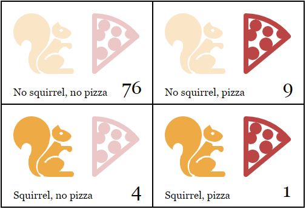

# Estrutura de dados: Objetos e _Array_

> Em duas ocasiões me perguntaram: "Ora, Sr. Babbage, se você colocar números errados em uma máquina, respostas certas irão sair?" [...] Certamente eu não sou capaz de compreender o tipo de confusão de ideias que poderia provocar tal questionamento.
>
> — Charles Babbage, Passages from the Life of a Philosopher (1864)

Números, Booleanos e _strings_ são os tijolos usados para construir as estruturas de dados. Entretanto, você não consegue fazer uma casa com um único tijolo. Objetos nos permitem agrupar valores (incluindo outros objetos) e, consequentemente, construir estruturas mais complexas.

Os programas que construímos até agora foram seriamente limitados devido ao fato de que estiveram operando apenas com tipos de dados simples. Esse capítulo irá adicionar uma compreensão básica sobre estrutura de dados para o seu _kit_ de ferramentas. Ao final, você saberá o suficiente para começar a escrever programas úteis.

O capítulo irá trabalhar com um exemplo de programação mais ou menos realista, introduzindo conceitos a medida em que eles se aplicam ao problema em questão. O código de exemplo será, muitas vezes, construído em cima de funções e variáveis ​​que foram apresentadas no início do texto.

## O Esquilo-homem

De vez em quando, geralmente entre oito e dez da noite, Jacques se transforma em um pequeno roedor peludo com uma cauda espessa.

Por um lado, Jacques fica muito contente por não ter licantropia clássica. Transformar-se em um esquilo tende a causar menos problemas do que se transformar em um lobo. Ao invés de ter que se preocupar em comer acidentalmente o vizinho (isso seria bem estranho), ele tem que se preocupar em não ser comido pelo gato do vizinho. Após duas ocasiões em que ele acordou nu, desorientado e em cima de um galho fino na copa de uma árvore, ele resolveu trancar as portas e as janelas do seu quarto durante a noite e colocar algumas nozes no chão para manter-se ocupado.


Isso resolve os problemas do gato e da árvore. Mesmo assim, Jacques ainda sofre com sua condição. As ocorrências irregulares das transformações o faz suspeitar de que talvez possa ter alguma coisa que as ativam. Por um tempo, ele acreditava que isso só acontecia nos dias em que ele havia tocado em árvores. Por isso, ele parou de tocar de vez nas árvores e até parou de ficar perto delas, mas o problema persistiu.

Mudando para uma abordagem mais científica, Jacques pretende começar a manter um registro diário de tudo o que ele faz e se ele se transformou. Com essas informações, ele espera ser capaz de diminuir e limitar as condições que ativam as transformações.

A primeira coisa que ele deverá fazer é criar uma estrutura de dados para armazenar essas informações.

## Conjuntos de dados

Para trabalhar com um pedaço de dados digitais, primeiramente precisamos encontrar uma maneira de representá-los na memória da nossa máquina. Vamos dizer que, como um exemplo simples, queremos representar a coleção de números: 2, 3, 5, 7 e 11.

Poderíamos ser criativos com _strings_ (elas podem ter qualquer tamanho, assim podemos armazenar muitos dados nelas) e usar `"2 3 5 7 11"` como nossa representação. Entretanto, isso é estranho, pois você teria que, de alguma forma, extrair os dígitos e convertê-los em números para poder acessá-los.

Felizmente, o JavaScript fornece um tipo de dado específico para armazenar uma sequências de valores. Ele é chamado de _array_ e é escrito como uma lista de valores separados por vírgulas e entre colchetes.

```js
var listOfNumbers = [2, 3, 5, 7, 11];
console.log(listOfNumbers[1]);
// → 3
console.log(listOfNumbers[1 - 1]);
// → 2
```

A notação para acessar elementos contidos em um _array_ também usa colchetes. Um par de colchetes imediatamente após uma expressão, contendo outra expressão entre esses colchetes, irá procurar o elemento contido na expressão à esquerda que está na posição dada pelo _índice_ determinado pela expressão entre colchetes.

###### Indexação de Arrays

O primeiro índice de um _array_ é o número zero e não o número um. Portanto, o primeiro elemento pode ser acessado usando `listOfNumbers[0]`. Se você não tem experiência com programação, essa convenção pode levar um tempo para se acostumar. Mesmo assim, a contagem baseada em zero é uma tradição de longa data no mundo da tecnologia e, desde que seja seguida consistentemente (que é o caso no JavaScript), ela funciona bem.

## Propriedades

Nós vimos, em exemplos anteriores, algumas expressões de aparência suspeita, como `myString.length` (para acessar o tamanho de uma _string_) e `Math.max` (função que retorna o valor máximo). Essas são expressões que acessam uma propriedade em algum valor. No primeiro caso, acessamos a propriedade `length` do valor contido em `myString`. No segundo, acessamos a propriedade chamada `max` no objeto `Math` (que é um conjunto de valores e funções relacionados à matemática).

Praticamente todos os valores no JavaScript possuem propriedades. As únicas exceções são `null` e `undefined`. Se você tentar acessar a propriedade em algum deles, você receberá um erro.

```js
null.length;
// → TypeError: Cannot read property 'length' of null
```

As duas formas mais comuns de acessar propriedades no JavaScript são usando ponto e colchetes. Ambos `value.x` e `value[x]` acessam uma propriedade em `value`, mas não necessariamente a mesma propriedade. A diferença está em como o `x` é interpretado. Quando usamos o ponto, a parte após o ponto deve ser um nome de variável válido e referente ao nome da propriedade em questão. Quando usamos colchetes, a expressão entre os colchetes é avaliada para obter o nome da propriedade. Enquanto que `value.x` acessa a propriedade chamada "x", `value[x]` tenta avaliar a expressão `x` e, então, usa o seu resultado como o nome da propriedade.

Portanto, se você sabe que a propriedade que você está interessado se chama "length", você usa `value.length`. Se você deseja extrair a propriedade cujo nome é o valor que está armazenado na variável `i`, você usa `value[i]`. Devido ao fato de que nomes de propriedades podem ser qualquer _string_, se você quiser acessar as propriedades "2" ou "John Doe", você deve usar os colchetes: `value[2]` ou `value["John Doe"]`, pois mesmo sabendo exatamente o nome da propriedade, "2" e "John Doe" não são nomes válidos de variáveis, sendo impossível acessá-los usando a notação com o ponto.

## Métodos

Ambos os objetos _string_ e _array_ possuem, além da propriedade `length`, um número de propriedades que se referem à valores de função.

```js
var doh = "Doh";
console.log(typeof doh.toUpperCase);
// → function
console.log(doh.toUpperCase());
// → DOH
```

Toda _string_ possui uma propriedade `toUpperCase`. Quando chamada, ela retornará uma cópia da string com todas as letras convertidas para maiúsculas. Existe também a propriedade `toLowerCase`, que você já pode imaginar o que faz.

Curiosamente, mesmo que a chamada para `toUpperCase` não passe nenhum argumento, de alguma forma a função tem acesso à _string_ `"Doh"`, que é o valor em que a propriedade foi chamada. Como isso funciona exatamente é descrito no [Capítulo 6](./06-a-vida-secreta-dos-objetos.md).

As propriedades que contêm funções são geralmente chamadas de _métodos_ do valor a que pertencem. Como por exemplo, "`toUpperCase` é um método de uma _string_".

O exemplo a seguir demonstra alguns métodos que os objetos do tipo _array_ possuem:

```js
var mack = [];
mack.push("Mack");
mack.push("the", "Knife");
console.log(mack);
// → ["Mack", "the", "Knife"]
console.log(mack.join(" "));
// → Mack the Knife
console.log(mack.pop());
// → Knife
console.log(mack);
// → ["Mack", "the"]
```

O método `push` pode ser usado para adicionar valores ao final de um _array_. O método `pop` faz o contrário, remove o valor que está no final do _array_ e o retorna. Um _array_ de _strings_ pode ser combinado em uma única _string_ com o método `join`. O argumento passado para `join` determina o texto que será inserido entre cada elemento do _array_.

## Objetos

Voltando ao esquilo-homem. Um conjunto de registros diários pode ser representado como um _array_. Entretanto, as entradas não são compostas apenas por um número ou uma _string_, pois precisam armazenar a lista de atividades e um valor booleano que indica se Jacques se transformou em um esquilo. Nós deveríamos, idealmente, agrupar esses valores em um único valor e, em seguida, colocá-los em um _array_ com os registros.

Valores do tipo _objeto_ são coleções arbitrárias de propriedades, sendo que podemos adicionar ou remover essas propriedades da forma que desejarmos. Uma maneira de criar um objeto é usando a notação com chaves.

```js
var day1 = {
  squirrel: false,
  events: ["work", "touched tree", "pizza", "running",
           "television"]
};
console.log(day1.squirrel);
// → false
console.log(day1.wolf);
// → undefined
day1.wolf = false;
console.log(day1.wolf);
// → false
```

Dentro das chaves, podemos informar uma lista de propriedades separadas por vírgulas. Cada propriedade é escrita com um nome seguido de dois pontos e uma expressão que fornece o valor da propriedade. Espaços e quebras de linha não fazem diferença. Quando um objeto se estende por várias linhas, indentá-lo, como mostrado no exemplo anterior, melhora a legibilidade. Propriedades cujos nomes não são variáveis ou números válidos precisam estar entre aspas.

```js
var descriptions = {
  work: "Went to work",
  "touched tree": "Touched a tree"
};
```

Isso significa que as chaves possuem dois significados no JavaScript. Quando usadas no início de uma declaração, elas definem o começo de um bloco de declarações. Em qualquer outro caso, elas descrevem um objeto. Felizmente, é praticamente inútil iniciar uma declaração com as chaves de um objeto e, em programas normais, não existe ambiguidade entre os dois casos de uso.

Tentar acessar uma propriedade que não existe irá produzir um valor `undefined`, o que acontece quando tentamos ler pela primeira vez a propriedade `wolf` no exemplo anterior.

É possível atribuir um valor a uma propriedade usando o operador `=`. Isso irá substituir o valor de uma propriedade, caso ela exista, ou criar uma nova propriedade no objeto se não existir.

Retornando brevemente ao nosso modelo de tentáculos para associações de variáveis, as associações de propriedades funcionam de forma similar. Elas _recebem_ valores, mas outras variáveis e propriedades podem também estar associadas aos mesmos valores. Você pode pensar em objetos como polvos com um número qualquer de tentáculos, e cada tentáculo com um nome escrito nele.


O operador `delete` corta um tentáculo de nosso polvo. Ele é um operador unário que, quando aplicado a uma propriedade, irá remover tal propriedade do objeto. Isso não é algo comum de se fazer, mas é possível.

```js
var anObject = {left: 1, right: 2};
console.log(anObject.left);
// → 1
delete anObject.left;
console.log(anObject.left);
// → undefined
console.log("left" in anObject);
// → false
console.log("right" in anObject);
// → true
```

O operador binário `in`, quando aplicado a uma _string_ ou a um objeto, retorna um valor booleano que indica se aquele objeto possui aquela propriedade. A diferença entre alterar uma propriedade para `undefined` e removê-la de fato, é que no primeiro caso, o objeto _continua com a propriedade_ (ela simplesmente não tem um valor muito interessante), enquanto que no segundo caso, a propriedade não estará mais presente no objeto e o operador `in` retornará `false`.

Os _arrays_ são, então, apenas um tipo especializado de objeto para armazenar sequências de coisas. Se você executar `typeof [1, 2]`, irá produzir `"object"`. Você pode interpretá-los como polvos com longos tentáculos de tamanhos semelhantes, ordenados em linha e rotulados com números.


Portanto, podemos representar o diário de Jacques como um _array_ de objetos.

```js
var journal = [
  {events: ["work", "touched tree", "pizza",
            "running", "television"],
   squirrel: false},
  {events: ["work", "ice cream", "cauliflower",
            "lasagna", "touched tree", "brushed teeth"],
   squirrel: false},
  {events: ["weekend", "cycling", "break",
            "peanuts", "beer"],
   squirrel: true},
  /* and so on... */
];
```

## Mutabilidade

Nós iremos chegar na programação de fato muito em breve. Mas há, primeiramente, uma última parte teórica que precisamos entender.

Nós vimos que os valores de objetos podem ser modificados. Os tipos de valores discutidos nos capítulos anteriores, tais como números, _strings_ e booleanos, são _imutáveis_. É impossível mudar o valor já existente desses tipos. Você pode, a partir deles, combiná-los e criar novos valores, mas quando você analisar um valor específico de _string_, ele será sempre o mesmo, sendo que o seu texto não pode ser alterado. Por exemplo, se você tiver referência a uma _string_ que contêm `"cat"`, é impossível que outro código altere os caracteres dessa _string_ para `"rat"`.

Por outro lado, no caso de objetos, o conteúdo de um valor pode ser modificado quando alteramos suas propriedades.

Quando temos dois números, 120 e 120, podemos considerá-los exatamente o mesmo número, quer se refiram ou não aos mesmos bits físicos. Entretanto, no caso de objetos há uma diferença entre ter duas referências para o mesmo objeto e ter dois objetos diferentes que possuem as mesmas propriedades. Considere o código a seguir:

```js
var object1 = {value: 10};
var object2 = object1;
var object3 = {value: 10};

console.log(object1 == object2);
// → true
console.log(object1 == object3);
// → false

object1.value = 15;
console.log(object2.value);
// → 15
console.log(object3.value);
// → 10
```

As variáveis `object1` e `object2` estão associadas ao _mesmo objeto_ e, por isso, alterar `object1` também altera o valor de `object2`. A variável `object3` aponta para um objeto diferente, o qual inicialmente contêm as mesmas propriedades de `object1` e sua existência é totalmente separada.

Quando comparamos objetos, o operador `==` do JavaScript irá retornar `true` apenas se ambos os objetos possuem exatamente o mesmo valor. Comparar objetos diferentes irá retornar `false` mesmo se eles tiverem conteúdos idênticos. Não existe uma operação nativa no JavaScript de _"deep" comparison_ (comparação "profunda"), onde se verifica o conteúdo de um objeto, mas é possível escrevê-la você mesmo (que será um dos [exercícios](#deep-comparison) ao final desse capítulo).

## O _log_ da licantropia

Jacques inicia seu interpretador de JavaScript e configura o ambiente que ele precisa para manter o seu diário.

```js
var journal = [];

function addEntry(events, didITurnIntoASquirrel) {
  journal.push({
    events: events,
    squirrel: didITurnIntoASquirrel
  });
}
```

E então, todas as noites às dez ou as vezes na manhã seguinte após descer do topo de sua estante de livros, ele faz o registro do dia.

```js
addEntry(["work", "touched tree", "pizza", "running",
          "television"], false);
addEntry(["work", "ice cream", "cauliflower", "lasagna",
          "touched tree", "brushed teeth"], false);
addEntry(["weekend", "cycling", "break", "peanuts",
          "beer"], true);
```

Uma vez que ele tem dados suficientes, ele pretende calcular a correlação entre sua transformação em esquilo e cada um dos eventos do dia e espera aprender algo útil a partir dessas correlações.

A _correlação_ é uma medida de dependência entre variáveis ("variáveis" no sentido estatístico e não no sentido do JavaScript). Ela é geralmente expressa em um coeficiente que varia de -1 a 1. Zero correlação significa que as variáveis não são relacionadas, enquanto que a correlação de um indica que as variáveis são perfeitamente relacionadas (se você conhece uma, você também conhece a outra). A correlação negativa de um também indica que as variáveis são perfeitamente relacionadas, mas são opostas (quando uma é verdadeira, a outra é falsa).

Para variáveis binárias (booleanos), o coeficiente _phi_ (_ϕ_) fornece uma boa forma de medir a correlação e é relativamente fácil de ser calculado. Para calcular _ϕ_, precisamos de uma tabela _n_ que contêm o número de vezes que as diversas combinações das duas variáveis foram observadas. Por exemplo, podemos considerar o evento de "comer pizza" e colocá-lo nessa tabela da seguinte maneira:



_ϕ_ pode ser calculado usando a seguinte fórmula, onde _n_ se refere à tabela:


A notação _n01_ indica o número de ocorrências nas quais a primeira variável (transformar-se em esquilo) é falsa (0) e a segunda variável (pizza) é verdadeira (1). Nesse exemplo, _n01_ é igual a 9.

O valor n1• se refere à soma de todas as medidas nas quais a primeira variável é verdadeira, que no caso do exemplo da tabela é 5. Da mesma forma, n•0 se refere à soma de todas as medidas nas quais a segunda variável é falsa.

Portanto, para a tabela de pizza, a parte de cima da linha (o dividendo) seria 1x76 - 4x9 = 40, e a parte de baixo (o divisor) seria a raiz quadrada de 5x85x10x80, ou √340000. Esse cálculo resulta em _ϕ_ ≈ 0.069, o que é um valor bem pequeno. Comer pizza parece não ter influência nas transformações.

## Calculando a correlação

No JavaScript, podemos representar uma tabela dois por dois usando um _array_ com quatro elementos (`[76, 9, 4, 1]`). Podemos também usar outras formas de representações, como por exemplo um _array_ contendo dois _arrays_ com dois elementos cada (`[[76, 9], [4, 1]]`), ou até mesmo um objeto com propriedades nomeadas de `"11"` e `"01"`. Entretanto, a maneira mais simples e que faz com que seja mais fácil acessar os dados é utilizando um _array_ com quatro elementos. Nós iremos interpretar os índices do _array_ como elementos binários de dois bits, onde o dígito a esquerda (mais significativo) se refere à variável do esquilo, e o dígito a direita (menos significativo) se refere à variável do evento. Por exemplo, o número binário `10` se refere ao caso no qual Jacques se tornou um esquilo, mas o evento não ocorreu (por exemplo "pizza"). Isso aconteceu quatro vezes, e já que o número binário `10` é equivalente ao número 2 na notação decimal, iremos armazenar esse valor no índice 2 do _array_.

Essa é a função que calcula o coeficiente _ϕ_ de um _array_ desse tipo:

```js
function phi(table) {
  return (table[3] * table[0] - table[2] * table[1]) /
    Math.sqrt((table[2] + table[3]) *
              (table[0] + table[1]) *
              (table[1] + table[3]) *
              (table[0] + table[2]));
}

console.log(phi([76, 9, 4, 1]));
// → 0.068599434
```

Essa é simplesmente uma tradução direta da fórmula de _ϕ_ para o JavaScript. `Math.sqrt` é a função que calcula a raiz quadrada, fornecida pelo objeto `Math` que é padrão do JavaScript. Temos que somar dois campos da tabela para encontrar valores como n1•, pois a soma das linhas ou colunas não são armazenadas diretamente em nossa estrutura de dados.

Jacques manteve seu diário por três meses. O conjunto de dados resultante está disponível no ambiente de código desse capítulo, armazenado na variável `JOURNAL` e em um [arquivo](http://eloquentjavascript.net/code/jacques_journal.js) que pode ser baixado.

Para extrair uma tabela dois por dois de um evento específico desse diário, devemos usar um loop para percorrer todas as entradas e ir adicionando quantas vezes o evento ocorreu em relação às transformações de esquilo.

```js
function hasEvent(event, entry) {
  return entry.events.indexOf(event) != -1;
}

function tableFor(event, journal) {
  var table = [0, 0, 0, 0];
  for (var i = 0; i < journal.length; i++) {
    var entry = journal[i], index = 0;
    if (hasEvent(event, entry)) index += 1;
    if (entry.squirrel) index += 2;
    table[index] += 1;
  }
  return table;
}

console.log(tableFor("pizza", JOURNAL));
// → [76, 9, 4, 1]
```

A função `hasEvent` testa se uma entrada contém ou não o evento em questão. Os _arrays_ possuem um método `indexOf` que procura pelo valor informado no _array_ (nesse exemplo o nome do evento), e retorna o índice onde ele foi encontrado ou -1 se não for. Portanto, se a chamada de `indexOf` não retornar -1, sabemos que o evento foi encontrado.

O corpo do loop presente na função `tableFor`, descobre qual caixa da tabela cada entrada do diário pertence, verificando se essa entrada contém o evento específico e se o evento ocorreu juntamente com um incidente de transformação em esquilo. O loop adiciona uma unidade no número contido no _array_ que corresponde a essa caixa na tabela.

Agora temos as ferramentas necessárias para calcular correlações individuais. O único passo que falta é encontrar a correlação para cada tipo de evento que foi armazenado e verificar se algo se sobressai. Como podemos armazenar essas correlações assim que as calculamos?

## Objetos como mapas

Uma maneira possível é armazenar todas as correlações em um _array_, usando objetos com as propriedades `name` (nome) e `value` (valor). Porém, isso faz com que o acesso às correlações de um evento seja bastante trabalhoso, pois você teria que percorrer por todo o _array_ para achar o objeto com o `name` certo. Poderíamos encapsular esse processo de busca em uma função e, mesmo assim, iríamos escrever mais código e o computador iria trabalhar mais do que o necessário.

Uma maneira melhor seria usar as propriedades do objeto nomeadas de acordo com o tipo do evento. Podemos usar a notação de colchetes para acessar e ler as propriedades e, além disso, usar o operador `in` para testar se tal propriedade existe.

```js
var map = {};
function storePhi(event, phi) {
  map[event] = phi;
}

storePhi("pizza", 0.069);
storePhi("touched tree", -0.081);
console.log("pizza" in map);
// → true
console.log(map["touched tree"]);
// → -0.081
```

Um _map_ é uma maneira de associar valores de um domínio (nesse caso nomes de eventos) com seus valores correspondentes em outro domínio (nesse caso coeficientes _ϕ_).

Existem alguns problemas que podem ser gerados usando objetos dessa forma, os quais serão discutidos no [capítulo 6](./06-a-vida-secreta-dos-objetos.md). Por enquanto, não iremos nos preocupar com eles.

E se quiséssemos encontrar todos os eventos nos quais armazenamos um coeficiente? Diferentemente de um _array_, as propriedades não formam uma sequência previsível, impossibilitando o uso de um loop `for` normal. Entretanto, o JavaScript fornece uma construção de loop específica para percorrer as propriedades de um objeto. Esse loop é parecido com o loop `for` e se distingue pelo fato de utilizar a palavra `in`.

```js
for (var event in map)
  console.log("The correlation for '" + event +
              "' is " + map[event]);
// → The correlation for 'pizza' is 0.069
// → The correlation for 'touched tree' is -0.081
```

## A análise final

Para achar todos os tipos de eventos que estão presentes no conjunto de dados, nós simplesmente processamos cada entrada e percorremos por todos os eventos presentes usando um loop. Mantemos um objeto chamado `phis` que contém os coeficientes das correlações de todos os tipos de eventos que foram vistos até agora. A partir do momento em que encontramos um tipo que não está presente no objeto `phis`, calculamos o valor de sua correlação e então adicionamos ao objeto.

```js
function gatherCorrelations(journal) {
  var phis = {};
  for (var entry = 0; entry < journal.length; entry++) {
    var events = journal[entry].events;
    for (var i = 0; i < events.length; i++) {
      var event = events[i];
      if (!(event in phis))
        phis[event] = phi(tableFor(event, journal));
    }
  }
  return phis;
}

var correlations = gatherCorrelations(JOURNAL);
console.log(correlations.pizza);
// → 0.068599434
```

Vamos ver o resultado.

```js
for (var event in correlations)
  console.log(event + ": " + correlations[event]);
// → carrot:   0.0140970969
// → exercise: 0.0685994341
// → weekend:  0.1371988681
// → bread:   -0.0757554019
// → pudding: -0.0648203724
// and so on...
```

A grande maioria das correlações tendem a zero. Comer cenouras, pão ou pudim aparentemente não ativam a transformação em esquilo. Entretanto, elas parecem acontecer com mais frequência aos finais de semana. Vamos filtrar os resultados para mostrar apenas as correlações que são maiores do que 0.1 ou menores do que -0.1.

```js
for (var event in correlations) {
  var correlation = correlations[event];
  if (correlation > 0.1 || correlation < -0.1)
    console.log(event + ": " + correlation);
}
// → weekend:        0.1371988681
// → brushed teeth: -0.3805211953
// → candy:          0.1296407447
// → work:          -0.1371988681
// → spaghetti:      0.2425356250
// → reading:        0.1106828054
// → peanuts:        0.5902679812
```

A-ha! Existem dois fatores nos quais a correlação é claramente mais forte que a das outras. Comer amendoins tem um forte efeito positivo na chance de se transformar em um esquilo, enquanto que escovar os dentes tem um significante efeito negativo.

Interessante. Vamos tentar uma coisa.

```js
for (var i = 0; i < JOURNAL.length; i++) {
  var entry = JOURNAL[i];
  if (hasEvent("peanuts", entry) &&
     !hasEvent("brushed teeth", entry))
    entry.events.push("peanut teeth");
}
console.log(phi(tableFor("peanut teeth", JOURNAL)));
// → 1
```

Está bem evidente! O fenômeno ocorre precisamente quando Jacques come amendoins e não escova os dentes. Se ele não fosse preguiçoso em relação à higiene bucal, ele não sequer teria reparado nesse problema que o aflige.

Sabendo disso, Jacques simplesmente para de comer amendoins e descobre que isso coloca um fim em suas transformações.

Tudo ficou bem com Jacques por um tempo. Entretanto, alguns anos depois, ele perdeu seu emprego e eventualmente foi forçado a trabalhar em um circo, onde suas performances como _O Incrível Homem-Esquilo_ se baseavam em encher sua boca com pasta de amendoim antes de cada apresentação. Em um dia de sua pobre existência, Jacques não conseguiu se transformar de volta em sua forma humana e fugiu do circo, desapareceu pela floresta e nunca mais foi visto.

## Estudo aprofundado de _Arrays_

Antes de finalizar esse capítulo, gostaria de introduzir alguns outros conceitos relacionados a objetos. Começaremos com alguns métodos normalmente úteis dos _arrays_.

Vimos no [início do capítulo](#user-content-estrutura-de-dados-objetos-e-array) os métodos `push` e `pop`, que adicionam e removem elementos no final de um _array_. Os métodos correspondentes para adicionar e remover itens no início de um _array_ são chamados `unshift` e `shift`.

```js
var todoList = [];
function rememberTo(task) {
  todoList.push(task);
}
function whatIsNext() {
  return todoList.shift();
}
function urgentlyRememberTo(task) {
  todoList.unshift(task);
}
```

O programa anterior gerencia uma lista de tarefas. Você pode adicionar tarefas no final da lista chamando `rememberTo("eat")` e, quando estiver preparado para realizar alguma tarefa, você chama `whatIsNext()` para acessar e remover o primeiro item da lista. A função `urgentlyRememberTo` também adiciona uma tarefa, porém, ao invés de adicionar ao final da lista, a adiciona no início.

O método `indexOf` tem um irmão chamado `lastIndexOf`, que começa a pesquisa de um dado elemento pelo final do _array_ ao invés de começar pelo início.

```js
console.log([1, 2, 3, 2, 1].indexOf(2));
// → 1
console.log([1, 2, 3, 2, 1].lastIndexOf(2));
// → 3
```

Ambos `indexOf` e `lastIndexOf` recebem um segundo argumento opcional que indica onde iniciar a pesquisa.

Outro método fundamental é o `slice`, que recebe um índice de início e outro de parada, retornando um _array_ que contém apenas os elementos presentes entre esses índices. O índice de início é inclusivo e o de parada é exclusivo.

```js
console.log([0, 1, 2, 3, 4].slice(2, 4));
// → [2, 3]
console.log([0, 1, 2, 3, 4].slice(2));
// → [2, 3, 4]
```

Quando o índice de parada não é informado, o `slice` irá pegar todos os elementos após o índice de início. _Strings_ também possuem o método `slice` com um comportamento similar.

O método `concat` pode ser usado para unir _arrays_, parecido com o que o operador `+` faz com as _strings_. O exemplo a seguir mostra ambos `concat` e `slice` em ação. Ele recebe um _array_ e um índice como argumento, retornando um novo _array_ que é uma cópia do _array_ original, exceto pelo fato de que o elemento no índice informado foi removido.

```js
function remove(array, index) {
  return array.slice(0, index)
    .concat(array.slice(index + 1));
}
console.log(remove(["a", "b", "c", "d", "e"], 2));
// → ["a", "b", "d", "e"]
```

# _Strings_ e suas propriedades

Podemos ler propriedades como `length` e `toUpperCase` de _strings_. Porém, caso tente adicionar uma nova propriedade, ela não será adicionada.

```js
var myString = "Fido";
myString.myProperty = "value";
console.log(myString.myProperty);
// → undefined
```

Valores do tipo _string_, _number_ e _Boolean_ não são objetos e, mesmo pelo fato da linguagem não reclamar quando tentamos adicionar novas propriedades neles, elas não são armazenadas. Esses valores são imutáveis e não podem ser alterados.

Mesmo assim, esses tipos possuem propriedades nativas. Toda _string_ possui uma série de métodos. Provavelmente, alguns dos mais úteis são `slice` e `indexOf`, que são parecidos com os métodos de _array_ que possuem o mesmo nome.

```js
console.log("coconuts".slice(4, 7));
// → nut
console.log("coconut".indexOf("u"));
// → 5
```

Uma diferença é que o `indexOf` das _strings_ pode receber uma _string_ contendo mais de um caractere, enquanto que o método correspondente no _array_ procura apenas por um único elemento.

```js
console.log("one two three".indexOf("ee"));
// → 11
```

O método `trim` remove todos os espaços vazios (espaços, linhas, tabs e caracteres similares) do começo e do final de uma _string_.

```js
console.log("  okay \n ".trim());
// → okay
```

Já vimos a propriedade `length` das _strings_. Para acessar caracteres individuais de uma _string_, podemos usar o método `charAt` ou simplesmente ler suas propriedades numéricas, da mesma forma que você faria em um _array_.

```js
var string = "abc";
console.log(string.length);
// → 3
console.log(string.charAt(0));
// → a
console.log(string[1]);
// → b
```

## O Objeto _Arguments_

Sempre que uma função é invocada, uma variável especial chamada `arguments` é adicionada ao ambiente no qual o corpo da função executa. Essa variável se refere a um objeto que contém todos os argumentos passados à função. Lembre-se de que no JavaScript você pode passar mais (ou menos) argumentos para uma função, independentemente do número de parâmetros que foi declarado.

```js
function noArguments() {}
noArguments(1, 2, 3); // This is okay
function threeArguments(a, b, c) {}
threeArguments(); // And so is this
```

O objeto `arguments` possui a propriedade `length` que nos informa o número de argumentos que realmente foi passado à função. Além disso, contém uma propriedade para cada argumento, chamadas 0, 1, 2, etc.

Se isso soa muito parecido como um _array_ para você, você está certo. Esse objeto é muito parecido com um _array_. Porém, ele não possui nenhum dos métodos de _array_ (como `slice` ou `indexOf`), fazendo com que seja um pouco mais difícil de se usar do que um _array_ de verdade.

```js
function argumentCounter() {
  console.log("You gave me", arguments.length, "arguments.");
}
argumentCounter("Straw man", "Tautology", "Ad hominem");
// → You gave me 3 arguments.
```

Algumas funções podem receber qualquer número de argumentos, como no caso de `console.log`. Essas funções normalmente percorrem por todos os valores em seu objeto `arguments` e podem ser usadas para criar interfaces extremamente agradáveis. Por exemplo, lembre-se de como criamos as entradas no diário do Jacques.

```js
addEntry(["work", "touched tree", "pizza", "running",
          "television"], false);
```

Devido ao fato de que essa função irá ser executada muitas vezes, poderíamos criar uma alternativa mais simples.

```js
function addEntry(squirrel) {
  var entry = {events: [], squirrel: squirrel};
  for (var i = 1; i < arguments.length; i++)
    entry.events.push(arguments[i]);
  journal.push(entry);
}
addEntry(true, "work", "touched tree", "pizza",
         "running", "television");
```

Essa versão lê o primeiro argumento (`squirrel`) da forma normal e depois percorre o resto dos argumentos (o loop pula o primeiro argumento, iniciando no índice 1) juntando-os em um _array_.

## O Objeto _Math_

Como vimos anteriormente, `Math` é uma caixa de ferramentas com funções relacionadas a números, tais como `Math.max` (máximo), `Math.min` (mínimo) e `Math.sqrt` (raiz quadrada).

O objeto `Math` é usado como um _container_ para agrupar uma série de funcionalidades relacionadas. Existe apenas um único objeto `Math` e, na maioria das vezes, ele não é útil quando usado como um valor. Mais precisamente, ele fornece um _namespace_ (espaço nominal) para que todas essas funções e valores não precisem ser declaradas como variáveis globais.

Possuir muitas variáveis globais "polui" o _namespace_. Quanto mais nomes são usados, mais prováveis são as chances de acidentalmente sobrescrever o valor de uma variável. Por exemplo, é provável que você queira chamar algo de `max` em um de seus programas. Sabendo que no JavaScript a função nativa `max` está contida de forma segura dentro do objeto `Math`, não precisamos nos preocupar em sobrescrevê-la.

Muitas linguagens irão parar você ou, ao menos, avisá-lo quando tentar definir uma variável com um nome que já está sendo usado. Como o JavaScript não faz isso, tenha cuidado.

De volta ao objeto `Math`, caso precise realizar cálculos trigonométricos, `Math` pode ajudá-lo. Ele contém `cos` (cosseno), `sin` (seno) e `tan` (tangente), tanto quanto suas funções inversas `aos`, `asin` e `atan` respectivamente. O número π (pi), ou pelo menos a aproximação que é possível ser representada através de um número no JavaScript, está disponível como `Math.PI`. (Existe uma tradição antiga na programação de escrever os nomes de valores constantes em caixa alta).

```js
function randomPointOnCircle(radius) {
  var angle = Math.random() * 2 * Math.PI;
  return {x: radius * Math.cos(angle),
          y: radius * Math.sin(angle)};
}
console.log(randomPointOnCircle(2));
// → {x: 0.3667, y: 1.966}
```

Se senos e cossenos não são muito familiares para você, não se preocupe. Quando eles forem usados no [Capítulo 13](./13-document-object-model.md) desse livro, eu lhe explicarei.

O exemplo anterior usa `Math.random`. Essa é uma função que retorna um número "pseudo-aleatório" entre zero (incluído) e um (excluído) toda vez que você a chama.

```js
console.log(Math.random());
// → 0.36993729369714856
console.log(Math.random());
// → 0.727367032552138
console.log(Math.random());
// → 0.40180766698904335
```

Embora os computadores sejam deterministas (sempre reagem da mesma maneira quando são usados os mesmos dados de entrada), é possível fazer com que eles produzam números que pareçam ser aleatórios. Para fazer isso, a máquina mantém um número (ou uma quantidade deles) armazenado em seu estado interno. Assim, toda vez que um número aleatório é requisitado, ela executa alguns cálculos complicados e deterministas usando esse estado interno e, então, retorna parte do resultado desses cálculos. A máquina também utiliza esses resultados para mudar o seu estado interno, fazendo com que o próximo número "aleatório" produzido seja diferente.

Se ao invés de um número fracionário, quisermos um número aleatório inteiro, podemos usar `Math.floor` (que arredonda o número para o menor valor inteiro mais próximo) no resultado de `Math.random`.

```js
console.log(Math.floor(Math.random() * 10));
// → 2
```

Multiplicar o número aleatório por dez resulta em um número que seja maior ou igual a zero e menor do que dez. Devido ao fato de que `Math.floor` arredonda o valor para baixo, essa expressão irá produzir, com chances iguais, qualquer número de zero a nove.

Também existem as funções `Math.ceil` (para arredondar o valor para o maior número inteiro mais próximo) e `Math.round` (para arredondar o valor para o número inteiro mais próximo).

## O objeto global

O escopo global, que é o espaço no qual as variáveis globais residem, também pode ser abordado como um objeto no JavaScript. Cada variável global está presente como uma propriedade desse objeto. Nos navegadores, o objeto do escopo global é armazenado na variável `window`.

```js
var myVar = 10;
console.log("myVar" in window);
// → true
console.log(window.myVar);
// → 10
```

## Resumo

Objetos e _arrays_ (que são tipos específicos de objetos) fornecem maneiras de agrupar um conjunto de valores em um único valor. Conceitualmente, ao invés de tentar carregar e manter todas as coisas individualmente em nossos braços, eles nos permitem colocar e carregar todas as coisas relacionadas dentro de uma bolsa.

Com exceção de `null` e `undefined`, a maioria dos valores no JavaScript possuem propriedades e são acessados usando `value.propName` ou `value["propName"]`. Objetos tendem a usar nomes para suas propriedades e armazenam mais o menos uma quantidade fixa delas. Por outro lado, os _Arrays_ normalmente contêm quantidades variáveis de valores conceitualmente iguais e usam números (iniciando do zero) como os nomes de suas propriedades.

Existem algumas propriedades com nomes específicos nos _arrays_, como `length` e uma série de métodos. Métodos são funções que são armazenadas em propriedades e, normalmente, atuam no valor nas quais elas são propriedade.

Objetos podem também ser usados como mapas, associando valores com seus nomes. O operador `in` pode ser usado para verificar se um objeto contém a propriedade com o nome informado. A mesma palavra-chave pode ser usada em um loop `for` (`for (var name in object)`) para percorrer todas as propriedades do objeto.

## Exercícios

### A soma de um intervalo

A [introdução](./00-introdução.md) desse livro mencionou a seguinte maneira como uma boa alternativa para somar um intervalo de números:

```js
console.log(sum(range(1, 10)));
```

Escreva uma função chamada `range` que recebe dois argumentos, `start` (início) e `end` (fim), e retorna um _array_ contendo todos os números a partir do valor `start` até o valor `end` (incluindo-o).

Em seguida, escreva a função `sum` que recebe um _array_ de números como argumento e retorna a soma desses números. Execute o programa anterior e veja se o resultado retornado é de fato 55.

Como exercício bônus, modifique a sua função `range` para aceitar um terceiro argumento opcional que indica o tamanho do "incremento" usado para construir o _array_. Se nenhum valor for atribuído ao tamanho do incremento, o _array_ de elementos será percorrido em incrementos de um, correspondendo ao comportamento original. A chamada à função `range(1, 10, 2)` deve retornar `[1, 3, 5, 7, 9]`. Certifique-se de que funcione também com valores negativos, fazendo com que `range(5, 2, -1)` produza `[5, 4, 3, 2]`.

```js
// Your code here.

console.log(range(1, 10));
// → [1, 2, 3, 4, 5, 6, 7, 8, 9, 10]
console.log(range(5, 2, -1));
// → [5, 4, 3, 2]
console.log(sum(range(1, 10)));
// → 55
```

**Dicas**

A maneira mais fácil de construir um _array_ é primeiramente inicializar uma variável usando `[]` (um novo _array_ vazio) e, em seguida, chamar várias vezes o seu método `push` para adicionar os valores. Não se esqueça de retornar o _array_ no final da função.

Devido ao fato de que o limite final é inclusivo, ao invés de usar um simples operador `<`, você deverá usar o operador `<=` para checar o final do seu loop.

Para verificar se o argumento opcional de incremento foi fornecido, você pode verificar o `arguments.length` ou comparar o valor do argumento com `undefined`. Caso não tenha sido informado, apenas configure o seu valor padrão (1) no início da função.

Fazer com que `range` entenda incrementos negativos é provavelmente mais fácil de ser feito escrevendo dois loops distintos, um para contar valores crescentes e outro para valores decrescentes. Isso se dá pelo fato de que, quando estamos contando valores decrescentes, o operador que compara e verifica se o loop terminou precisa ser `>=` ao invés de `<=`.

Pode ser útil usar um valor de incremento diferente do valor padrão (por exemplo -1) quando o valor final do intervalo for menor do que o valor de início. Dessa forma, ao invés de ficar preso em um loop infinito, `range(5, 2)` retorna algo relevante.

### Invertendo um _array_

Os _arrays_ possuem o método `reverse`, que modifica o _array_ invertendo a ordem em que os elementos aparecem. Para esse exercício, escreva duas funções: `reverseArray` e `reverseArrayInPlace`. A primeira (`reverseArray`) recebe um _array_ como argumento e produz um _novo array_ que tem os mesmos elementos com ordem inversa. A segunda (`reverseArrayInPlace`) funciona da mesma forma que o método `reverse`, só que nesse caso, invertendo os elementos do próprio _array_ que foi fornecido como argumento. Ambas as funções não devem usar o método padrão `reverse`.

Levando em consideração as notas sobre efeitos colaterais e funções puras do [capítulo anterior](./03-funcoes.md), qual versão você espera que seja útil em mais situações? Qual delas é mais eficiente?

```js
// Your code here.

console.log(reverseArray(["A", "B", "C"]));
// → ["C", "B", "A"];
var arrayValue = [1, 2, 3, 4, 5];
reverseArrayInPlace(arrayValue);
console.log(arrayValue);
// → [5, 4, 3, 2, 1]
```

**Dicas**

Existem duas maneiras óbvias de implementar `reverseArray`. A primeira é simplesmente iterar o _array_ fornecido do início ao fim e usar o método `unshift` para inserir cada elemento no início do novo _array_. A segunda é iterar o _array_ fornecido começando pelo fim e terminando no início, usando o método `push`. Iterar um _array_ de trás para frente faz com que seja necessário usar uma notação `for` um pouco estranha (`var i = array.length - 1; i >= 0; i--`).

Inverter o _array_ em questão (`reverseArrayInPlace`) é mais difícil. Você deve ter cuidado para não sobrescrever elementos que você precisará posteriormente. Usar `reverseArray` ou até mesmo copiar o _array_ inteiro (`array.slice(0)` é uma boa forma de se copiar um _array_) funciona, mas é considerado trapaça.

O truque é _inverter_ o primeiro e o último elemento, depois o segundo e o penúltimo e assim por diante. Você pode fazer isso percorrendo até a metade do valor de `length` do _array_ (use `Math.floor` para arredondar o valor para baixo, pois você não precisa lidar com o elemento do meio de um _array_ com tamanho ímpar) e substituir o elemento na posição `i` com o elemento na posição `array.length - 1 - i`. Você pode usar uma variável local para armazenar temporariamente um dos elementos, sobrescrever o seu valor com o valor do elemento espelhado (elemento que deseja substituir) e, por fim, colocar o valor da variável local no lugar onde o elemento espelhado estava originalmente.

### A lista

Objetos tratados como agrupamentos genéricos de valores, podem ser usados para construir diversos tipos de estrutura de dados. Uma estrutura de dados comum é a _lista_ (não se confunda com o _array_). A lista é um conjunto de objetos, sendo que o primeiro objeto contém uma referência para o segundo, o segundo para o terceiro, e assim por diante.

```js
var list = {
  value: 1,
  rest: {
    value: 2,
    rest: {
      value: 3,
      rest: null
    }
  }
};
```

O resultado é uma cadeia de objetos conectados, como mostrado abaixo:


Uma das vantagens das listas é que elas podem compartilhar partes de sua estrutura. Por exemplo, se eu criasse dois novos valores `{value: 0, rest: list}` e `{value: -1, rest: list}` (sendo que `list` é uma referência à variável definida anteriormente), ambas serão listas independentes que compartilham a mesma estrutura que foi usada para criar os três últimos elementos. Além disso, a lista original ainda é uma lista válida com três elementos.

Escreva a função `arrayToList` que constrói uma estrutura de dados similar à estrutura anterior quando fornecido `[1, 2, 3]` como argumento e, escreva também, a função `listToArray` que produz um _array_ a partir de uma lista. Além disso, implemente uma função auxiliar `prepend` que receberá um elemento e uma lista e será responsável por criar uma nova lista com esse novo elemento adicionado ao início da lista original e, por fim, crie a função `nth` que recebe uma lista e um número como argumentos e retorna o elemento que está na posição informada pelo número ou `undefined` caso não exista elemento em tal posição.

Caso não tenha feito ainda, implemente a versão recursiva da função `nth`.

```js
// Your code here.

console.log(arrayToList([10, 20]));
// → {value: 10, rest: {value: 20, rest: null}}
console.log(listToArray(arrayToList([10, 20, 30])));
// → [10, 20, 30]
console.log(prepend(10, prepend(20, null)));
// → {value: 10, rest: {value: 20, rest: null}}
console.log(nth(arrayToList([10, 20, 30]), 1));
// → 20
```

**Dicas**

Construir uma lista é mais fácil de ser feito de trás para frente. Portanto, `arrayToList` poderia percorrer o _array_ de trás para frente (veja o exercício anterior) e, para cada elemento, adicionar um objeto à lista. Você pode usar uma variável local para armazenar a parte da lista que foi criada e usar um padrão parecido com `list = {value: X, rest: list}` para adicionar um elemento.

Para percorrer uma lista (no caso de `listToArray` e `nth`), o seguinte loop `for` pode ser usado:

```js
for (var node = list; node; node = node.rest) {}
```

Você consegue ver como isso funcionaria? A cada iteração do loop, `node` aponta para a próxima sublista e, por isso, o corpo da função pode acessar a propriedade `value` para pegar o elemento atual. Ao final de cada iteração, `node` é atualizado apontando para a próxima sublista. Quando seu valor é `null`, nós chegamos ao final da lista e o loop é finalizado.

A versão recursiva de `nth` irá, similarmente, olhar para uma parte ainda menor do _tail_ (final) da lista e, ao mesmo tempo, fazer a contagem regressiva do índice até que chegue ao zero, significando que é o ponto no qual ela pode retornar a propriedade `value` do nó que está sendo verificado. Para acessar o elemento na posição zero de uma lista, você pode simplesmente acessar a propriedade `value` do seu nó _head_ (inicial). Para acessar o elemento `N + 1`, você pega o n-ésimo elemento da lista que está contido na propriedade `rest` da lista em questão.

### Comparação "profunda"

O operador `==` compara objetos pelas suas identidades. Entretanto, algumas vezes, você pode preferir comparar os valores das suas propriedades de fato.

Escreva a função `deepEqual` que recebe dois valores e retorna `true` apenas se os valores forem iguais ou se forem objetos que possuem propriedades e valores iguais quando comparados usando uma chamada recursiva de `deepEqual`.

Para saber se a comparação entre duas coisas deve ser feita pela identidade (use o operador `===` para isso) ou pela verificação de suas propriedades, você pode usar o operador `typeof`. Se ele produzir `"object"` para ambos os valores, você deverá fazer uma comparação "profunda". Entretanto, você deve levar em consideração uma exceção: devido a um acidente histórico, `typeof null` também produz `"object"`.

```js
// Your code here.

var obj = {here: {is: "an"}, object: 2};
console.log(deepEqual(obj, obj));
// → true
console.log(deepEqual(obj, {here: 1, object: 2}));
// → false
console.log(deepEqual(obj, {here: {is: "an"}, object: 2}));
// → true
```

**Dicas**

O teste para saber se está lidando com um objeto real deverá ser parecido com `typeof x == "object" && x != null`. Tome cuidado para comparar as propriedades apenas quando ambos argumentos forem objetos. Em todos os outros casos, você pode simplesmente retornar imediatamente o resultado da aplicação do operador `===`.

Use um loop `for/in` para percorrer todas as propriedades. Você precisa verificar se ambos os objetos possuem o mesmo conjunto de propriedades e se essas propriedades têm valores idênticos. O primeiro teste pode ser feito contando a quantidade de propriedades em cada objeto e retornar `false` se forem diferentes. Caso seja o mesmo, então, percorra todas as propriedades de um objeto e, para cada uma delas, verifique se o outro objeto também a possui. Os valores das propriedades são comparados usando uma chamada recursiva para `deepEqual`.

Para retornar o valor correto da função, é mais fácil retornar imediatamente `false` quando qualquer diferença for encontrada e retornar `true` apenas ao final da função.
