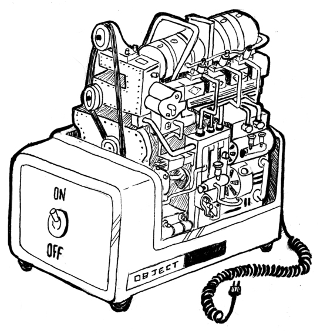

# A vida secreta dos objetos
> "O problema com as linguagens orientadas a objeto é que elas têm tudo
implícito no ambiente que elas carregam consigo. Você queria banana, mas o que
você teve foi um gorila segurando a banana e toda a floresta."
> `Joe Armstrong, entrevistado em Coders at Work`

Quando um programador diz "objeto", isso é um termo carregado. Na minha
profissão, objetos são a maneira de viver, o sujeito das guerras santas, e um
jargão apaixonante que ainda não perdeu o seu poder.

Para um estrangeiro, isso provavelmente é um pouco confuso. Vamos começar com
uma rápida história dos objetos como constrtutores da programação.

## História
Essa história, como a maioria das histórias de programação, começa com um
problema de complexidade. A teoria é de que a complexidade pode ser
administrada separando-a em pequenos compartimentos isolados um do outro. Esses
compartimentos acabaram ganhando o nome de _objetos_.

Um objeto é um escudo duro que esconde a complexidade grudenta dentro dele e nos apresenta pequenos conectores (como métodos) que apresentam uma interface
para utilizarmos o objeto. A ideia é que a interface seja relativamente simples
e toda as coisas complexas que vão dentro do objeto possam ser ignoradas
enquanto se trabalha com ele.



Como exemplo, você pode imaginar um objeto que disponibiliza uma interface para
uma determinada área na sua tela. Ele disponibiliza uma maneira de desenhar
formas ou textos nessa área, mas esconde todos os detalhes de como essas formas
são convertidos para os pixels que compõem a tela. Você teria um conjunto de
métodos-`desenharCirculo`, por exemplo- e essas serão as únicas coisas que
você precisa saber pra usar tal objeto.

Essas ideias foram trabalhadas inicialmente por volta dos anos 70 e 80 e, nos
anos 90, foram trazidas a tona por uma enorme onda _hype_-a revolução da
programação orientada a objetos. De repente, existia uma enorme tribo de pessoas declarando que objetos eram a maneira correta de programar-e que qualquer coisa que não envolvesse objetos era uma loucura ultrapassada.

Esse tipo de fanatismo produz um monte de bobagem impraticável, e desde então
uma espécie de contra-revolução vem acontecendo. Em alguns círculos de
desenvolvedores, os objetos têm uma péssima reputação hoje em dia.

Eu prefiro olhar para esse problema de um ângulo prático, e não ideológico.
Existem vários conceitos úteis, dentre eles um dos mais importantes é o
_encapsulamento_ (distinguir complexidade interna e interface externa), que a
cultura orientada a objetos tem popularizado. Vamos ver esses conceitos, pois
eles valem a pena.

Esse capítulo descreve uma pegada mais excêntrica do JavaScript com foco nos
objetos e na forma como eles se relacionam com algumas técnicas clássicas de
orientação a objetos.

## Métodos
Métodos são propriedades simples que comportam valores de funções. Isso é um
método simples:

```javascript
var coelho = {};
coelho.diz = function(linha) {
  console.log("O coelho diz '" + linha + "'");
};

coelho.diz("Estou vivo.");
// → O coelho diz 'Estou vivo.'
```

Normalmente um método precisa fazer alguma coisa com o objeto pelo qual ele
foi chamado. Quando uma função é chamada como um método-visualizada como uma
propriedade e imediatamente chamada, como em `objeto.metodo()`-a variável
especial `this` no seu conteúdo vai apontar para o objeto pelo qual foi chamada.

```javascript
function speak(line) {
  console.log("The " + this.type + " rabbit says '" +
              line + "'");
}
var whiteRabbit = {type: "white", speak: speak};
var fatRabbit = {type: "fat", speak: speak};

whiteRabbit.speak("Oh my ears and whiskers, " +
                  "how late it's getting!");
// → The white rabbit says 'Oh my ears and whiskers, how
//   late it's getting!'
fatRabbit.speak("I could sure use a carrot right now.");
// → The fat rabbit says 'I could sure use a carrot
//   right now.'
```

O código acima usa a palavra-chave `this` para dar a saída do tipo de coelho que está falando. Lembrando que ambos os métodos `apply` e `bind` podem usar o
primeiro argumento para simular chamadas de métodos. Esse primeiro argumento, é
na verdade, usado para passar um valor ao `this`.

Existe um método parecido ao `apply` chamado `call`. Ele também chama a função
na qual ele é um método e aceita argumentos normalmente, ao invés de um array.
Assim como `apply` e `bind`, o `call` pode ser passado com um valor específico
no `this`.

```javascript
speak.apply(fatRabbit, ["Burp!"]);
// → The fat rabbit says 'Burp!'
speak.call({type: "old"}, "Oh my.");
// → The old rabbit says 'Oh my.'
```

## Prototypes
Observe com atenção.

```javascript
var empty = {};
console.log(empty.toString);
// → function toString(){…}
console.log(empty.toString());
// → [object Object]
```

Eu acabei de sacar uma propriedade de um objeto vazio. Mágica!

Só que não. Eu venho ocultando algumas informações sobre como os objetos
funcionam no JavaScript. Além de sua lista de propriedades, quase todos os
objetos também possuem um _protótipo_, ou _prototype_. Um _prototype_ é outro objeto que é usado como fonte de _fallback_ para as propriedades. Quando um objeto recebe uma chamada em uma propriedade que ele não possui, seu _prototype_ designado para aquela propriedade será buscado, e então o _prototype_ daquele _prototype_ e assim por diante.

Então quem é o _prototype_ de um objeto vazio? É o ancestral de todos os
_prototypes_, a entidade por trás de quase todos os objetos, `Object.prototype`.

```javascript
console.log(Object.getPrototypeOf({}) ==
            Object.prototype);
// → true
console.log(Object.getPrototypeOf(Object.prototype));
// → null
```

A função `Object.getPrototypeOf` retorna o _prototype_ de um objeto como o esperado.

As relações dos objetos JavaScript formam uma estrutura em forma de árvore, e na raiz dessa estrutura se encontra o `Object.prototype`. Ele fornece alguns métodos que estão presentes em todos os objetos, como o toString, que converte um objeto para uma representação em _string_.

Muitos objetos não possuem o `Object.prototype` diretamente em seu _prototype_. Ao invés disso eles têm outro objeto que fornece suas propriedades padrão. Funções derivam do `Function.prototype`, e _arrays_ derivam do `Array.prototype`.

```javascript
console.log(Object.getPrototypeOf(isNaN) ==
            Function.prototype);
// → true
console.log(Object.getPrototypeOf([]) ==
            Array.prototype);
// → true
```

Por diversas vezes, o _prototype_ de um objeto também terá um _prototype_, dessa forma ele ainda fornecerá indiretamente métodos como `toString`.

A função `Object.getPrototypeOf` obviamente retornarão o _prototype_ de um objeto. Você pode usar `Object.create` para criar um objeto com um _prototype_ específico.

```javascript
var protoCoelho = {
  fala: function(linha) {
    console.log("O coelho " + this.tipo + " fala '" +
                linha + "'");
  }
};
var coelhoAssassino = Object.create(protoCoelho);
coelhoAssassino.tipo = "assassino";
coelhoAssassino.fala("SKREEEE!");
// → O coelho assassino fala 'SKREEEE!'
```

## Construtores

A maneira mais conveniente de criar objetos que herdam algum _prototype_ compartilhado é usar um construtor. No JavaScript, chamar uma função precedida pela palavra-chave `new` vai fazer com que ela seja tratada como um construtor. O construtor terá sua variável `this` atrelada a um objeto novo, e a menos que ele explicite o retorno do valor de outro objeto, esse novo objeto será retornado a partir da chamada.

Um objeto criado com `new` é chamado de _instância_ do construtor.

Aqui está um construtor simples para coelhos. É uma conveção iniciar o nome de um construtor com letra maiúscula para que seja fácil destinguí-los das outras funções.

```javascript
function Coelho(tipo) {
  this.tipo = tipo;
}

var coelhoAssassino = new Coelho("assassino");
var coelhoPreto = new Coelho("preto");
console.log(coelhoPreto.tipo);
// → preto
```

Construtores (todas as funções, na verdade) pegam automaticamente uma propriedade chamada `prototype`, que por padrão possui um objeto vazio que deriva do `Object.prototype`. Toda instância criada com esse construtor terá esse objeto assim como seu _prototype_. Então, para adicionar um método `fala` aos coelhos criados com o construtor `Coelho`, nós podemos simplesmente fazer isso:

```javascript
Coelho.prototype.fala = function(linha) {
  console.log("O coelho " + this.tipo + " fala '" +
              linha + "'");
};
coelhoPreto.fala("Doom...");
// → O coelho preto fala 'Doom...'
```

É importante notar a dinstinção entre a maneira que um _prototype_ é associado a um construtor (por sua propriedade _prototype_) e a maneira que objetos _têm_ um _prototype_ (que pode ser obtido com `Object.getPrototypeOf`). O _prototype_ propriamente dito de um construtor é `Function.prototype`, visto que os construtores são funções. Sua _propriedade_ `prototype` será o _prototype_ de instâncias criadas através dele mas não será seu _próprio prototype_.

## Definindo uma tabela

Eu vou trabalhar sobre um exemplo ou pouco mais envolvido na tentativa de dar a você uma melhor ideia de polimorfismo, assim como de programação orientada a objetos em geral. O projeto é este: nós vamos escrever um programa que, dado um array de arrays de células de uma tabela, cria uma string que contém uma tabela bem formatada - significando que colunas são retas e linhas estão alinhadas. Algo dessa forma:

```
name         height country
------------ ------ -------------
Kilimanjaro    5895 Tanzania
Everest        8848 Nepal
Mount Fuji     3776 Japan
Mont Blanc     4808 Italy/France
Vaalserberg     323 Netherlands
Denali         6168 United States
Popocatepetl   5465 Mexico
```

A forma que nosso sistema de construir tabelas vai funcionar é que a função construtora vai perguntar para cada célula quanto de altura e largura ela vai querer ter e então usar essa informação para determinar a largura das colunas e a altura das linhas. A função construtora vai então pedir para as células se desenharem no tamanho correto e montar o resultado dentro de uma string.

O programa de *layout* vai comunicar com os objetos células através de uma interface bem definida. Dessa forma, os tipos de células que o programa suporta não está definida antecipadamente. Nós podemos adicionar novas células de estilo depois — por exemplo, células sublinhadas para cabeçalho — e se eles suportarem nossa interface, isso vai simplesmente, funcionar, sem exigir alterações no layout do programa.

Esta é a interface:

- `minHeight()` retorna um número indicando a altura mínima que esta célula necessita (em linhas).
- `minWidth()` retorna um número indicando a largura mínima da célula (em caracteres).
- `draw(width, height)` retorna um array de tamanho `height`, que contém uma série de strings que contém `width` caracteres de tamanho. Isso representa o conteúdo da célula.

Irei fazer forte uso de métodos de ordem superior de array neste exemplo uma vez que isso é apropriado para essa abordagem.

A primeira parte do programa calcula matrizes de largura e altura mínima para uma grade de células.

```js
function rowHeights(rows) {
  return rows.map(function(row) {
    return row.reduce(function(max, cell) {
      return Math.max(max, cell.minHeight());
    }, 0);
  });
}

function colWidths(rows) {
  return rows[0].map(function(_, i) {
    return rows.reduce(function(max, row) {
      return Math.max(max, row[i].minWidth());
    }, 0);
  });
}
```

Usar um nome de variável que se inicia com um *underscore* (`_`) ou consistir inteiramente em um simples underscore é uma forma de indicar (para leitores humanos) que este argumento não será usado.

A função `rowHeights` não deve ser tão difícil de ser seguida. Ela usa `reduce` para computar a altura máxima de um array de células e envolve isso em um `map` para fazer isso em todas as linhas no array `rows`.

As coisas são um pouco mais difíceis na função `colWidths` porque o array externo é um array de linhas, não de colunas. Não mencionei até agora que `map` (assim como `forEach`, `filter` e métodos de array similares) passam um segundo argumento à função fornecida: o índice do elemento atual. Mapeando os elementos da primeira linha e somente usando o segundo argumento da função de mapeamento, `colWidths` constrói um array com um elemento para cada índice da coluna. A chamada à `reduce` roda sobre o array `rows` exterior para cada índice e pega a largura da célula mais larga nesse índice.

Aqui está o código para desenhar a tabela:

```js
function drawTable(rows) {
  var heights = rowHeights(rows);
  var widths = colWidths(rows);

  function drawLine(blocks, lineNo) {
    return blocks.map(function(block) {
      return block[lineNo];
    }).join(" ");
  }

  function drawRow(row, rowNum) {
    var blocks = row.map(function(cell, colNum) {
      return cell.draw(widths[colNum], heights[rowNum]);
    });
    return blocks[0].map(function(_, lineNo) {
      return drawLine(blocks, lineNo);
    }).join("\n");
  }

  return rows.map(drawRow).join("\n");
}
```

A função `drawTable` usa a função interna `drawRow` para desenhar todas as linhas e então as junta com caracteres *newline* (nova linha).

A função `drawRow` primeiro converte os objetos célula na linha em *blocos*, que são arrays representando o conteúdo das células, divididos por linha. Uma célula simples contendo apenas o número 3776 deve ser representada por um array com um único elemento como `["3776"]`, onde uma célula sublinhada deve conter duas linhas e ser representada pelo array `["name", "----"]`.

Os blocos para uma linha, que devem todos ter a mesma largura, devem aparecer próximos um ao outro na saída final. A segunda chamada a `map` em `drawRow` constrói essa saída linha por linha mapeando sobre as linhas do bloco mais à esquerda e, para cada uma delas, coletando uma linha que expande a tabela para sua largura máxima. Essas linhas são então juntadas com caracteres *newline* para fornecer a linha completa e ser o valor retornado de `drawRow`.

A função `drawLine` extrai linhas que devem aparecer próximas uma a outra a partir de um array de blocos e as junta com um caracter espaço para criar o espaço de um caracter entre as colunas da tabela.

Agora vamos escrever o construtor para células que contenham texto, implementando a interface para as células da tabela. O construtor divide a linha em um array de linhas usando o método string `split`, que corta uma string em cada ocorrência do seu argumento e retorna um array com as partes. O método `minWidth` encontra a linha com maior largura nesse array.

```js
function repeat(string, times) {
  var result = "";
  for (var i = 0; i < times; i++)
    result += string;
  return result;
}

function TextCell(text) {
  this.text = text.split("\n");
}
TextCell.prototype.minWidth = function() {
  return this.text.reduce(function(width, line) {
    return Math.max(width, line.length);
  }, 0);
};
TextCell.prototype.minHeight = function() {
  return this.text.length;
};
TextCell.prototype.draw = function(width, height) {
  var result = [];
  for (var i = 0; i < height; i++) {
    var line = this.text[i] || "";
    result.push(line + repeat(" ", width - line.length));
  }
  return result;
};
```

O código usa uma função auxiliar chamada `repeat`, que constrói uma linha na qual o valor é um argumento `string` repetido `times` número de vezes. O método `draw` usa isso e adiciona "preenchimento" para as linhas assim todas vão ter o tamanho requerido.

Vamos testar tudo que construímos e criar um tabuleiro de damas 5 x 5.

```js
var rows = [];
for (var i = 0; i < 5; i++) {
   var row = [];
   for (var j = 0; j < 5; j++) {
     if ((j + i) % 2 == 0)
       row.push(new TextCell("##"));
     else
       row.push(new TextCell("  "));
   }
   rows.push(row);
}
console.log(drawTable(rows));
// → ##    ##    ##
//      ##    ##
//   ##    ##    ##
//      ##    ##
//   ##    ##    ##
```

Funciona! Mas apesar de todas as células terem o mesmo tamanho, o código do layout da tabela não faz nada realmente interessante.

Os dados fonte para a tabela de montanhas que estamos tentando construir estão disponíveis na variável `MOUNTAINS` na *sandbox* e também [neste arquivo](http://eloquentjavascript.net/code/mountains.js) em nosso website.

Vamos querer destacar a linha do topo, que contém o nome das colunas, sublinhando as células com uma série de caracteres *traço*. Sem problemas — nós simplesmente escrevemos um tipo de célula que manipula o sublinhado.

```js
function UnderlinedCell(inner) {
  this.inner = inner;
};
UnderlinedCell.prototype.minWidth = function() {
  return this.inner.minWidth();
};
UnderlinedCell.prototype.minHeight = function() {
  return this.inner.minHeight() + 1;
};
UnderlinedCell.prototype.draw = function(width, height) {
  return this.inner.draw(width, height - 1)
    .concat([repeat("-", width)]);
};
```

Uma célula sublinhada *contém* outra célula. Ela reporta seu tamanho mínimo sendo o mesmo que da sua célula interna (chamando os métodos `minWidth` e `minHeight` desta célula) mas adicionando um à largura para contar o espaço usado pelo sublinhado.

Desenhar essa célula é bem simples - nós pegamos o conteúdo da célula interna e concatenamos uma simples linha preenchida com traços a ela.

Tendo um mecanismo de sublinhamento, nós podemos agora escrever uma função que constrói uma grade de células a partir do conjunto de dados.

```js
function dataTable(data) {
  var keys = Object.keys(data[0]);
  var headers = keys.map(function(name) {
    return new UnderlinedCell(new TextCell(name));
  });
  var body = data.map(function(row) {
    return keys.map(function(name) {
      return new TextCell(String(row[name]));
    });
  });
  return [headers].concat(body);
}

console.log(drawTable(dataTable(MOUNTAINS)));
// → name         height country
//   ------------ ------ -------------
//   Kilimanjaro  5895   Tanzania
//   … etcetera
```

A função padrão `Object.keys` retorna um array com nomes de propriedades de um objeto. A linha do topo da tabela deve conter células sublinhadas que dão os nomes das colunas. Abaixo disso, os valores de todos os objetos no conjunto de dados aparecem como células normais - nós os extraímos mapeando sobre o array `keys` de modo que tenhamos certeza que a ordem das células é a mesma em todas as linhas.

A tabela resultante se assemelha ao exemplo mostrado anteriormente, exceto que ela não alinha os números à direita na coluna `height`. Vamos chegar nessa parte em um instante.

## Getters and Setters

Quando especificamos uma interface, é possível incluir propriedades que não são métodos. Poderíamos ter definido `minHeight` e `minWidth` para simplesmente conter números. Mas isso teria exigido de nós computá-los no construtor, o que adicionaria código que não é estritamente relevante para *construção* do objeto. Isso pode causar problemas se, por exemplo, a célula interior de uma célula exterior mudou, onde nesse ponto o tamanho da célula sublinhada também deve mudar.

Isso tem levado algumas pessoas a adotarem um princípio de nunca incluírem propriedades *nonmethod* em interfaces. Ao invés de acessarem diretamente o valor da propriedade, eles usam métodos `getSomething` e `setSomething` para ler e escrever propriedades. Esta abordagem tem a parte negativa de que você irá acabar escrevendo - e lendo - muitos métodos adicionais.

Felizmente, o JavaScript fornece uma técnica que fornece o melhor de ambos os mundos. Nós podemos especificar propriedades que, do lado de fora, parecem propriedades normais mas secretamente tem métodos associados a elas.

```js
var pile = {
  elements: ["eggshell", "orange peel", "worm"],
  get height() {
    return this.elements.length;
  },
  set height(value) {
    console.log("Ignoring attempt to set height to", value);
  }
};

console.log(pile.height);
// → 3
pile.height = 100;
// → Ignoring attempt to set height to 100
```

Em um objeto literal, a notação `get` ou  `set` para propriedades permite que você especifique uma função a ser executada quando a propriedade for lida ou escrita. Você pode também adicionar tal propriedade em um objeto existente, por exemplo um protótipo, usando a função `Object.defineProperty` (que nós previamente usamos para criar propriedades não enumeráveis).

```js
Object.defineProperty(TextCell.prototype, "heightProp", {
  get: function() { return this.text.length; }
});

var cell = new TextCell("no\nway");
console.log(cell.heightProp);
// → 2
cell.heightProp = 100;
console.log(cell.heightProp);
// → 2
```

Você pode usar a propriedade similar `set`, no objeto passado à `defineProperty`, para especificar um método *setter*. Quando um *getter* é definido mas um *setter* não, escrever nessa propriedade é algo simplesmente ignorado.

## Herança

Nós não estamos prontos com nosso exercício de layout de tabela. Ela deve ajudar na leitura de números alinhados à direita em colunas. Nós devemos criar outra tipo de célula como `TextCell`, mas ao invés de dar espaço nas linhas do lado direito, vamos espaçá-las do lado esquerdo que irá alinhas à direita.

Podemos simplesmente construir um novo construtor com todos os três métodos em seu protótipo. Mas protótipos podem ter seus próprios protótipos, e isso nos permite fazer algo inteligente.

```js
function RTextCell(text) {
  TextCell.call(this, text);
}
RTextCell.prototype = Object.create(TextCell.prototype);
RTextCell.prototype.draw = function(width, height) {
  var result = [];
  for (var i = 0; i < height; i++) {
    var line = this.text[i] || "";
    result.push(repeat(" ", width - line.length) + line);
  }
  return result;
};
```

Nós reusamos o construtor e os métodos `minHeight` e `minWidth` de `TextCell`. Um `RTextCell` é agora basicamente equivalente a `TextCell`, exceto que seu método `draw` contém uma função diferente.

Este padrão é chamado *herança*. Isso nos permite construir tipos de dados levemente diferentes a partir de tipos de dados existentes com relativamente pouco esforço. Tipicamente, o novo construtor vai chamar o antigo construtor (usando o método `call` para ser capaz de dar a ele o novo objeto assim como o seu valor `this`). Uma vez que esse construtor tenha sido chamado, nós podemos assumir que todos os campos que o tipo do antigo objeto supostamente contém foram adicionados. Nós organizamos para que o protótipo do construtor derive do antigo protótipo, então as instâncias deste tipo também vão acesso às propriedades deste protótipo. Finalmente, nós podemos sobrescrever algumas das propriedades adicionando-as ao nosso novo protótipo.

Agora, se nós ajustarmos sutilmente a função `dataTable` para usar `RTextCell` para as células cujo valor é um número, vamos obter a tabela que estávamos buscando.

```js
function dataTable(data) {
  var keys = Object.keys(data[0]);
  var headers = keys.map(function(name) {
    return new UnderlinedCell(new TextCell(name));
  });
  var body = data.map(function(row) {
    return keys.map(function(name) {
      var value = row[name];
      // This was changed:
      if (typeof value == "number")
        return new RTextCell(String(value));
      else
        return new TextCell(String(value));
    });
  });
  return [headers].concat(body);
}

console.log(drawTable(dataTable(MOUNTAINS)));
// → … beautifully aligned table
```

Herança é uma parte fundamental da orientação a objetos tradicional, ao lado de encapsulamento e polimorfismo. Mas enquanto os dois últimos sejam agora geralmente considerados como ideias brilhantes, herança é algo controverso.

A principal razão para isso é que este tópico é geralmente confundido com polimorfismo, vendido como uma ferramenta mais poderosa do que realmente é, e subsequentemente usado em excesso de diversas horríveis formas. Onde encapsulamento e polimorfismo podem ser usados para *separar* pedaços de código de cada um, reduzindo o emaranhamento de todo o programa, herança fundamentalmente vincula os tipos, criando *mais* emaranhados.

Você pode ter polimorfismo sem herança, como nós vimos. Eu não vou dizer para você evitar herança completamente. Eu a uso regularmente em meus programas. Mas você deve vê-la como um leve truque desonesto que vai ajudá-lo a definir novos tipos com menos código, não como um grande princípio de organização de código. Uma forma mais apropriada de extender tipos é através da composição, como `UnderlinedCell` constrói em outra célula simplesmente armazenando-a em uma propriedade e um método posterior a chama nos seus próprios métodos.

## O operador `instanceof`

Ocasionalmente é útil saber se um objeto foi derivado de um construtor em específico. Para isso, o JavaScript fornece um operador binário chamado `instaceof`.

```js
console.log(new RTextCell("A") instanceof RTextCell);
// → true
console.log(new RTextCell("A") instanceof TextCell);
// → true
console.log(new TextCell("A") instanceof RTextCell);
// → false
console.log([1] instanceof Array);
// → true
```

O operador vai olhar através dos tipos herdados. Um `RTextCell` é uma instância de `TextCell` porque `RTextCell.prototype` deriva de `TextCell.prototype`. O operador pode ser aplicado a construtores padrão como `Array`. Praticamente todos os objetos são uma instância de `Object`.

## Resumo

Então objetos são mais complicados do que inicialmente eu os retratei. Eles tem protótipos, que são outros objetos, e vão agir como se tivessem propriedades que eles não tem caso seu protótipo tenha essa propriedade. Objetos simples tem `Object.prototype` como seus protótipos.

Construtores, que são funções cujos nomes usualmente iniciam com uma letra maiúscula, podem ser usador com o operador `new` para criar objetos. O protótipo do novo objeto será o objeto encontrado na propriedade `prototype` da função construtora. Você pode fazer bom uso disso adicionando propriedades que todos os valores de um tipo  compartilham em seus protótipos. O operador `instanceof` pode, dado um objeto e um construtor, dizer se o objeto é uma instância deste construtor.

Algo útil a se fazer com objetos é especificar uma interface para eles e dizer para todos quer irão supostamente conversar com seu objeto a fazer isso somente por essa interface. O resto dos detalhes que constroem seu objeto estão agora *encapsulados*, escondidos atrás da interface.

Uma vez que você esteja conversando em termos de interfaces, quem diz que apenas um tipo de objeto pode implementar essa interface? Ter diferentes objetos expondo a mesma interface é chamado de *polimorfismo*. Isso é muito útil.

Quando implementando vários tipos que diferem apenas em alguns detalhes, pode ser útil simplesmente criar o protótipo do seu novo tipo derivando do protótipo do seu antigo tipo e ter seu novo construtor chamando o antigo. Isso lhe dá um tipo similar de objeto ao antigo mas que permite que você adicione ou sobrescreva propriedades quando necessário.

## Exercícios

### Um tipo de vetor

Escreva um construtor `Vector` que represente um vetor em duas dimensões do espaço. Ele recebe os parâmetros `x` e `y` (números), que deve salvar em propriedades de mesmo nome.

Dê ao protótipo de `Vector` dois métodos, `plus` e `minus`, que pegam outro vetor como parâmetro e retornam um novo vetor que tem a soma ou diferença dos valores `x` e `y` dos dois vetores (o vetor que está em `this` e o passado no parâmetro).

Adicione uma propriedade getter `length` ao protótipo que calcula o tamanho do vetor - isto é, a distância do ponto (`x, y`) até a origem (0,0).

```js
// Your code here.

console.log(new Vector(1, 2).plus(new Vector(2, 3)));
// → Vector{x: 3, y: 5}
console.log(new Vector(1, 2).minus(new Vector(2, 3)));
// → Vector{x: -1, y: -1}
console.log(new Vector(3, 4).length);
// → 5
```

**Dicas**

Sua solução pode seguir o padrão do construtor `Rabbit` deste capítulo de forma bem semelhante.

Adicionar uma propriedade getter ao construtor pode ser feita com a função `Object.defineProperty`. Para calcular a distância do ponto `(0, 0)` até `(x, y)` você pode usar o teorema de Pitágoras, que diz que o quadrado da distância que estamos procurando é igual ao quadrado da coordenada x mais o quadrado da coordenada y. Assim, `√(x2 + y2)` é o número que você quer, e `Math.sqrt` é o caminho para você calcular a raiz quadrada no JavaScript.

## Outra célula

Implemente uma célula do tipo `StretchCell(inner, width, height)` que se adeque a [interface da célula da tabela](#definindo-uma-tabela) descrita anteriormente neste capítulo. Ela deve envolver outra célula (como `UnderlinedCell` faz) e assegurar que a célula resultante tem pelo menos a largura (`width`) e altura (`height`) especificada, mesmo se a célula interior for naturalmente menor.

```js
// Your code here.

var sc = new StretchCell(new TextCell("abc"), 1, 2);
console.log(sc.minWidth());
// → 3
console.log(sc.minHeight());
// → 2
console.log(sc.draw(3, 2));
// → ["abc", "   "]
```

**Dicas**

Você vai ter que armazenar os 3 argumentos construtores na instância do objeto. Os métodos `minWidth` e `minHeight` devem chamar através dos métodos correspondentes na célula interna (`inner`), mas assegure-se que nenhum número menor que o tamanho dado é retornado (possivelmente usando `Math.max`).

Não se esqueça de adicionar um método `draw` que simplesmente encaminha a chamada para a célula interior.

### Interface sequencial

Projete uma *interface* que abstraia interações sobre uma coleção de valores. Um objeto que fornece esta interface representa uma sequência, e a interface deve de alguma forma tornar possível para o código que usa este objeto iterar sobre uma sequência, olhando para o valor dos elementos de que ela é composta e tendo alguma forma de saber quando o fim da sequência foi atingido.

Quando você tiver especificado sua interface, tente escrever uma função `logFive` que pega um objeto sequencial e chama `console.log` para seus primeiros 5 elementos - ou menos, se a sequência tiver menos do que cinco elementos.

Então implemente um tipo de objeto `ArraySeq` que envolve um array e permite interação sobre o array usando a interface que você desenvolveu. Implemente outro tipo de objeto `RangeSeq` que itera sobre um intervalo de inteiros (recebendo os argumentos `from` e `to` em seu construtor).

```js
// Your code here.

logFive(new ArraySeq([1, 2]));
// → 1
// → 2
logFive(new RangeSeq(100, 1000));
// → 100
// → 101
// → 102
// → 103
// → 104
```

**Dicas**

Uma forma de resolver isso é fornecendo objetos sequenciais *state*, que significa que suas propriedades são alteradas no seu processo de uso. Você pode armazenar um contador que indica quão longe o objeto sequenciais avançaram.

Sua interface vai precisar expor ao menos uma forma de pegar o próximo elemento e encontrar se a iteração já chegou no fim da sequencia. É tentador fazer isso em um método, `next`, que retorna `null` ou `undefined` quando a sequência chegar ao fim. Mas agora você tem um problema quando a sequência realmente tiver `null`. Então um método separado (ou uma propriedade getter) para descobrir se o fim foi alcançado é provavelmente preferível.

Outra solução é evitar mudar o estado do objeto. Você pode expor um método para pegar o elemento atual (sem o auxílio de nenhum contador) e outro para pegar uma nova sequência que representa os elementos restantes depois do atual (ou um valor especial se o fim da sequência tiver sido atingido). Isso é bem elegante - um valor sequencial vai "permanecer ele mesmo" mesmo depois de ter sido usado e pode ser compartilhado com outro código sem a preocupação sobre o que pode acontecer com ele. Isso é, infelizmente, algo um pouco ineficiente numa linguagem como JavaScript porque envolve criar vários objetos durante a iteração.
