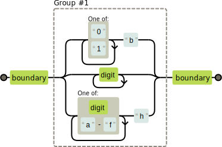

Capítulo 9

# Expressões Regulares

> "Algumas pessoas, quando confrontadas com um problema, pensam "Eu sei, terei que usar expressões regulares." Agora elas têm dois problemas.
>
> — Jamie Zawinski

> "Yuan-Ma disse, 'Quando você serra contra o sentido da madeira, muita força será necessária. Quando você programa contra o sentido do problema, muito código será necessário'
>
> — Mestre Yuan-Ma, The Book of Programming

A maneira como técnicas e convenções de programação sobrevivem e se disseminam, ocorrem de um modo caótico, evolucionário. Não é comum que a mais agradável e brilhante vença, mas sim aquelas que funcionam bem com o nicho ou as que aparentam ser integradas com outra tecnologia de sucesso.

Neste capítulo, discutiremos uma dessas tecnologias, expressões regulares. Expressões regulares são um modo de descrever padrões nos dados de uma *string*. Eles formam uma pequena linguagem à parte, que inclui JavaScript e várias outras linguagens e sistemas.

Expressões regulares são ao mesmo tempo, estranhas e extremamente úteis. Sua sintaxe é enigmática é a interface que o
JavaScript oferece para elas é desajeitada. Mas elas são uma ferramenta poderosa utilizada para inspecionar e processar *strings*. A compreensão adequada das expressões regulares fará de você um programador mais eficaz.  

----

## Criando uma Expressão Regular

Uma expressão regular é um tipo de objeto. Ele pode ser construído com o construtor *RegExp* ou escrito como um valor literal, encapsulando o padrão com o caractere barra ('/').

```js
let re1 = new RegExp("abc");
let re2 = /abc/;
```

Ambos os objetos acima representam o mesmo padrão: um caractere "a" seguido de um caractere "b" e depois de um caractere "c".

Ao usarmos o construtor *RegExp*, o padrão é escrito como uma *string* normal, de modo que as regras normais se aplicam para barras invertidas.

A segunda notação, onde o padrão está entre barras, trata as barras invertidas de maneira um pouco diferente. Primeiro, como uma barra encerra o padrão, é necessário colocarmos uma barra invertida antes de inserirmos qualquer barra que queremos que faça parte do padrão. Além disso, as barras invertidas que não pertecem a códigos de caracteres especiais (como \n) serão preservadas ao invés de serem ignoradas, pois fazem parte de *strings* e alteram o significado do padrão. Alguns caracteres, como sinais de interrogação (?) e sinais de soma (+), possuem um significado especial em expressões regulares e devem ser precedidos por barras invertidas para representarem o próprio caractere, e não o comando de expressão regular.

```js
let eighteenPlus = /eighteen\+/;
```

## Teste de correspondências

Expressões regulares possuem vários métodos. O mais simples é o *test*. Se você o passa como uma *string*, ele retorna um booleano que informa se a *string* mantém uma correspondência do padrão na expressão.

```js
console.log( /abc/.test("abcde") );
// → true
console.log( /abc/.test("12345") );
// → false
```

Uma expressão regular que contenha apenas caracteres simples, representa essa mesma sequência de caracteres. Se "abc" existe em qualquer lugar (não apenas no início), *test* retornará verdadeiro.

## Encontrando um conjunto de caracteres

Saber quando uma *string* contém "abc" pode muito bem ser feito usando a função *indexOf*. A diferença das expressões regulares é que elas nos permite usar padrões mais complexos.

Digamos que queremos encontrar qualquer número. Em uma expressão regular, colocar um conjunto de caracteres entre colchetes ("[]") faz com que a expressão encontre qualquer dos caracteres dentro dos colchetes.

Ambas as expressões abaixo encontram todas as *strings* que contem um dígito numérico.

```js
console.log( /[0123456789]/.test("ano 1992") );
// → true
console.log( /[0-9]/.test("ano 1992") );
// → true
```

Dentro de colchetes, um hífen ("-") entre dois caracteres pode ser usado para indicar um conjunto de caracteres, onde a ordem é determinada pelo número *Unicode* do caractere. Os caracteres de "0" a "9" contém todos os dígitos (códigos 48 a 57), então [0-9] e encontra qualquer dígito.

Existem alguns grupos de caracteres de uso comum, que já possuem atalhos inclusos na sintaxe de expressões regulares. Dígitos são um dos conjuntos que você pode escrever usando um atalho, barra invertida seguida de um "d" minúsculo (\d), com o mesmo significado que [0-9].

	- \d	caracteres numéricos
	- \w	caracteres alfanuméricos ("letras")
	- \s	espaços em branco (espaço, tabs, quebras de linha e similares)
	- \D	caracteres que não são dígitos
	- \W	caracteres não alfanuméricos
	- \S	caracteres que não representam espaços
	- . (ponto)	todos os caracteres, exceto espaços


Então você pode registrar um formato de data e hora como "30/01/2003 15:20" com a seguinte expressão:

```js
let dataHora = /\d\d\/\d\d\/\d\d\d\d \d\d:\d\d/;
console.log( dataHora.test("30/01/2003 15:20") );
// → true
console.log( dataHora.test("30/jan/2003 15:20") );
// → false
```

Parece confuso, certo? Muitas barras invertidas sujando a expressão e dificultando compreender qual é o padrão procurado. Veremos mais a frente uma versão melhorada desta expressão.

Estes marcadores de categoria também podem ser usados dentro de colchetes, então [\d.] significa qualquer dígito ou caractere de ponto final. Mas o próprio ponto final, entre colchetes, perde seu significado especial. O mesmo vale para outros caracteres especiais, como +.

Para "inverter" um conjunto de caracteres e buscar tudo menos o que você escreveu no padrão, você pode colocar um acento circunflexo ("^") após abrir colchetes.

```js
let naoBinario = /[^01]/;
console.log( naoBinario.test("01101") );
// → false
console.log( naoBinario.test("01201") );
// → true
```

## Partes repetidas em um padrão

Agora nós já sabemos como encontrar um dígito, mas e se o que queremos é encontrar um número, uma sequência de um ou mais dígitos?

Quando colocamos um sinal de mais ("+") depois de algo em uma expressão regular, indicamos que pode existir mais de um. Então /\d+/ encontra um ou mais dígitos.

```js
console.log( /'\d+'/.test("'123'") );
// → true
console.log( /'\d+'/.test("''") );
// → false
console.log( /'\d*'/.test("'123'") );
// → true
console.log( /'\d*'/.test("''") );
// → true
```

O asterisco ("*") tem um significado similar, mas também permite não encontrar o padrão. Então, algo colocado com um asterisco depois dele, não impede um padrão de ser achado, ele apenas retornará zero resultados se não conseguir encontrar algum texto adequado.

Uma interrogação ("?") define uma parte do padrão de busca como "opcional", o que significa que ele pode ocorrer zero vezes ou apenas uma vez. No exemplo a seguir, é permitido que ocorra o caractere "u", mas o padrão também é encontrado quando ele está ausente.

```js
var neighbor = /neighbou?r/;
console.log(neighbor.test("neighbour"));
// → true
console.log(neighbor.test("neighbor"));
// → true
```

Para permitir que um padrão ocorra um número definido de vezes, use chaves ("{}"). Colocando {4} depois de um elemento do padrão, requer que ele ocorra exatamente 4 vezes. Da mesma maneira, {2,4} é utilizado para definir que ele deve aparecer no mínimo 2 vezes e no máximo 4.

Aqui está outra versão do padrão de data e hora que permite dias, meses e horas com um ou mais dígitos. Também são mais legíveis:

```js
let dataHora = /\d{1,2}\/\d{1,2}\/\d{4} \d{1,2}:\d{2}/;
console.log( dataHora.test("30/1/2003 8:45") );
// → true
```

Também é possível deixar em aberto o número mínimo ou máximo de ocorrências, omitindo o número após a vírgula. Então {5,} significa que deve ocorrer cinco ou mais vezes.

## Agrupando subexpressões

Para usar um operador como "*" ou "+" em mais de um caractere por vez, é necessário o uso de parênteses. Um pedaço de uma expressão regular que é delimitado por parênteses conta como uma única unidade, assim como os operadores aplicados a esse pedaço delimitado.

```js
let cartoonCrying = /boo+(hoo+)+/i;
console.log( cartoonCrying.test("Boohoooohoohooo") );
// → true
```

O terceiro e segundo "+" aplicam-se apenas ao segundo *o* em *boo hoo*, respectivamente.  O terceiro "+" se aplica a todo grupo (hoo+), combinando uma ou mais sequências como essa.

O "i" no final da expressão do exemplo acima faz com que a expressão regular seja case-insensitive, permitindo-a encontrar a letra maiúscula "B" na *string* dada, mesmo que a descrição do padrão tenha sido feita em letras minúsculas.

## Resultados e grupos

O método *test* é a maneira mais simples de encontrar correspondências de uma expressão regular. Ela apenas informa se foi encontrado algo e nada mais. Expressões regulares também possuem o método *exec* (executar), que irá retornar *null* quando nenhum resultado for encontrado, e um objeto com informações se encontrar.

```js
let match = /\d+/.exec("one two 100");
console.log(match);
// → ["100"]
console.log(match.index);
// → 8
```
Um objeto retornado pelo método *exec* possui um index de propriedades que informa aonde na *string* o resultado encontrado se inicia. Além disso, o objeto parece (e de fato é) um *array* de *strings*, cujo primeiro elemento é a *string* que foi encontrada. No exemplo anterior, esta é a sequência de dígitos que estávamos procurando.

Valores *string* possuem um método que se comporta de maneira semelhante.

```js
console.log("one two 100".match(/\d+/));
// → ["100"]
```

Quando uma expressão regular contém expressões agrupadas entre parênteses, o texto que corresponde a esses grupos também aparece no *array*. O primeiro elemento sempre é todo o resultado, seguido pelo resultado do primeiro grupo entre parênteses, depois o segundo grupo e assim em diante.

```js
let textoCitado = /'([^']*)'/;
console.log( textoCitado.exec("ela disse 'olá'") );
// → ["'olá'", "olá"]
```

Quando um grupo não termina sendo achado (se por exemplo, possui um sinal de interrogação depois dele), seu valor no array de resultado será undefined. Do mesmo modo, quando um grupo é achado várias vezes, apenas o último resultado encontrado estará no array.

```js
console.log(/bad(ly)?/.exec("bad"));
// → ["bad", undefined]
console.log(/(\d)+/.exec("123"));
// → ["123", "3"]
```

Grupos podem ser muito úteis para extrair partes de uma *string*. Por exemplo, podemos querer não apenas verificar quando uma *string* contém uma data, mas também extraí-la, e construir um objeto que a representa. Se adicionarmos parênteses em volta do padrão de dígitos, poderemos selecionar a data no resultado da função *exec*.

Mas antes, um pequeno desvio, na qual discutiremos a maneira integrada de representar os valores de data e hora em JavaScript.

## O tipo *data*

O JavaScript possui uma classe padrão para representar datas, ou melhor, pontos no tempo. Ele é chamado *Date*. Se você simplesmente criar uma data usando *new*, terá a data e hora atual.

```js
console.log( new Date() );
// → Mon Nov 13 2017 16:19:11 GMT+0300 (BRT)
```

Também é possível criar um objeto para uma hora específica

```js
console.log( new Date(2014, 6, 29) );
// → Tue Jul 29 2014 00:00:00 GMT-0300 (BRT)
console.log( new Date(1981, 6, 29, 18, 30, 50) );
// → Wed Jul 29 1981 18:30:50 GMT-0300 (BRT)
```

O JavaScript utiliza uma convenção onde a numeração dos meses se inicia em zero (então Dezembro é 11), mas os dias iniciam-se em um. É bem confuso e bobo, então, tenha cuidado.

Os últimos quatro argumentos (horas, minutos, segundos e milissegundos) são opcionais, e assumem o valor de zero se não forem fornecidos.

Internamente, objetos do tipo data são armazenados como o número de milissegundos desde o início de 1970, no fuso horário UTC. Ele segue uma convenção definida pela "hora do Unix", que foi inventada nessa época. Você pode usar números negativos para tempos anteriores a 1970. Usar o método *getTime* em uma data retorna esse número, e ele é bem grande, como deve imaginar.

```js
console.log( new Date(2014, 2, 21).getTime() );
// → 1395370800000
console.log( new Date( 1395370800000 ) );
// → Fri Mar 21 2014 00:00:00 GMT-0300 (BRT)
```

Quando fornecemos apenas um argumento ao construtor do *Date*, ele é tratado como se fosse um número de milissegundos. Você pode obter a contagem atual de milissegundos criando um novo objeto *Date* usando o método *getTime* ou chamando a função *Date.now*.

Objetos *Date* possuem métodos como *getFullYear*, *getMonth*, *getDate*, *getHours*, *getMinutes* e *getSeconds* para extrair seus componentes. Além de *getFullYear*, também há *getYear* que retorna o ano menos 1900 (98 ou 119) o que é quase inútil.

Então agora, ao colocarmos parênteses em volta das partes que nos interessam, podemos facilmente extrair uma data de uma *string*.

```js
function buscaData(string) {
  let [_, month, day, year] = 
  /(\d{1,2})\/(\d{1,2})\/(\d{4})/.exec(string);
  return new Date(year, month -1, day);
}
console.log( buscaData("21/1/2014") );
// → Fri Feb 21 2014 00:00:00 GMT-0300 (BRT)
```
O _ (underline) é ignorado e usado apenas para pular o elemento completo de correspondência no *array* retornado por *exec*.

## Limites de palavra e *string*

Infelizmente, a função *buscaData* acima também irá extrair a data absurda 00-1-3000 da *string* "100-1-30000", um resultado pode acontecer em qualquer lugar da *string* fornecida, então, nesse caso, vai encontrar no segundo caractere e terminar no penúltimo.

Se quisermos nos assegurar que a busca seja em todo a *string*, podemos adicionar os marcadores  "^" e "$". O acento circunflexo corresponde ao início da *string* fornecida, enquanto a sifrão  corresponde ao final dela. Então /^\d+$/ encontra apenas em uma *string* feita de um ou mais dígitos, /^!/ encontra qualquer *string* que começa com sinal de exclamação e /x^/ não corresponde a nenhuma *string* (não pode haver um x antes do início da *string*).

Se, por outro lado, queremos ter certeza que a data inicia e termina no limite da palavra, usamos o marcador \b. Um limite de palavra pode ser no início ou fim de uma *string* ou qualquer ponto nela em que tenha um caractere de palavra de um lado e um caractere que não seja uma palavra de outro (como em \w).

```js
console.log( /cat/.test("concatenate"));
// → true
console.log( /\bcat\b/.test("concatenate"));
// → false
```

Note que esses marcadores de limite não cobrem nenhum caractere real, eles apenas asseguram que a expressão regular corresponda apenas quando uma certa condição for mantida no lugar onde ele aparece no padrão.

## Padrões de escolha

Digamos que queremos saber se um pedaço do texto contém não apenas um número, mas um número seguido por uma das palavras "porco", "vaca", "galinha" ou seus plurais também.

Podemos escrever três expressões regulares, e testar cada uma, mas existe uma maneira mais simples. O caractere pipe ( | ) indica uma opção entre o padrão à esquerda ou a direita. Então podemos fazer:

```js
let contagemAnimal = /\b\d+ (porco|vaca|galinha)s?\b/;
console.log( contagemAnimal.test("15 porcos") );
// → true
console.log( contagemAnimal.test("15 porcosgalinhas"));
// → false
```

Parênteses podem ser usados para limitar a que parte do padrão que o pipe ( | ) se aplica, e você pode colocar vários desses operadores lado a lado para expressar uma escolha entre mais de dois padrões.

## O mecanismo de correspondência

Conceitualmente, quando usamos *exec* ou *test*, o mecanismo de expressão regular busca uma correspondência em sua *string*, tentando corresponder à expressão do início da *string* primeiro, depois do segundo caractere e assim por diante, até encontrar uma correspondência ou chegar ao fim da *string*. Ele retornará a primeira correspondência que pode ser encontrada ou não encontrará nenhuma correspondência.

Para fazer a correspondência atual, o mecanismo trata a expressão regular como um diagrama de fluxo. Este é o diagrama para a expressão do conjunto de animais do exemplo anterior:


Uma *string* corresponde à expressão se um caminho do início (esquerda) até o final (direita) do diagrama puder ser encontrado, com uma posição inicial e final correspondente, de modo que cada vez que passar em uma caixa, verificamos que a posição atual na sequência corresponde ao elemento descrito nela, e, para os elementos que correspondem caracteres reais (menos os limites de palavra), continue no fluxo das caixas.

Portanto, se tentarmos combinar "os 3 porcos" da posição 4, nosso progresso através do fluxograma ficaria assim:

- Na posição 4, existe um limite de palavra, então passamos a primeira caixa
- Ainda na posição 4, encontramos um dígito, então também podemos passar a segunda caixa.
- Na posição 5, poderíamos voltar para antes da segunda caixa (dígitos), ou avançar através da caixa que contém um único caractere de espaço. Há um espaço aqui, não um dígito, por isso escolhemos o segundo caminho.
- Estamos agora na posição 6 (o início de "porcos") e na divisão entre três caminhos do diagrama. Nós não temos "vaca" ou "galinha" aqui, mas nós temos "porco", por isso tomamos esse caminho.
- Na posição 9, depois da divisão em três caminhos, poderíamos também ignorar o "s" e ir direto para o limite da palavra, ou achar o "s" primeiro. Existe um "s", não um limite de palavra, então passamos a caixa "s".
- Estamos na posição 10 (final da string) e só podemos achar um limite de palavra. O fim de uma *string* conta como um limite de palavra, de modo que passamos através da última caixa e combinamos com sucesso a *string*.

## Retrocedendo

A expressão regular /\b([01]+b|\d+|[\da-f]h)\b/ encontra um número binário seguido por um "b", um número decimal, sem um caractere de sufixo, ou um número hexadecimal (de base 16, com as letras "a" a "f" para os algarismos de 10 a 15), seguido por um "h". Este é o diagrama equivalente:



Ao buscar esta expressão, muitas vezes o ramo superior será percorrido, mesmo que a entrada não contenha realmente um número binário. Quando busca a *string* "103", é apenas no "3" que torna-se claro que estamos no local errado. A *string* é buscada não apenas no ramo que se está executando.

É o que acontece se a expressão retroage. Quando entra em um ramo, ela guarda em que ponto aconteceu (nesse caso, no início da *string*, na primeira caixa do diagrama), então ela retrocede e tenta outro ramo do diagrama se o atual não encontra nenhum resultado. Então para a *string* "103", após encontrar o caractere "3", ela tentará o segundo ramo do número decimal. E este, encontra um resultado.

Quando mais de um ramo encontra um resultado, o primeiro (na ordem em que foi escrito na expressão regular) será considerado.

Retroceder acontece também, de maneiras diferentes, quando buscamos por operadores repetidos. Se buscarmos /^.*x/  em "abcxe", a parte ".*" tentará achar toda a *string*. Depois, tentará achar apenas o que for seguido de um "x", e não existe um "x" no final da *string*. Então ela tentará achar desconsiderando um caractere, e outro, e outro. Quando acha o "x", sinaliza um resultado com sucesso, da posição 0 até 4.

É possível escrever expressões regulares que fazem muitos retrocessos. O Problema ocorre quando um padrão encontra um pedaço da *string* de entrada de muitas maneiras. Por exemplo, se confundimos e escrevemos nossa expressão regular para achar binários e números assim /([01]+)+b/.


Ela tentará achar séries de zeros sem um "b" após elas, depois irá percorrer o circuito interno até passar por todos os dígitos. Quando perceber que não existe nenhum "b", retorna uma posição e passa pelo caminho de fora mais uma vez, e de novo, retrocedendo até o circuito interno mais uma vez. Continuará tentando todas as rotas possíveis através destes dois *loops*, em todos os caracteres. Para *strings* mais longas o resultado demorará praticamente para sempre.


## O método _replace_

*Strings* possuem o método *replace*, que pode ser usado para substituir partes da *string* com outra *string*.

```js
console.log("papa".replace("p", "m"));
// → mapa
```

O primeiro argumento também pode ser uma expressão regular, que na primeira ocorrência de correspondência será substituída. Quando a opção "g" ("global") é adicionada à expressão, todas as ocorrências serão substituídas, não só a primeira.

```js
console.log("Borobudur".replace(/[ou]/, "a"));
// → Barobudur
console.log("Borobudur".replace(/[ou]/g, "a"));
// → Barabadar
```

Seria melhor se essa opção fosse feita através de outro argumento adicional para substituir ou fornecer um método diferente, um *replaceAll*. Mas infelizmente a escolha depende de uma propriedade de expressão regular. 

A verdadeira utilidade do uso de expressões regulares com o método *replace* é a opção de fazer referências aos grupos combinados através da *string*. Por exemplo, se temos uma *string* longa com nomes de pessoas, uma por linha, no formato "Sobrenome, Nome" e queremos trocar essa ordem e remover a vírgula, para obter o formato "Nome Sobrenome", podemos usar o seguinte código:

```js
console.log("Lisvok, Barbara\nMcCarthy, John\nWadler, Phillip".replace(/([\w ]+), ([\w ]+)/g, "$2 $1"));
// → Barbara Lisvok
//   John McCarthy
//   Philip Wadler
```

O "$1" e "$2" na *string* de substituição referem-se as partes entre parênteses no padrão. "$1" será substituído pelo texto encontrado no primeiro grupo entre parênteses e "$2" pelo segundo, e assim em diante, até "$9". A correspondência inteira pode ser referenciada com $&.

Também é possível passar uma função, em vez de uma *string* no segundo argumento do método *replace*. Para cada substituição, a função será chamada com os grupos encontrados (assim como o padrão) como argumentos, e o valor retornado pela função será inserido na nova *string*.

Aqui está um pequeno exemplo:

```js
let s = "the cia and fbi";
console.log(s.replace(/\b(fbi|cia)\b/g,
  str => str.toUpperCase()));
// → the CIA and FBI
```

E outro exemplo mais interessante:

```js
let stock = "1 lemon, 2 cabbages, and 101 eggs";
function minusOne(match, amount, unit) {
  amount = Number(amount) - 1;
  if (amount == 1) // only one left, remove the 's'
	unit = unit.slice(0, unit.length - 1);
  else if (amount == 0)
	amount = "no";
  return amount + " " + unit;
}
console.log(stock.replace(/(\d+) (\w+)/g, minusOne));
// → no lemon, 1 cabbage, and 100 eggs
```

Ele pega a *string*, encontra todas as ocorrências de um número seguido por uma palavra alfanumérica e retorna uma nova *string* onde em cada ocorrência é diminuído por um.

O grupo (\d+) finaliza o argumento *amount* da função e o (\w+) limita a unidade. A função converte o valor em um número, desde que encontrado, \d+ faz ajustes caso exista apenas um ou zero esquerda.

## Quantificador / Greed

É simples usar o método *replace* para escrever uma função que remove todos os comentários de um pedaço de código JavaScript. Veja uma primeira tentativa

```js
function stripComments(code) {
  return code.replace(/\/\/.*|\/\*[\w\W]*\*\//g, "");
}
console.log(stripComments("1 + /* 2 */3"));
// → 1 + 3
console.log(stripComments("x = 10;// ten!"));
// → x = 10;
console.log(stripComments("1 /* a */+/* b */ 1"));
// → 1  1
```

A parte [\w\W] é uma maneira (feia) de encontrar qualquer caractere. Lembre-se que um ponto não encontra um caractere de quebra de linha / linha nova. Comentários podem conter mais de uma linha, então não podemos usar um ponto aqui. Achar algo que seja ou não um caractere de palavra, irá encontrar todos os caracteres possíveis.

Mas o resultado do último exemplo parece errado. Porque?

A parte ".*" da expressão, como foi escrita na seção "Retrocedendo", acima, encontrará primeiro tudo que puder e depois, se falhar, volta atrás e tenta mais uma vez a partir daí. Nesse caso, primeiro procuramos no resto da _string_ e depois continuamos a partir daí. Encontrará uma ocorrência de "*/" depois volta quatro caracteres e acha um resultado. Isto não era o que desejávamos, queríamos um comentário de uma linha, para não ir até o final do código e encontrar o final do último comentário.

Existem duas variações de operadores de repetição em expressões regulares ('+', '*', e '{}'). Por padrão, eles quantificam, significa que eles encontram o que podem e retrocedem a partir daí. Se você colocar uma interrogação depois deles, eles se tornam _non_greedy_, e começam encontrando o menor grupo possível e o resto que não contenha o grupo menor.

E é exatamente o que queremos nesse caso. Com o asterisco encontramos os grupos menores que tenham "*/" no fechamento, encontramos um bloco de comentários e nada mais.

```js
function stripComments(code) {
  return code.replace(/\/\/.*|\/\*[\w\W]*?\*\//g, "");
}
console.log(stripComments("1 /* a */+/* b */ 1"));
// → 1 + 1
```

## Criando objetos RegExp dinamicamente

Existem casos onde você pode não saber o padrão exato que você precisa quando escreve seu código. Digamos que você queira buscar o nome de um usuário em um pedaço de texto e colocá-lo entre caracteres "_" para destacá-lo. O nome será fornecido apenas quando o programa estiver sendo executado, então não podemos usar a notação de barras para criar nosso padrão.

Mas podemos construir uma _string_ e usar o construtor _RegExp_ para isso. Por exemplo:

```js
var name = "harry";
var text = "Harry is a suspicious character.";
var regexp = new RegExp("\\b(" + name + ")\\b", "gi");
console.log(text.replace(regexp, "_$1_"));
// → _Harry_ is a suspicious character.
```

Ao criar os marcos de limite "\b, usamos duas barras invertidas, porque estamos escrevendo-os em uma _string_ normal, não uma expressão regular com barras. As opções (global e case-insensitive) para a expressão regular podem ser inseridas como segundo argumento para o construtor RegExp.

Mas e se o nome for "dea+hl[]rd" porque o usuário é um adolescente nerd? Isso irá gerar uma falsa expressão regular, por conter caracteres comando, que irá gerar um resultado estranho

Para contornar isso, adicionamos contrabarras antes de qualquer caractere que não confiamos. Adicionar contrabarras antes de qualquer caractere alfabético é uma má idéia, porque coisas como "\b" ou "\n" possuem significado para uma expressão regular. Mas escapar tudo que não for alfanumérico ou espaço é seguro.

```js
var name = "dea+hl[]rd";
var text = "This dea+hl[]rd guy is quite annoying.";
var escaped = name.replace(/[^\w\s]/g, "\\$&");
var regexp = new RegExp("\\b(" + escaped + ")\\b", "gi");
console.log(text.replace(regexp, "_$1_"));
// → This _dea+hl[]rd_ guy is quite annoying.
```

O marcador "$&" na _string_ de substituição age como se fosse "$1", mas será substituído em dodos os resultados ao invés do grupo encontrado.

## O método _search_

O método _indexOf_ em _strings_ não pode ser invocado com uma expressão regular. Mas existe um outro método, _search_, que espera como argumento uma expressão regular, e como o _indexOf_, retorna o índice do primeiro resultado encontrado ou -1 se não encontra.

```js
console.log("  word".search(/\S/));
// → 2
console.log("    ".search(/\S/));
// → -1
```

Infelizmente, não existe um modo de indicar onde a busca deve começar, com um índice (como o segundo argumento de _indexOf_), o que seria muito útil.

## A propriedade _lastIndex_

O método _exec_ também não possui um modo conveniente de iniciar a busca a partir de uma determinada posição. Mas ele fornece um método não muito prático.

Expressões regulares possuem propriedades (como _source_ que contém a _string_ que originou a expressão). Uma dessas propriedades, _lastIndex_, controla, em algumas circunstâncias, onde a busca começará.

Essas circunstâncias são que a expressão regular precisa ter a opção "global" (g) habilitada e precisa ser no método _exec_. Novamente, deveria ser da mesma maneira que permitir um argumento extra para o método _exec_, mas coesão não é uma característica que define a sintaxe de expressões regulares em JavaScript

```js
var pattern = /y/g;
pattern.lastIndex = 3;
var match = pattern.exec("xyzzy");
console.log(match.index);
// → 4
console.log(pattern.lastIndex);
// → 5
```

A propriedade _lastIndex_ é atualizada ao ser executada após encontrar algo. Quando não encontra nada, _lastIndex_ é definida como zero, que também é o valor quando uma nova expressão é construída.

Quando usada uma expressão regular global para múltiplas chamadas ao método _exec_, esta mudança da propriedade _lastIndex_ pode causar problemas, sua expressão pode iniciar por acidente em um índice deixado na ultima vez que foi executada.

Outro efeito interessante da opção global é que ela muda a maneira como o método _match_ funciona em uma _string_. Quando chamada com uma expressão global, em vez de retornar um array semelhante ao retornado pelo _exec_, _match_ encontrará todos os resultados do padrão na _string_ e retornará um array contendo todas as _strings_ encontradas.

```js
console.log("Banana".match(/an/g));
// → ["an", "an"]
```

Então tenha cuidado com expressões regulares globais. Os casos em que são necessárias - chamadas para substituir e lugares onde você deseja usar explicitamente _lastIndex_ - normalmente são os únicos lugares onde você deseja utilizá-las.

Um padrão comum é buscar todas as ocorrências de um padrão em uma _string_, com acesso a todos os grupos encontrados e ao índice onde foram encontrados, usando _lastIndex_ e _exec_.

```js
var input = "A text with 3 numbers in it... 42 and 88.";
var re = /\b(\d+)\b/g;
var match;
while (match = re.exec(input))
  console.log("Found", match[1], "at", match.index);
// → Found 3 at 12
//   Found 42 at 31
//   Found 88 at 38
```

Usa-se o fato que o valor de uma expressão de definição ('=') é o valor assinalado. Então usando-se `match = re.exec(input)` como a condição no bloco `while`, podemos buscar no início de cada iteração.

## Analisando um arquivo .ini

Agora vamos ver um problema real que pede por uma expressão regular. Imagine que estamos escrevendo um programa que coleta informação automaticamente da internet dos nossos inimigos. (Não vamos escrever um programa aqui, apenas a parte que lê o arquivo de configuração, desculpe desapontá-los). Este arquivo tem a seguinte aparência:

```
searchengine=http://www.google.com/search?q=$1
spitefulness=9.7

; comments are preceded by a semicolon...
; these are sections, concerning individual enemies
[larry]
fullname=Larry Doe
type=kindergarten bully
website=http://www.geocities.com/CapeCanaveral/11451

[gargamel]
fullname=Gargamel
type=evil sorcerer
outputdir=/home/marijn/enemies/gargamel
```

As regras exatas desse formato (que é um formato muito usado, chamado arquivo .ini) são as seguintes:

- Linhas em branco e linhas iniciadas com ponto e vírgula são ignoradas.
- Linhas entre colchetes "[ ]" iniciam uma nova seção.
- Linhas contendo um identificador alfanumérico seguido por um caractere = adicionam uma configuração à seção atual.
- Qualquer outra coisa é inválida.

Nossa tarefa é converter uma _string_ como essa em um _array_ de objetos, cada uma com um nome e um _array_ de pares nome/valor. Precisaremos de um objeto para cada seção e outro para as configurações de seção.

Já que o formato precisa ser processado linha a linha, dividir em linhas separadas é um bom começo. Usamos o método _split_ antes para isso, _string.split("\n")_. Entretanto alguns sistemas operacionais não usam apenas um caractere de nova linha para separar linhas, mas um caractere de retorno seguido por um de nova linha ("_\r\n_").

Desse modo o método _split_ ,em uma expressão regular com _/\r?\n/_ permite separar os dois modos, com "_\n_"e "_\r\n_" enre linhas.

```js
function parseINI(texto) {
  var categorias = [];
  function novaCategoria(nome) {
	var categ = {nome: nome, fields: []};
	categorias.push(categ);
	return categ;
  }
  var categoriaAtual = novaCategoria("TOP");

  texto.split(/\r?\n/).forEach(function(linha) {
	var encontrados;
	if (/^\s*(;.*)?$/.test(linha))
	  return;
	else if (encontrados = linha.encontrados(/^\[(.*)\]$/))
	  categoriaAtual = novaCategoria(encontrados[1]);
	else if (encontrados = linha.encontrados(/^(\w+)=(.*)$/))
	  categoriaAtual.fields.push({nome: encontrados[1],
								   value: encontrados[2]});
	else
	  throw new Error("Linha '" + linha + "' is invalid.");
  });

  return categorias;
}
```

O código percorre cada linha no arquivo. Ele mantém um objeto "categoria atual", e quando encontra um diretiva normal, adiciona ela ao objeto. Quando encontra uma linha que inicia uma nova categoria, ela troca a categoria atual pela nova, para adicionar as diretivas seguintes. Finalmente, retorna um _array_ contendo todas as categorias que encontrou.

Observe o uso recorrente de _ˆ_ e _$_ para certificar-se que a expressão busca em toda a linha, não apenas em parte dela. Esquecer isso é um erro comum, que resulta um código que funciona mas retorna resultados estranhos para algumas entradas.

A expressão _/^\s*(;.*)?$/_ pode ser usada para testar linhas que podem ser ignoradas. Entende como funciona? A parte entre parênteses irá encontrar comentários e o _?_ depois certificará que também encontrará linhas apenas com espaços em branco.

O padrão _if (encontrados = texto.match(...))_ é parecido com o truque que foi usado como definição do _while_ antes. Geralmente não temos certeza se a expressão encontrará algo. Mas você só deseja fazer algo com o resultado se ele não for nulo, então você precisa testar ele antes. Para não quebrar a agradável sequencia de _ifs_ podemos definir o resultado a uma variável para o teste, e fazer a busca e testes em uma única linha.

## Caracteres internacionais

Devido a uma implementação inicial simplista e o fato que esta abordagem simplista mais tarde foi gravada em pedra como comportamento padrão, expressões regulares do JavaScript são um pouco estúpidas sobre caracteres que não parecem na língua inglesa. Por exemplo, "caracteres palavra", nesse contexto, atualmente significam apenas os 26 caracteres do alfabeto latino. Coisas como "é" ou "β", que definitivamente são caracteres de palavras, não encontrarão resultados com _\w_ (e serão encontradas com o marcador de letras maiúsculas _\W_).

Devido a um estranho acidente histórico, _\s_ (espaço em branco) é diferente, e irá encontrar todos os caracteres que o padrão Unicode considera como espaço em branco, como espaços sem quebra ou o separador de vogais do alfabeto Mongol.

Algumas implementações de expressões regulares em outras linguagens de programação possuem uma sintaxe para buscar conjuntos específicos de caracteres Unicode, como todas as maiúsculas, todos de pontuação, caracteres de controle ou semelhantes. Existem planos para adicionar esse suporte ao JavaScript, mas infelizmente parece que isso não acontecerá tão cedo.

## Uma ou mais ocorrências do padrão

Expressões regulares são objetos que representam padrões em _strings_. Eles usam sua própria sintaxe para expressar esses padrões.

	/abc/	Sequência de caracteres
	/[abc]/	Qualquer caractere do conjunto
	/[^abc]/	Qualquer caractere que não seja do conjunto
	/[0-9]/	Qualquer caractere no intervalo de caracteres
	/x+/	Uma ou mais ocorrências do padrão
	/x+?/	Uma ou mais ocorrências do padrão, não obrigatório
	/x*/	Zero ou mais ocorrências
	/x?/	Zero ou uma ocorrência
	/x{2,4}/	Entre duas e quatro ocorrências
	/(abc)+/	Agrupamento
	/a|b|c/	Padrões alternativos
	/\d/	Caracteres dígitos
	/\w/	Caracteres alfanuméricos ("caracteres palavra")
	/\s/	caracteres espaço em branco
	/./	Todos caracteres exceto quebras de linha
	/\b/	Limite de palavra
	/^/	Início da entrada
	/$/	Final da Entrada

Uma expressão regular possui um método _test_ para testar quando um padrão é encontrado em uma _string_, um método _exec_ que quando encontra um resultado retorna um _array_ com todos os grupos encontrados e uma propriedade _index_ que indica onde o resultado inicia.

_Strings_ possuem um método _match_ para testá-las contra uma expressão regular e um método _search_ para buscar por um resultado. O método _replace_  pode substituir resultados encontrados por um padrão. Como alternativa, uma função pode ser passada para montar o texto que será substituído de acordo com que foi achado.

Expressões regulares podem ter opções configuradas (_flags_), que são escritas após o fechamento da barra. A opção "_i_" faz a busca sem se importar se é maiúscula ou minúscula, a opção "_g_" faz a busca global, que, entre outras coisas, faz o método _replace_ substituir todas as ocorrências, em vez de só a primeira.

O construtor _RegExp_ pode ser usado para criar uma expressão regular dinâmica a partir de uma _string_.

Expressões regulares são uma ferramenta precisa mas com um manuseio estranho. Elas simplificarão muito algumas tarefas simples, mas rapidamente se tornarão inviáveis quando aplicadas a tarefas mais complexas. Saber quando usá-las é útil. Parte do conhecimento de saber __quando__ usá-las é o conhecimento de saber __como__ usá-las e quando desistir do seu uso e procurar uma abordagem mais simples.

## Exercícios

É quase inevitável que, no decorrer do trabalho, você irá ficar confuso e frustado por algum comportamento estranho de uma expressão regular. O que ajuda às vezes é colocar a sua expressão em uma ferramenta online como [debuggex.com](debuggex.com), para ver se a visualização corresponde à sua intenção inicial, e rapidamente ver como ela responde à várias _strings_ diferentes.

## Regexp golf

"Golf de Código" é um termo usado para o jogo de tentar escrever um programa com o menor número de caracteres possível. Parecido, o regexp golf é a prática de escrever pequenas expressões regulares para achar um determinado padrão (e apenas esse padrão).

Escreva uma expressão regular que testa quando qualquer das _sub-strings_ dadas ocorre em um texto. A expressão regular deverá achar apenas _strings_ contendo uma das _sub-strings_ dadas. Não se preocupe com limites de palavras a não ser que seja explicitamente pedido. Quando a sua expressão funcionar, veja se consegue fazê-la menor.

	"car" e "cat"
	"pop" e "prop"
	"ferret", "ferry", e "ferrari"
	Qualquer palavra terminando em "ious"
	Um espaço em branco seguido por um ponto, vírgula, dois-pontos, ou ponto-e-vírgula
	Uma palavra com mais de seis letras
	Uma palavra sem a letra "e"

Consulte a tabela no capítulo Sumário para achar algo rapidamente.
Teste cada solução encontrada com alguns testes com _strings_.

```js
// Fill in the regular expressions

verify(/.../,
	   ["my car", "bad cats"],
	   ["camper", "high art"]);

verify(/.../,
	   ["pop culture", "mad props"],
	   ["plop"]);

verify(/.../,
	   ["ferret", "ferry", "ferrari"],
	   ["ferrum", "transfer A"]);

verify(/.../,
	   ["how delicious", "spacious room"],
	   ["ruinous", "consciousness"]);

verify(/.../,
	   ["bad punctuation ."],
	   ["escape the dot"]);

verify(/.../,
	   ["hottentottententen"],
	   ["no", "hotten totten tenten"]);

verify(/.../,
	   ["red platypus", "wobbling nest"],
	   ["earth bed", "learning ape"]);


function verify(regexp, yes, no) {
  // Ignore unfinished tests
  if (regexp.source == "...") return;
  yes.forEach(function(s) {
	if (!regexp.test(s))
	  console.log("Failure to match '" + s + "'");
  });
  no.forEach(function(s) {
	if (regexp.test(s))
	  console.log("Unexpected match for '" + s + "'");
  });
}
```

## Estilo de aspas

Imagine que você escreveu um texto e usou aspas simples por toda parte. Agora você deseja substituir todas que realmente possuem algum texto com aspas duplas, mas não as usadas em contrações de texto com _aren't).

Pense em um padrão que faça distinção entre esses dois usos de aspas e faça uma chamada que substitua apenas nos lugares apropriados.

```js
var text = "'I'm the cook,' he said, 'it's my job.'";
// Altere esta chamada
console.log(text.replace(/A/, "B"));
// → "I'm the cook," he said, "it's my job."
```

**Dicas**

A solução mais óbvia é substituir apenas as aspas que não estão cercadas de caracteres de palavra. A primeira expressão vem à mente é _/\W'\W/_, mas é preciso cuidado para lidar com o início da _string_ corretamente. Isso pode ser feito usando os marcadores "_ˆ_" e "_$_", como em _/(\W|^)'(\W|$)/_.

### Novamente números

Séries de dígitos podem ser usados pela agradável expressão regular _/\d+/_.

Escreva uma expressão que encontre (apenas) números no estilo JavaScript. Isso significa que precisa suportar um sinal de menor ou maior, opcional, na frente do número, um ponto decimal e a notação exponencial —5e-3 ou 1E10—, novamente com o sinal opcional na frente dele.

```js
// Preencha esta expressão regular
var number = /^...$/;

// Tests:
["1", "-1", "+15", "1.55", ".5", "5.", "1.3e2", "1E-4",
 "1e+12"].forEach(function(s) {
  if (!number.test(s))
	console.log("Falhou em achar '" + s + "'");
});
["1a", "+-1", "1.2.3", "1+1", "1e4.5", ".5.", "1f5",
 "."].forEach(function(s) {
  if (number.test(s))
	console.log("Aceitou erroneamente '" + s + "'");
});
```

Dicas

Primeiro, não esqueça da barra invertida em frente ao ponto.

Achar o sinal opcional na frente do número, como na frente do exponencial, pode ser feito com _[+\-]?_ ou _(+|-|)_ (mais, menos ou nada).

A parte mais complicada deste exercício provavelmente é a dificuldade de achar "5." e ".5"  sem achar também o ".". Para isso, achamos que a melhor solução é usar o operador "|" para separar os dois casos, um ou mais dígitos opcionalmente seguidos por um ponto e zero ou mais dígitos, ou um ponto seguido por um ou mais dígitos.

Finalmente, fazer o "e" _case-insensitive_, ou adicional a opção "i" à expressão regular ou usar "_[eE]_ ".
