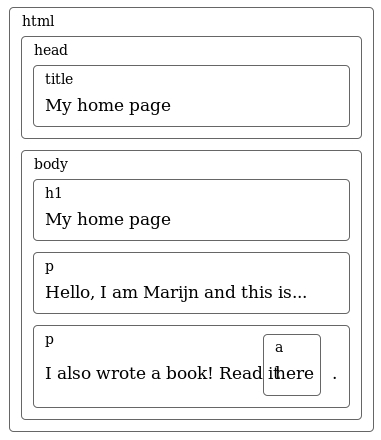
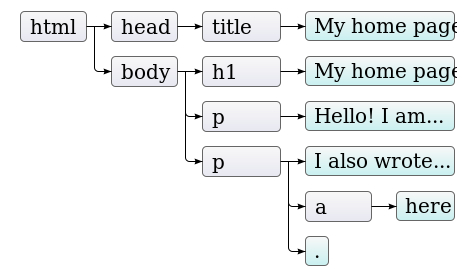
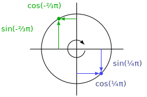

# O Modelo de Objeto de Documentos (DOM)

Quando você abre uma página web em seu navegador, ele resgata o texto em HTML da página e o interpreta, de maneira semelhante ao que nosso interpretador do [Capítulo 11](11-pratica-linguagem-de-programacao.md) fazia. O navegador constrói um modelo da estrutura do documento e depois usa esse modelo para desenhar a página na tela.

Um dos "brinquedos" que um programa em JavaScript possui disponível em sua caixa de ferramentas é essa representação do documento. Você pode lê-la e também alterá-la. Essa representação age como uma estrutura viva de dados: quando modificada, a página na tela é atualizada para refletir as mudanças.

## Estrutura do Documento

Você pode imaginar um documento HTML como um conjunto de caixas aninhadas. Tags como <body> e </body> encapsulam outras tags, as quais, por sua vez, contêm outras tags ou texto. Aqui está o documento de exemplo do último capítulo:

```html
<html>
  <head>
    <title>Minha home page</title>
  </head>
  <body>
    <h1>Minha home page</h1>
    <p>Olá, eu sou Marijn e essa é minha home page.</p>
    <p>Eu também escrevi um livro! leia-o
      <a href="http://eloquentjavascript.net">aqui</a>.</p>
  </body>
</html>
```

Essa página tem a seguinte estrutura:



A estrutura de dados que o navegador usa para representar o documento segue este formato. Para cada caixa há um objeto, com o qual podemos interagir para descobrir coisas como: qual tag HTML ele representa e quais caixas e textos ele contém. Essa representação é chamada de Modelo de Objeto de Documentos, também apelidada de DOM  (do inglês *Document Object Model*).

A variável global `document` nos dá acesso à esses objetos. Sua propriedade `documentElement` se refere ao objeto que representa a tag <html>. Essa propriedade também nos fornece as propriedades `head` e `body`, alocando objetos para esses elementos.

## Árvores

Relembre-se da sintaxe das árvores do [Capítulo 11](11-pratica-linguagem-de-programacao.md) por um momento. A estrutura delas é incrivelmente similar a estrutura de um documento do navegador. Cada nó pode se referir a outros nós "filhos", os quais podem ter, por sua vez, seus próprios "filhos". Esse formato é típico de estruturas aninhadas, nas quais os elementos podem conter subelementos que são similares à eles mesmos.

Nós chamamos uma estrutura de dados de uma *árvore* quando ela possui uma estrutura de galhos, sem ciclos (um nó não deve conter ele mesmo, direta ou indiretamente) e possui uma única, e bem definida raiz. No caso do DOM, document.documentElement representa a raiz.

Árvores aparecem muito em Ciências da Computação. Além de representar estruturas recursivas como documentos HTML ou programas, elas também são comumente usadas para manter conjuntos ordenados de dados, pois elementos podem ser tipicamente encontrados ou inseridos de maneira mais eficiente em uma árvore ordenada do que em um conjunto (ou "array") plano ordenado.

Uma árvore típica possui diferentes tipos de nós. A árvore de sintaxe para a [Egg Language](11-pratica-linguagem-de-programacao.md) continha variáveis, valores e nós de aplicação. Nós de aplicação sempre têm filhos, diferentemente das variáveis e valores, que eram *folhas*, ou seja, nós sem filhos.

O mesmo vale para o DOM. Nós de elementos comuns, os quais representam tags HTML, determinam a estrutura do documento. Esses podem possuir nós filhos. Um exemplo de um desses nós é o `document.body`. Alguns desses nós filhos podem ser folhas, assim como fragmentos de texto ou comentários (os quais são escritos entre `<!--` e `-->` em HTML).

Cada objeto que é um nó do DOM tem a propriedade nodeType, a qual contém um código numérico que identifica o tipo do nó. Elementos comuns têm valor 1, o qual também é definido como a propriedade constante `document.ELEMENT_NODE`. Nós de texto representando um intervalo de texto no documento, possuem o valor 3 (document.TEXT_NODE). Comentários têm valor 8 (document.COMMENT_NODE).

Sendo assim, outra maneira de visualizar a árvore do nosso documento é:



Na imagem acima, as folhas são os nós de texto e as setas indicam a relação de pai e filho entre os nós.

## O Padrão

Usar estranhos códigos numéricos para representar tipos de nós não é algo muito ao estilo JavaScript de se fazer. Mais tarde neste capítulo, veremos que outras partes da interface DOM também se sentem estranhas, *não pertencentes*. A razão para isso é que o DOM não foi concebido apenas para uso com o JavaScript, ao invés disso, ele tenta definir uma interface com uma linguagem neutra, a qual pode ser usada por outros sistemas—não somente HTML, mas também XML, o qual é um formato genérico de dados com um sintaxe semelhante ao HTML.

Padrões são geralmente úteis, mas nesse caso, a vantagem (consistência entre diferentes linguagens), não é tão convincente. Possuir uma interface que é corretamente integrada com a linguagem que você está usando vai fazer você economizar mais tempo do que uma interface familiar entre diferentes linguagens.

Como um exemplo dessa integração *pobre*, considere a propriedade `childNodes` que os nós de elementos DOM possuem. Essa propriedade carrega um objeto parecido com um array, com uma propriedade `length` e propriedades identificadas por números para acessar os nós filhos. Mas ele é uma instância do tipo `NodeList`, não um array real, logo ele não possui métodos como `slice` e `forEach`.

Além disso existem outros problemas que são simplesmente ocasionados por um design falho. Por exemplo: não há nenhuma maneira de criar um novo nó e imediatamente adicionar nós filhos ou atributos à ele. Ao invés disso, você precisa primeiro criá-lo, depois adicionar os filhos, um por um, e só então definir os atributos um à um usando *side effects*. Códigos que interagem muito com o DOM tendem à ficar muito longos, repetitivos e feios.

Porém nenhuma dessas falhas é fatal, pois JavaScript nos permite criar nossas próprias abstrações. É fácil escrever algumas funções auxiliares que permitem que você expresse as operações que quer fazer de maneira mais curta. Na verdade, muitas *libraries* dedicadas à programação em browsers já vêm com essas ferramentas.

## Movendo-se Através da Árvore

Os nós DOM contêm uma variedade de ligações para outros nós próximos. O diagrama a seguir tenta ilustrá-los:


Ainda que o diagrama mostre apenas uma ligação de cada tipo, todo nó possui uma propriedade `parentNode` que aponta para o nó que o contém (seu nó pai). Dessa mesma maneira, todo nó de um elemento (nó do tipo 1) possui a propriedade `childNodes` que aponta para um objeto parecido com um array, o qual contém seus nós filhos.

Em teoria, você pode se mover para qualquer lugar na árvore usando apenas essas ligações entre nós pais e nós filhos, porém o JavaScript também te dá acesso à outras ligações muito convenientes. As propriedades `firstChild` e `lastChild` apontam para o primeiro e último elemento filho, respectivamente, ou então possuem o valor `null` (nulo) para nós sem filhos. Similarmente, `previousSibling` e `nextSibling` apontam para os nós adjacentes, que são nós com o mesmo pai que aparecem imediatamente antes ou depois do nó em questão. No caso de usarmos a propriedade `previousSibling` para um primeiro nó filho, ela irá possuir um valor nulo, o mesmo acontece se usarmos a propriedade `nextSibling` para o último nó filho.

Quando lidamos com uma estrutura de dados aninhada como essa, funções recursivas são geralmente muito úteis. A função abaixo escaneia um documento procurando por nós de texto contendo uma determinada string e retorna `true` quando encontrar um.

```JavaScript
function talksAbout(node, string) {
  if (node.nodeType == document.ELEMENT_NODE) {
    for (var i = 0; i < node.childNodes.length; i++) {
      if (talksAbout(node.childNodes[i], string))
        return true;
    }
    return false;
  } else if (node.nodeType == document.TEXT_NODE) {
    return node.nodeValue.indexOf(string) > -1;
  }


}
console.log(talksAbout(document.body, "book"));
// → true
```

A propriedade `nodeValue` de um nó de texto se refere à string de texto que ele representa.

## Encontrando Elementos

Navegar por essas ligações entre pais, filhos e irmãos pode até ser útil, assim como no exemplo da função acima, a qual passa por todo o documento, mas, se quisermos encontrar um nó específico no documento, é uma má ideia começarmos a busca em `document.body` e seguirmos cegamente um caminho preestabelecido de ligações até finalmente achá-lo. Fazer isso irá formular pressuposições no nosso programa sobre a estrutura precisa do documento—uma estrutura que pode mudar depois. Outro fator complicante é que os nós de texto são criados até mesmo por espaço em branco entre nós. A tag `body` que usamos no começo deste capítulo, por exemplo, não tem apenas três filhos (um `<h1>` e dois `<p>`'s), na verdade ela tem sete: esses três e ainda o espaço antes, depois e entre eles.

Então se quisermos obter o atributo `href` do link naquele documento, nós não queremos dizer algo como "pegue o segundo filho do sexto filho do corpo do documento". Seria muito melhor se pudéssemos dizer "pegue o primeiro link nesse documento". E nós podemos.

```JavaScript
var link = document.body.getElementsByTagName("a")[0];
console.log(link.href);
```

Todos os nós possuem um método `getElementsByTagName`, o qual coleta todos os elementos com o nome passado que são descendentes (filhos diretos ou indiretos) do nó dado e retorna-os no formato de um objeto parecido com um array.

Para encontrar um nó único específico, você pode dar à ele um atributo `id` e usar o método `document.getElementById`.

```html
<p>Minha avestruz Gertrude:</p>
<p></p>

<script>
  var ostrich = document.getElementById("gertrude");
  console.log(ostrich.src);
</script>
```

Um terceiro método, similar a esse, é o `getElementsByClassName`, o qual, assim como `getElementsByTagName`, faz uma busca entre os conteúdos de um nó elemento e retorna todos os elementos que possuem a string passada no seu atributo `class`.

## Alterando o Documento

Quase tudo na estrutura de dados DOM pode ser alterado. Nós de elementos possuem uma variedade de métodos que podem ser usados para mudar seu conteúdo. O método `removeChild` remove um dado nó filho do documento. Para adicionar um filho, nós podemos usar o método `appendChild`, o qual coloca o nó filho no fim da lista de filhos, ou até o método `insertBefore`, que insere um nó passado como primeiro argumento antes do nó passado como segundo argumento.

```html
<p>Um</p>
<p>Dois</p>
<p>Três</p>

<script>
  var paragraphs = document.body.getElementsByTagName("p");
  document.body.insertBefore(paragraphs[2], paragraphs[0]);
</script>
```

Um nó pode existir no documento em apenas um lugar. Sendo assim, inserir o parágrafo "Três" na frente do parágrafo "Um" vai apenas removê-lo do fim do documento e depois inseri-lo na frente, resultando em "Três/Um/Dois". Todas as operações que inserem um nó em algum lugar irão como efeito colateral, fazer com que ele seja removido de sua posição atual (caso ele tenha uma).

O método `replaceChild` é usado para substituir um nó filho por outro. Ele aceita como argumentos dois nós: um novo nó e o nó à ser substituído. O nó substituído deverá ser um filho do elemento com o qual o método é chamado. Note que ambos `replaceChild` e `insertBefore` esperam o seu *novo* nó como primeiro argumento.

## Criando Nós

No exemplo seguinte, nós queremos escrever um script que substitua todas as imagens (tags ``) no documento pelo texto que elas possuem no seu atributo `alt`, o qual especifica uma alternativa textual para representação da imagem.

Isso envolve não só remover as imagens, mas adicionar um novo nó de texto para substituí-las. Para isso, nós usamos o método `document.createTextNode`.

```html
<p>The  in the
  .</p>

<p><button onclick="replaceImages()">Substituir</button></p>

<script>
  function replaceImages() {
    var images = document.body.getElementsByTagName("img");
    for (var i = images.length - 1; i >= 0; i--) {
      var image = images[i];
      if (image.alt) {
        var text = document.createTextNode(image.alt);
        image.parentNode.replaceChild(text, image);
      }
    }
  }
</script>
```

Dada uma string, o método `createTextNode` nos dá um nó do DOM de tipo 3 (um nó de texto), que podemos inserir no nosso documento para que seja mostrado na tela.

O *loop* (ou repetição) que percorre as imagens começa no fim da lista de nós. Isso é necessário porque a lista de nós retornada por um método como `getElementsByTagName` (ou uma propriedade como `childNodes`) é *viva*—isto é, atualizada em tempo real conforme o documento muda. Se nós começássemos pelo início do documento, remover a primeira imagem faria com que a lista perdesse seu primeiro elemento, então na segunda vez que o *loop* se repetisse, quando `i` é um, ele iria parar, pois o comprimento da coleção agora também é um.

Se você quiser um conjunto sólido de nós, em oposição a um conjunto em tempo real, você pode converter o conjunto para um *array* de verdade, chamando o método `slice`.

```JavaScript
var arrayish = {0: "um", 1: "dois", length: 2};
var real = Array.prototype.slice.call(arrayish, 0);
real.forEach(function(elt) { console.log(elt); });
// → um
//   dois
```

Para criar nós comuns de elementos (tipo 1), você pode usar o método `document.createElement`. Esse método pega o nome de uma tag e retorna um novo nó vazio do tipo fornecido.

O exemplo à seguir define uma função `elt`, a qual cria um nó de elemento e trata o resto dos argumentos como filhos para aquele nó. Essa função é depois usada para adicionar uma simples atribuição para uma citação (em inglês, *quote*).

```JavaScript
<blockquote id="quote">
  Nenhum livro pode ser terminado. Enquanto trabalhos nele
  nós aprendemos apenas o suficiente para considerá-lo imaturo
  no momento em que damos as costas a ele.
</blockquote>

<script>
  function elt(type) {
    var node = document.createElement(type);
    for (var i = 1; i < arguments.length; i++) {
      var child = arguments[i];
      if (typeof child == "string")
        child = document.createTextNode(child);
      node.appendChild(child);
    }
    return node;
  }

  document.getElementById("quote").appendChild(
    elt("footer", "—",
        elt("strong", "Karl Popper"),
        ", prefácio da segunda edição de ",
        elt("em", "A Sociedade Aberta e Seus Inimigos"),
        ", 1950"));
</script>
```

## Atributos

Alguns atributos de elementos, como `href` para links, podem ser acessados através de uma propriedade com o mesmo nome do objeto DOM do elemento. Esse é o caso para um conjunto limitado de atributos padrões comumente usados.

HTML permite que você defina qualquer atributo que você queira em nós. Isso pode ser útil, pois pode permitir que você guarde informações extras em um documento. Se você quiser fazer seus próprios nomes de atributos, porém, esses atributos não estarão presentes como uma propriedade no nó do elemento. Ao invés disso, você terá que usar os métodos `getAttribute` e `setAttribute` para trabalhar com eles.

```html
<p data-classified="secret">O código de lançamento é 00000000.</p>
<p data-classified="unclassified">Eu tenho dois pés.</p>

<script>
  var paras = document.body.getElementsByTagName("p");
  Array.prototype.forEach.call(paras, function(para) {
    if (para.getAttribute("data-classified") == "secret")
      para.parentNode.removeChild(para);
  });
</script>
```

Eu recomendo prefixar os nomes dos atributos inventados com `data-`, para certificar-se que eles não irão entrar em conflito com outros atributos.

Como um simples exemplo, nós iremos escrever um "destacador de sintaxe" que procura por tags `<pre>` (tag para "pré-formatado", usado para código ou similares em texto plano) com um atributo `data-language` e tenta destacar as palavras chaves para aquela linguagem.

```JavaScript
function highlightCode(node, keywords) {
  var text = node.textContent;
  node.textContent = ""; // Limpa o nó.

  var match, pos = 0;
  while (match = keywords.exec(text)) {
    var before = text.slice(pos, match.index);
    node.appendChild(document.createTextNode(before));
    var strong = document.createElement("strong");
    strong.appendChild(document.createTextNode(match[0]));
    node.appendChild(strong);
    pos = keywords.lastIndex;
  }
  var after = text.slice(pos);
  node.appendChild(document.createTextNode(after));
}
```

A função `highlightCode` pega um nó `<pre>` e uma expressão regular (com a opção "global" ligada) que identifica as palavras reservadas da linguagem de programação que o elemento contém.

A propriedade `textContent` é usada para pegar todo o texto dentro do nó e depois é definida para uma string vazia, a qual tem o efeito de esvaziar o nó. Nós fazemos um *loop* por todas as ocorrências das palavras chaves da linguagem, e fazemos o texto entre essas ocorrências como nós normais de texto e cercamos as palavras chaves com a tag `<bold>`, fazendo com que elas fiquem em negrito.

Nós podemos sublinhar automaticamente todos os códigos de programas na página fazendo um *looping* entre todos os elementos `<pre>` que possuem o atributo `data-language` e então chamando a função `highlightCode` em cada um e depois aplicando uma expressão regular adequada para a linguagem que se quer destacar.

```JavaScript
var languages = {
  javascript: /\b(function|return|var)\b/g /* … etc */
};

function highlightAllCode() {
  var pres = document.body.getElementsByTagName("pre");
  for (var i = 0; i < pres.length; i++) {
    var pre = pres[i];
    var lang = pre.getAttribute("data-language");
    if (languages.hasOwnProperty(lang))
      highlightCode(pre, languages[lang]);
  }
}
```

Por exemplo:

```JavaScript
<p>Aqui está, a função identidade:</p>
<pre data-language="javascript">
function id(x) { return x; }
</pre>

<script>highlightAllCode();</script>
```

Existe um atributo comumente usado, `class`, o qual é uma palavra reservada na linguagem JavaScript. Por razões históricas—algumas implementações antigas de JavaScript não conseguiam lidar nomes de propriedades que correspondiam a palavras chave ou palavras reservadas da linguagem—a propriedade usada para acessar esse atributo é chamada de `className`. Você também pode acessá-la pelo seu nome real, "`class`", usando os métodos `getAttribute` e `setAttribute`.

## Layout

Você provavelmente notou que tipos diferentes de elementos são dispostos de maneiras diferentes. Alguns, como parágrafos (`<p>`) ou cabeçalhos (`<h1>`), ocupam toda a largura do documento e são mostrados em linhas separadas. Esses são chamados de elementos *bloco*. Outros, como links (`<a>`) ou o elemento `<strong>`, usado no exemplo acima, são mostrados na mesma linha, juntamente com o texto que os cerca. Esses elementos são chamados elementos *inline* (em linha).

Para qualquer documento, navegadores são capazes de computar um layout, o qual dá para cada elemento um tamanho e uma posição baseando-se em seu tipo e conteúdo. Esse layout é depois usado para desenhar o documento na tela.

O tamanho e posição de um elemento pode ser acessado através de JavaScript. As propriedades `offsetWidth` e `offsetHeight` irão fornecer à você o espaço que o elemento ocupa em *pixels*. Um *pixel* é a unidade básica de medida em um navegador e tipicamente corresponde ao menor ponto que sua tela pode mostrar. Do mesmo modo, `clientWidth` e `clientHeight` irão fornecer o espaço *dentro* do elemento, ignorando a largura da borda.

```html
<p style="border: 3px solid red">
  Estou encaixotado em
</p>

<script>
  var para = document.body.getElementsByTagName("p")[0];
  console.log("clientHeight:", para.clientHeight);
  console.log("offsetHeight:", para.offsetHeight);
</script>
```

A maneira mais efetiva de encontrar a posição precisa de um elemento na tela é o método `getBoundingClientRect`. Ele retorna um objeto com as propriedades `top` (topo), `bottom` (baixo), `left` (esquerda) e `right` (direita), que correspondem às posições dos pixels em relação ao canto esquerdo da tela. Se você quiser que eles sejam relativos ao documento como um todo, você deverá adicionar a posição atual de rolagem, encontrada à partir das variáveis globais `pageXOffset` e `pageYOffset`.

Organizar um documento e fazer seu *layout* pode ser muito trabalhoso. Para ganhar velocidade, os motores dos navegadores não fazem uma reorganização do documento imediatamente a cada vez que ele muda, ao invés disso eles esperam o máximo que podem. Quando um programa JavaScript que mudou o documento termina de rodar, o navegador irá ter que computar um novo *layout* para poder mostrar o documento alterado na tela. Quando um programa pede pela posição ou tamanho de algo, lendo propriedades como `offsetHeight` ou chamando `getBoundingClientRect`, prover a ele uma informação correta também requer computar um *layout*.

Um programa que repetidamente alterna entre ler informações sobre a organização (*layout*) do DOM e alterá-lo, força muitas reorganizações e consequentemente compromete o desempenho. O código à seguir mostra um exemplo disso. Ele contém dois programas diferentes que constroem uma linha de "X" caracteres com 2000 pixels de comprimento e mede quanto tempo cada um leva.

```html
<p><span id="one"></span></p>
<p><span id="two"></span></p>

<script>
  function time(name, action) {
    var start = Date.now(); // Tempo atual milissegundos
    action();
    console.log(name, "took", Date.now() - start, "ms");
  }

  time("naive", function() {
    var target = document.getElementById("one");
    while (target.offsetWidth < 2000)
      target.appendChild(document.createTextNode("X"));
  });
  // → naive levou 32 ms

  time("clever", function() {
    var target = document.getElementById("two");
    target.appendChild(document.createTextNode("XXXXX"));
    var total = Math.ceil(2000 / (target.offsetWidth / 5));
    for (var i = 5; i < total; i++)
      target.appendChild(document.createTextNode("X"));
  });
  // → clever levou 1 ms
</script>
```

## Estilizando

Nós vimos que diferentes elementos HTML irão apresentar diferentes comportamentos. Alguns são mostrados como blocos, outros são mostrados em linha. Alguns adicionam um tipo de estilo, como `<strong>` fazendo seu conteúdo ficar em negrito e `<a>` fazendo seu conteúdo azul e sublinhando-o.

A maneira que uma tag `` mostra uma imagem, e a maneira uma tag `<a>` faz com que um link seja acessado quando é clicado, estão intimamente ligadas ao tipo do elemento. Mas o estilo padrão associado à um elemento, assim como a cor de texto ou sublinhado, pode ser mudado por nós. Veja o exemplo abaixo usando a propriedade `style`.

```html
<p><a href=".">Normal link</a></p>
<p><a href="." style="color: green">Link verde</a></p>
```

Um atributo `style` pode conter uma ou mais declarações, as quais são propriedades (como por exemplo `color`) seguidas por dois pontos e um valor (assim como `green`). Caso existam múltiplas declarações, elas deverão ser separadas por pontos e vírgulas. Por exemplo, "`color: red;border:none`"

Existem muitos aspectos que podem ser influenciados através dessa estilização. Por exemplo, a propriedade `display` controla quando um elemento é mostrado como um bloco ou em linha.

```html
Esse texto é mostrado <strong>em linha</strong>,
<strong style="display: block">como um bloco</strong>, e
<strong style="display: none">não é mostrado</strong>.
```

A tag `block` vai acabar em sua própria linha, pois elementos em blocos não são mostrados em linha com texto ao seu redor. A última tag não é mostrada, `display: none` faz com que um elemento seja exibido na tela. Essa é uma maneira de esconder elementos e é comumente preferível à removê-los por completo do documento, tornando mais fácil revelá-los mais tarde.

Código JavaScript pode manipular diretamente o estilo de um elemento através da propriedade `style` do nó. Essa propriedade carrega um objeto que possui todas as propriedades possíveis para o atributo `style`. Os valores dessas propriedades são strings, os quais nós podemos escrever para mudar um aspecto em particular do estilo do elemento.

```html
<p id="para" style="color: purple">
  Texto bonito
</p>

<script>
  var para = document.getElementById("para");
  console.log(para.style.color);
  para.style.color = "magenta";
</script>
```

Alguns nomes de propriedades de estilo contêm traços, como font-family. Devido ao fato desses nomes de propriedades serem estranhos para serem trabalhados em JavaScript (você teria que escrever `style["font-family"]`), os nomes de propriedades no objeto `style`, nestes casos, têm seus traços removidos e a letra após eles é tornada maiúscula (`style.fontFamily`).

## Estilos em Cascata

O sistema de estilos para HTML é chamado de CSS, que é uma abreviação para *Cascading Style Sheets* (Folhas de Estilo em Cascata, em português). Uma folha de estilos é um conjunto de regras de como estilizar os elementos no documento. Ela pode ser fornecida dentro de uma tag `<style>`.

```html
<style>
  strong {
    font-style: italic;
    color: grey;
  }
</style>
<p>Agora <strong>textos com tag strong</strong> são itálicos e cinza.</p>
```

A palavra *cascata* no nome refere-se ao fato de que múltiplas regras são combinadas para produzir o estilo final de um elemento, aplicando-se em "cascata". No exemplo acima, o estilo padrão para as tags `<strong>`, o qual dá à eles `font-weight: bold`, é sobreposto pela regra na tag `<style>`, que adiciona `font-style` e `color`.

Quando múltiplas regras definem um valor para a mesma propriedade, a regra lida mais recentemente tem um nível de preferência maior e vence. Então se a regra na tag `<style>` incluísse `font-weight: normal`, conflitando com a regra `font-weight` padrão, o texto seria normal e não em negrito. Estilos em um atributo `style` aplicados diretamente ao nó possuem maior preferência e sempre vencem.

É possível selecionar outras coisas além de nomes de tags em regras CSS. Uma regra para `.abc` aplica-se para todos os elementos com "abc" no seu atributo classe. Uma regra para `#xyz` aplica-se para o elemento com um atributo `id` de "xyz" (o qual deve ser único dentro do documento).

```css
.subtle {
  color: grey;
  font-size: 80%;
}
#header {
  background: blue;
  color: white;
}
/* Elementos p, com classes a e b, e id main */
p.a.b#main {
  margin-bottom: 20px;
}
```

A regra de preferência favorecendo a regra mais recentemente definida é válida somente quando as regras possuem a mesma especificidade. A especificidade de uma regra é uma medida de o quão precisamente ela descreve os elementos que seleciona, sendo determinada por um número e um tipo (tag, classe ou id) de um aspecto do elemento que requer. Por exemplo, `p.a` é mais específico que apenas um `p` ou apenas um `.a`, então uma regra composta como essa teria preferência.

A notação `p > a {...}` aplica os estilos passados para todas as tags `<a>` que são filhos diretos de tags `<p>`. Do mesmo modo, `p a {...}` aplica-se à todas as tags `<a>` dentro de tags `<p>`, sejam elas filhos diretos ou indiretos.

## Seletores de Busca

Nós não iremos usar muitas folhas de estilo neste livro. Ainda assim, entendê-las é crucial para programar no navegador, explicar todas as propriedades que elas suportam de maneira correta e a interação entre essas propriedades levaria dois ou três livros somente para isso.

A razão principal pela qual eu introduzi a sintaxe de *seletores*—a notação usada em folhas de estilo para definir a qual elemento um conjunto de regras se aplica—é que nós podemos usar essa mesma mini linguagem para definir uma maneira eficaz de encontrar elementos do DOM.

O método querySelectorAll, que é definido em tanto no objeto `document` quanto nos nós de elementos, leva apenas uma string seletora e retorna um objeto parecido um array, contendo todos os elementos que encontra.

```html
<p>Se você sair por aí caçando
  <span class="animal">coelhos</span></p>
<p>E você souber que vai cair</p>
<p>Diga à eles que <span class="character">enquanto fumava narguilé,
  <span class="animal">uma lagarta</span></span></p>
<p>Lhe deu a ordem</p>

<script>
  function count(selector) {
    return document.querySelectorAll(selector).length;
  }
  console.log(count("p"));           // Todos os elementos <p>
  // → 4
  console.log(count(".animal"));     // Classe animal
  // → 2
  console.log(count("p .animal"));   // Animal dentro de <p>
  // → 2
  console.log(count("p > .animal")); // Filhos diretos de <p>
  // → 1
</script>
```

Diferentemente de métodos como `getElementsByTagName`, o objeto retornado por `querySelectorAll` não é "vivo", ou seja, atualizado em tempo real. Ele não irá mudar quando você mudar o documento.

O método `querySelector` (sem a parte `All`) funciona de maneira similar. Ele é útil para quando você quiser um único e específico elemento. Ele irá retornar apenas o primeiro elemento coincidente com a busca ou `null` se nenhum elemento cumprir os critérios de busca.

## Posicionando e Animando

A propriedade de estilo `position` influencia o layout de uma maneira muito poderosa.

Por padrão, essa propriedade tem o valor `static`, significando que o elemento fica em seu lugar "absoluto", estático. Quando essa propriedade é definida como `relative`, o elemento ainda ocupa espaço no documento, mas agora as propriedades `top`e `left` podem ser usadas para movê-lo em relação ao seu lugar original. Quando `position` é definida como `absolute` o elemento é removido do fluxo normal do documento—isso é, não ocupa mais espaço e pode sobrepor outros elementos—e suas propriedades `top` e `left` podem ser usadas para posicioná-lo de maneira absoluta em relação ao canto superior esquerdo do elemento fechado mais próximo cuja propriedade `position` não é estática. Se não houver tal elemento, ele é posicionado em relação ao documento.

Nós podemos usar essa técnica para criar uma animação. O documento abaixo mostra uma foto de um gato que flutua seguindo a forma de uma elipse:

```html
<p style="text-align: center">
  
</p>
<script>
  var cat = document.querySelector("img");
  var angle = 0, lastTime = null;
  function animate(time) {
    if (lastTime != null)
      angle += (time - lastTime) * 0.001;
    lastTime = time;
    cat.style.top = (Math.sin(angle) * 20) + "px";
    cat.style.left = (Math.cos(angle) * 200) + "px";
    requestAnimationFrame(animate);
  }
  requestAnimationFrame(animate);
</script>
```

Primeiro a imagem é centralizada na página e dada uma posição do tipo `relative`. Nós vamos atualizar repetidamente as propriedades de estilo `top` e `left` dessa imagem para movê-la.

O script usa `requestAnimationFrame` para agendar a função `animate` para rodar sempre que o navegador estiver preparado para redesenhar na tela. A função `animate` por sua vez, chama `requestAnimationFrame` para agendar a próxima atualização do elemento. Quando a janela ou aba do navegador está ativa, isso irá fazer com que as atualizações ocorram em uma taxa de cerca de 60 por segundo, o que tende a produzir uma animação com um bom aspecto.

Se nós apenas atualizássemos o DOM em um loop, a página iria congelar e nada seria mostrado na tela. Navegadores não fazem atualizações do que mostram enquanto um programa JavaScript está rodando e também não permitem qualquer interação com a página durante esse período. Esse é o motivo pelo qual nós precisamos da função `requestAnimationFrame`—ela permite que o navegador saiba que nós estamos satisfeitos por enquanto e que ele pode ir em frente e fazer as coisas que os navegadores geralmente fazem, como atualizar a tela e responder às ações do usuário.

Nossa função de animação recebe como argumento o tempo atual, o qual é comparado com o tempo recebido anteriormente (nesse caso, a variável `lastTime`) para ter certeza que o movimento do gato por milissegundo é estável, e então a animação se move suavemente. Se ela se movesse uma porcentagem fixa à cada passo, o movimento iria sofrer atraso se, por exemplo, outra tarefa que exige muito processamento no mesmo computador acabasse impedindo com que a função fosse executada por uma fração de segundo.

`Math.cos` (cosseno) e `Math.sin` (seno) são úteis para achar pontos que se localizam em um círculo ao redor de um ponto (0,0) com o raio de uma unidade. Ambas as funções interpretam seu argumento como a posição nesse círculo, com 0 significando o ponto na extrema direita do círculo, indo em sentido horário até 2π (cerca de 6.28) nos levou ao redor de todo o círculo. `Math.cos` informa a coordenada x (no plano cartesiano) do ponto que corresponde à dada posição no círculo, enquanto `Math.sin` informa a coordenada y. Posições (ou ângulos) maiores que 2π ou abaixo de 0 são válidos—a rotação se repete, de modo que *a*+2π refere-se ao mesmo ângulo que *a*



A animação do gato mantém um contador, `angle`, para o ângulo atual da animação, e incrementa-o proporcionalmente ao tempo decorrido a cada vez que a função `animate` é chamada. Ela pode usar esse ângulo para computar a posição atual do elemento de imagem. A propriedade de estilo `top` é computada com `Math.sin` e multiplicada por 20, que é o raio vertical do nosso círculo. O estilo `left` é baseado em `Math.cos` e multiplicado por 200, de maneira que o círculo é muito mais largo do que alto, resultando em uma rotação elíptica.

Note que os estilos geralmente precisam de *unidades*. Nesse caso, nós temos que inserir "`px`" para o número com o intuito de dizer ao navegador que nós estamos contando em pixels (não em centímetros, "ems" ou outras unidades). Isso é algo fácil de esquecer. Usar números sem unidades vai resultar em uma regra de estilo ignorada—exceto se o número for 0, que sempre significa a mesma coisa, não importando a unidade.

## Resumo

Programas JavaScript podem inspecionar e interferir com o documento atual cujo navegador está mostrando através de uma estrutura de dados chamada DOM. Essa estrutura representa o modelo do documento feito pelo navegador e um programa JavaScript pode modificá-la para mudar o documento que está sendo mostrado.

O DOM é organizado como uma árvore, na qual elementos são organizados hierarquicamente de acordo com a estrutura do documento. Os objetos representando elementos possuem propriedades como `parentNode` e `childNodes`, que podem ser usadas para navegar pela árvore.

A maneira com que um documento é mostrada pode ser influenciada através da *estilização*, tanto anexando estilos diretamente à um nó ou definindo regras que aplicam-se à certos nós. Existem muitas propriedades de estilo diferentes, assim como `color` ou `display`. JavaScript pode manipular o estilo de um elemento diretamente através de sua propriedade `style`.

## Exercícios

### Construa uma Tabela

Nós construímos tabelas de texto plano no [Capítulo 6](06-a-vida-secreta-dos-objetos.md). O HTML faz com que mostrar tabelas seja um pouco mais fácil. Uma tabela em HTML é construída com a seguinte estrutura de tags:

```html
<table>
  <tr>
    <th>nome</th>
    <th>altura</th>
    <th>país</th>
  </tr>
  <tr>
    <td>Kilimanjaro</td>
    <td>5895</td>
    <td>Tanzania</td>
  </tr>
</table>
```

Para cada *sequência* (linha), a tag `<table>` contém uma tag `<tr>`. Dentro dessa tag nós podemos colocar elementos célula: ou células de cabeçalho (`<th>`) ou células comuns (`<td>`).

A mesma fonte de dados usada no [Capítulo 6](06-a-vida-secreta-dos-objetos.md) está disponível novamente na variável `MOUNTAINS`, disponível em nossa *sandbox* e também [disponível para download](../code/mountains.js) na nossa lista de conjunto de dados no website([eloquentjavascript.net/code](http://eloquentjavascript.net/code)).

Escreva uma função buildTable que, dado um array de objetos com um mesmo conjunto de propriedades, construa uma estrutura DOM representando uma tabela. A tabela deve ter uma sequência (linha) de cabeçalho com os nomes das propriedades dentro de elementos `<th>` e uma linha subsequente por objeto no array, com seus valores das propriedades em elementos `<td>`.

A função `Object.keys, a qual retorna um array contendo os nomes das propriedades que um objeto possui, provavelmente vai ser útil nesse caso.

Uma vez que você fez a parte básica funcionar, alinhe as células que contêm números à direita usando a propriedade `style.textAlign` com o valor "`right`".

```html
<style>
  /* Define uma visualização mais limpa para tabelas */
  table  { border-collapse: collapse; }
  td, th { border: 1px solid black; padding: 3px 8px; }
  th     { text-align: left; }
</style>

<script>
  function buildTable(data) {
    // Seu código aqui.
  }

  document.body.appendChild(buildTable(MOUNTAINS));
</script>
```

**Dicas**

Use `document.createElement` para criar novos nós de elementos, `document.createTextNode` para criar nós de texto e  o método `appendChild` para colocar nós dentro de outros nós.

Você deve fazer um loop através das palavras chaves uma vez para preencher a linha do topo e depois novamente para cada objeto no array para construir linhas com os dados.

Não esqueça de retornar o elemento `<table>` que engloba tudo isso no fim da função.

### Elementos por Nome de Tags

O método `getElementsByTagName` retorna todos os elementos filhos com um dado nome de `tag`. Implemente sua própria versão disso, como uma função normal, a qual recebe um nó e uma string (com o nome da tag) como argumentos e retorna um array contendo todos os nós de elementos descendentes com a dada tag.

Para encontrar o nome de tag de um elemento, use sua propriedade `tagName`. Mas note que isso irá retornar o mesmo nome de tag todo em caixa alta. Use os métodos `toLowerCase` ou `toUpperCase` para compensar isso.

```html
<h1>Cabeçalho com um elemento <span>span</span>.</h1>
<p>Um parágrafo com <span>um</span>, <span>dois</span>
  spans.</p>

<script>
  function byTagName(node, tagName) {
    // Seu código aqui.
  }

  console.log(byTagName(document.body, "h1").length);
  // → 1
  console.log(byTagName(document.body, "span").length);
  // → 3
  var para = document.querySelector("p");
  console.log(byTagName(para, "span").length);
  // → 2
</script>
```

#### Dicas

A solução é expressada mais facilmente com uma função recursiva, similar à função `talksAbout` definida anteriormente neste capítulo.

Você pode chamar `byTagname` usando ela mesma, ou seja, de maneira recursiva, concatenando os arrays resultantes para produzir uma saída. Uma aproximação mais eficiente à esse problema envolve definir uma função interior à qual chama a si mesma recursivamente, a qual tem acesso a qualquer posição do array definida na função exterior, nas quais ela pode adicionar os elementos que encontrar. Não esqueça de chamar a função interior através da função exterior uma vez.

A função recursiva deve checar o tipo de nó. Aqui nós estamos interessados apenas no nó tipo 1 (`document.ELEMENT_NODE`). Para tais nós, nós deveremos fazer um loop sobre seus filhos e, para cada filho, ver se ele cumpre nossos critérios de busca e também fazer uma chamada recursiva para inspecionar, por sua vez, seus próprios filhos.

### O Chapéu do Gato

Extenda a animação do gato definida anteriormente de modo que tanto o gato quanto seu chapéu (`


<script>
  var cat = document.querySelector("#cat");
  var hat = document.querySelector("#hat");
  // Seu código aqui.
</script>
```
