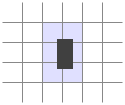

# Plataforma de jogo

> Toda realidade é um jogo.

> `Iain Banks, The Player of Games`

Meu fascínio inicial com computadores foi como o de muitas crianças, originado por jogos de computadores. Fui convocado para um pequeno mundo simulado por computadores onde eu poderia manipular as histórias (mais ou menos) que iam se desenrolando, mais, eu suponho, por causa da maneira que eu poderia projetar a minha imaginação neles do que pelas possibilidades que eles realmente ofereciam.

Eu não desejo uma carreira na programação de jogos a ninguém. Assim como a indústria da música, a discrepância entre os muitos jovens ansiosos que querem trabalhar nela e a demanda real para essas pessoas cria um ambiente não muito saudável. Mas escrever jogos para se divertir é muito legal.

Este capítulo vai falar sobre a implementação de um jogo de plataforma simples. Jogos de Plataforma (ou jogos de "saltar e correr") são os jogos que esperam o jogador para mover uma figura através de um mundo que muitas vezes é bidimensional e visto de lado, onde pode ter a possibilidade de muitos saltos para se mover sobre as coisas.

## O jogo

Nosso jogo será mais ou menos baseado em **Dark blue** por Thomas Palef. Eu escolhi este jogo porque é divertido, minimalista e pode ser construído sem muito código. Observe:


A caixa escura representa o jogador, cuja a tarefa é coletar as caixas amarelas (moedas), evitando o material vermelho (lava). Um nível (*level*) é concluído quando todas as moedas forem recolhidas.

O jogador pode movimentar o personagem com as setas do teclado para a esquerda, para a direita, ou pular com a seta para cima. *Jumping* é uma especialidade deste personagem do jogo. Ela pode atingir várias vezes sua própria altura e é capaz de mudar de direção em pleno ar. Isto pode não ser inteiramente realista mas ajuda a dar ao jogador a sensação de estar no controle do avatar na tela.

O jogo consiste em um fundo fixo como uma grade e com os elementos que se deslocam, sobrepostos ao fundo. Cada campo na grade pode estar vazio, sólido ou ser uma lava. Os elementos móveis são os jogadores, moedas e alguns pedaços de lava. Ao contrário da simulação de vida artificial no Capítulo 7, as posições destes elementos não estão limitadas a grade - suas coordenadas podem ser fracionadas, permitindo movimentos suaves.

## A tecnologia

Nós vamos usar o DOM e o navegador para exibir o jogo e iremos ler a entrada do usuário por manipulação de eventos de teclas.

O código de triagem e manipulação com o teclado é apenas uma pequena parte do trabalho que precisamos fazer para construir este jogo. A parte do desenho é simples, uma vez que tudo parece colorido: criamos elementos no DOM e usamos `styling` para dar-lhes uma cor de fundo, tamanho e posição.

Podemos representar o fundo como uma tabela, uma vez que é uma grade imutável de quadrados. Os elementos de movimento livre podem ser cobertos em cima disso, utilizando-se posicionamentos absolutos.

Em jogos e outros programas, que têm que animar gráficos e responder à entrada do usuário sem demora notável, a eficiência é importante. O DOM não foi originalmente projetado para gráficos de alto desempenho, mas é o melhor que podemos esperar. Você viu algumas animações no capítulo 13. Em uma máquina moderna um jogo simples como este tem um bom desempenho mesmo se não estivermos pensando em otimização.

No próximo capítulo vamos explorar uma outra tecnologia do navegador que é a tag `<canvas>`, onde é proporcionado uma forma mais tradicional para desenhar gráficos, trabalhando em termos de formas e pixels em vez de elementos no DOM.

## Níveis

No Capítulo 7 usamos matrizes de sequências para descrever uma grade bidimensional. Nós podemos fazer o mesmo aqui. Ele nos permitirá projetar `Level` sem antes construir um editor de `Level`.

Um `Level` simples ficaria assim:

```js
var simpleLevelPlan = [
  "                      ",
  "                      ",
  "  x              = x  ",
  "  x         o o    x  ",
  "  x @      xxxxx   x  ",
  "  xxxxx            x  ",
  "      x!!!!!!!!!!!!x  ",
  "      xxxxxxxxxxxxxx  ",
  "                      "
];
```

Tanto a grade (*grid*) fixa e os elementos móveis são inclusos no plano. Os caracteres `x` representam paredes, os caracteres de espaço são para o `espaço vazio` e os `!` representam algo fixo, seções de lava que não se mechem.

O `@` define o local onde o jogador começa. Todo `o` é uma moeda e o sinal de igual `=` representa um bloco de lava que se move para trás e para a frente na horizontal. Note que a grade para essas regras será definida para conter o espaço vazio, e outra estrutura de dados é usada para rastrear a posição de tais elementos em movimento.

Vamos apoiar dois outros tipos de lava em movimento: O personagem *pipe* (`|`) para blocos que se deslocam verticalmente e `v` por gotejamento de lava verticalmente. Lava que não salta para trás e nem para a frente só se move para baixo pulando de volta à sua posição inicial quando atinge o chão.

Um jogo inteiro é composto por vários `Levels` que o jogador deve completar. Um `Level` é concluído quando todas as moedas forem recolhidas. Se o jogador toca a lava o `Level` atual é restaurado à sua posição inicial e o jogador pode tentar novamente.

## A leitura de um level

O construtor a seguir cria um objeto de `Level`. Seu argumento deve ser uma matriz de sequências que define o `Level`.

```js
function Level(plan) {
  this.width = plan[0].length;
  this.height = plan.length;
  this.grid = [];
  this.actors = [];

  for (var y = 0; y < this.height; y++) {
    var line = plan[y], gridLine = [];
    for (var x = 0; x < this.width; x++) {
      var ch = line[x], fieldType = null;
      var Actor = actorChars[ch];
      if (Actor)
        this.actors.push(new Actor(new Vector(x, y), ch));
      else if (ch == "x")
        fieldType = "wall";
      else if (ch == "!")
        fieldType = "lava";
      gridLine.push(fieldType);
    }
    this.grid.push(gridLine);
  }

  this.player = this.actors.filter(function(actor) {
    return actor.type == "player";
  })[0];
  this.status = this.finishDelay = null;
}
```

Para deixar o código pequeno, não verificamos entradas erradas. Ele assume que você sempre entrega um plano de *level* adequado, completo, com a posição de início do jogador e com outros itens essenciais.

Um *level* armazena a sua largura e altura juntamente com duas matrizes, uma para a grade e um para os agentes que são os elementos dinâmicos. A grade é representada como uma matriz de matrizes onde cada uma das séries internas representam uma linha horizontal, e cada quadrado contém algo ou é nulo; para as casas vazias, ou uma string, indicaremos o tipo do quadrado ("muro" ou "lava").

A matriz contém objetos que rastreiam a posição atual e estado dos elementos dinâmicos no *level*. Cada um deles deverá ter uma propriedade para indicar sua posição (as coordenadas do seu canto superior esquerdo), uma propriedade `size` dando o seu tamanho, e uma propriedade `type` que mantém uma cadeia que identifica o elemento ("lava", "dinheiro" ou "jogador").

Depois de construir a `grid` (grade), usaremos o método de filtro para encontrar o objeto jogador que nós armazenamos em uma propriedade do `level`. A propriedade `status` controla se o jogador ganhou ou perdeu. Quando isto acontece, `finishDelay` é usado para manter o `Level` ativo durante um curto período de tempo, de modo que uma animação simples pode ser mostrada (repor imediatamente ou avançar o `Level` ficaria mais fácil). Este método pode ser usado para descobrir se um `Level` foi concluído.

```js
Level.prototype.isFinished = function() {
  return this.status != null && this.finishDelay < 0;
};
```

## Atores

Para armazenar a posição e o tamanho de um ator vamos voltar para o nosso tipo `Vector` que agrupa uma coordenada `x` e `y` para coordenar um objeto.

```js
function Vector(x, y) {
  this.x = x; this.y = y;
}
Vector.prototype.plus = function(other) {
  return new Vector(this.x + other.x, this.y + other.y);
};
Vector.prototype.times = function(factor) {
  return new Vector(this.x * factor, this.y * factor);
};
```

O método de escalas temporais de um vetor nos passa uma determinada quantidade. Isso será útil para quando precisarmos de multiplicar um vetor de velocidade por um intervalo de tempo, para obter a distância percorrida durante esse tempo.

Na seção anterior, o objeto `actorChars` foi usado pelo construtor `Level` para associar personagens com as funções do construtor. O objeto parece com isso:

```js
var actorChars = {
  "@": Player,
  "o": Coin,
  "=": Lava, "|": Lava, "v": Lava
};
```

Três personagens estão sendo mapeados para o objeto `Lava`. O construtor `Level` passa o caractere fonte do ator como o segundo argumento para o construtor, e o construtor de `Lava` usa isso para ajustar o seu comportamento (saltando horizontalmente, saltando verticalmente ou gotejando).

O tipo do jogador é construído da seguinte forma. A velocidade esta sendo armazenada com velocidade atual, que vai ajudar a simular movimento e gravidade.

```js
function Player(pos) {
  this.pos = pos.plus(new Vector(0, -0.5));
  this.size = new Vector(0.8, 1.5);
  this.speed = new Vector(0, 0);
}
Player.prototype.type = "player";
```

Como um jogador tem a altura de um quadrado e meio, a sua posição inicial está sendo definida para ser a metade de um quadrado acima da posição em que o `@` personagem apareceu. Desta forma a sua parte inferior fica alinhada com a parte inferior do quadrado que apareceu.

Ao construir um objeto `Lava` dinamicamente é preciso inicializar o objeto de uma forma diferente, dependendo do personagem que se baseia. `Lava Dinâmica` se move longitudinalmente em sua velocidade dada até atingir um obstáculo. Nesse ponto, se ele tem uma propriedade `repeatPos` ele vai pular de volta à sua posição inicial (`gotejamento`). Se isso não acontecer, ele irá inverter a sua velocidade e continuar no outro sentido (pular). O construtor só configura as propriedades necessárias. O método que faz o movimento real será escrito mais tarde.

```js
function Lava(pos, ch) {
  this.pos = pos;
  this.size = new Vector(1, 1);
  if (ch == "=") {
    this.speed = new Vector(2, 0);
  } else if (ch == "|") {
    this.speed = new Vector(0, 2);
  } else if (ch == "v") {
    this.speed = new Vector(0, 3);
    this.repeatPos = pos;
  }
}
Lava.prototype.type = "lava";
```

`Coin` são atores simples. A maioria dos blocos simplesmente esperam em seus lugares. Mas para animar o jogo eles recebem um pouco de "oscilação", um ligeiro movimento vertical de vai e volta. Para controlar isto, um objeto `coin` armazena uma posição da base, bem como uma propriedade que controla a oscilação da fase do movimento no salto. Juntas essas propriedades determinam a posição real da moeda (armazenada na propriedade `pos`).


```js
function Coin(pos) {
  this.basePos = this.pos = pos.plus(new Vector(0.2, 0.1));
  this.size = new Vector(0.6, 0.6);
  this.wobble = Math.random() * Math.PI * 2;
}
Coin.prototype.type = "coin";
```

No capítulo 13 vimos que `Math.sin` nos dá a coordenada `y` de um ponto em um círculo. Isso é para coordenar um vai e vem em forma de onda suave à medida que avançamos o círculo, fazendo a função `seno` se tornar útil para a modelagem de um movimento ondulatório.

Para evitar uma situação em que todas as moedas se movam para cima ou para baixo de forma síncrona, a fase inicial de cada moeda é aleatória. A fase da onda de `Math.Sin`, a largura de uma onda produzida, é de 2π. Multiplicamos o valor retornado pelo `Math.random` por esse número para dar a posição inicial de uma moeda de forma aleatória.

Agora escrevemos todas as peças necessárias para representar o `Level` nesse estado.

 ```js
var simpleLevel = new Level(simpleLevelPlan);
console.log(simpleLevel.width, "by", simpleLevel.height);
// → 22 by 9
 ```

A tarefa a seguir deve exibir tais *levels* na tela, e assim modelar o tempo do movimento entre deles.

 ## Tarefa de encapsulamento

A maior parte do código neste capítulo não ira se preocupar com o encapsulamento. Isto tem duas razões. Em primeiro lugar o encapsulamento exige esforço extra. Em programas maiores isso requer conceitos adicionais de interfaces a serem introduzidas. Como só há código para você enviar ao leitor que esta jogando com seus olhos vidrados, fiz um esforço para manter o programa pequeno.

Em segundo lugar, os vários elementos neste jogo estão tão ligados que se o comportamento de um deles mudar, é improvável que qualquer um dos outros seriam capazes de ficar na mesma ordem. As interfaces e os elementos acabam codificando uma série de suposições sobre a forma de como o jogo funciona. Isso os torna muito menos eficazes - sempre que você altera uma parte do sistema, você ainda tem que se preocupar com a forma como ela afeta as outras partes, isto porque suas interfaces não cobrem a nova situação.

Alguns pontos de corte que existem em um sistema são as separações através de interfaces rigorosas, mas em outros casos não. Tentar encapsular algo que não é um limite adequado é uma maneira de desperdiçar uma grande quantidade de energia. Quando você está cometendo este erro, normalmente você vai perceber que suas interfaces estarão ficando desajeitadamente grandes e detalhadas, e que elas precisam ser modificadas muitas vezes, durante a evolução do programa.

Há uma coisa que vamos encapsular neste capítulo que é o subsistema de desenho. A razão para isso é que nós vamos mostrar o mesmo jogo de uma maneira diferente no próximo capítulo. Ao colocar o desenho atrás de uma interface, podemos simplesmente carregar o mesmo programa de jogo lá e ligar um novo módulo para exibição.

## Desenho

O encapsulamento do código de desenho é feito através da definição de um objeto de exibição de um determinado `Level`. O tipo de exibição que definimos neste capítulo é chamado de `DOMDisplay`, e usaremos elementos simples do DOM para mostrar o `Level`.

Nós estaremos usando uma folha de estilo para definir as cores reais e outras propriedades fixas dos elementos que farão parte do jogo. Também seria possível atribuir diretamente as propriedades de estilo dos elementos quando os criamos, mas queremos produzir programas mais detalhados.

A seguinte função auxiliar fornece uma maneira curta para criar um elemento e dar-lhe uma classe:

```js
function elt(name, className) {
  var elt = document.createElement(name);
  if (className) elt.className = className;
  return elt;
}
```

O modo de exibição é criado dando-lhe um elemento pai a que se deve acrescentar e um objeto de `Level`.

```js
function DOMDisplay(parent, level) {
  this.wrap = parent.appendChild(elt("div", "game"));
  this.level = level;

  this.wrap.appendChild(this.drawBackground());
  this.actorLayer = null;
  this.drawFrame();
}
```

Levando em consideração o fato de que `appendChild` retorna o elemento ao criar o conteúdo do elemento, então podemos armazená-lo na suas propriedade com apenas uma única instrução.

O fundo do `Level`, que nunca muda, é desenhado apenas uma vez. Os atores são redesenhados toda vez que o `display` for atualizado. A propriedade `actorLayer` será utilizada para controlar o elemento que contém os agentes, de modo que elas possam ser facilmente removidas e substituídas.

Nossas coordenadas e tamanhos são rastreadas em unidades relativas ao tamanho do `grid`, onde o tamanho ou distância de 1 significa uma unidade do `grid`. Ao definir os tamanhos de pixel vamos ter que escalar essas coordenadas, tudo no jogo seria ridiculamente pequeno em um único pixel por metro quadrado. A variável de escala indica o número de pixels que uma única unidade ocupa na tela.

```js
var scale = 20;

DOMDisplay.prototype.drawBackground = function() {
  var table = elt("table", "background");
  table.style.width = this.level.width * scale + "px";
  this.level.grid.forEach(function(row) {
    var rowElt = table.appendChild(elt("tr"));
    rowElt.style.height = scale + "px";
    row.forEach(function(type) {
      rowElt.appendChild(elt("td", type));
    });
  });
  return table;
};
```

Como mencionado anteriormente o fundo é desenhado com um elemento `<table>`. Este corresponde à estrutura da propriedade `grid` onde cada linha é transformada em uma linha da tabela (elemento `<tr>`). As cordas na grade são usadas ​​como nomes de classe para a célula da tabela (elemento `<td>`). O seguinte CSS ajuda a olhar o resultado do quadro como o fundo que queremos:

```css
.background    { background: rgb(52, 166, 251);
                 table-layout: fixed;
                 border-spacing: 0;              }
.background td { padding: 0;                     }
.lava          { background: rgb(255, 100, 100); }
.wall          { background: white;              }
```

Alguns deles (`table-layout`, `border-spacing` e `padding`) são simplesmente usados ​​para suprimir o comportamento padrão indesejado. Nós não queremos que o layout da tabela dependa do conteúdo de suas células, e nós não queremos espaço entre as células da tabela ou `padding` dentro deles.

A regra de `background` define a cor de fundo. No CSS é permitido as cores serem especificadas tanto com palavras (`write`) tanto com um formato como RGB (`R, G, B`) onde os componentes são vermelho, verde e azul ou separados em três números de 0 a 255. Assim em `rgb(52, 166, 251)`, o componente vermelho é de 52 o verde é 166 e azul é 251. Como o componente azul é maior, a cor resultante será azulada. Você pode ver que na regra das `lavas` o primeiro número (vermelho) é o maior.

Chamamos a cada ator criado por um elemento no DOM, e para ele definimos sua posição e o tamanho desse elemento com base nas propriedades do ator. Os valores devem ser multiplicados por escala e convertidos para unidades de pixels do jogo.

```js
DOMDisplay.prototype.drawActors = function() {
  var wrap = elt("div");
  this.level.actors.forEach(function(actor) {
    var rect = wrap.appendChild(elt("div",
                                    "actor " + actor.type));
    rect.style.width = actor.size.x * scale + "px";
    rect.style.height = actor.size.y * scale + "px";
    rect.style.left = actor.pos.x * scale + "px";
    rect.style.top = actor.pos.y * scale + "px";
  });
  return wrap;
};
```

Para dar mais classe ao elemento separamos os nomes de classe com espaços. No código CSS abaixo mostramos a classe ator que nos dá os atores com sua posição absoluta. O seu nome é o tipo usado como uma classe extra para dar-lhes uma uma cor diferente. Não temos que definir a classe de lava novamente porque vamos reutilizar a classe para os quadradinhos de lava que definimos anteriormente.

```css
.actor  { position: absolute;            }
.coin   { background: rgb(241, 229, 89); }
.player { background: rgb(64, 64, 64);   }
```

Quando se atualiza a exibição, o método `drawFrame` que foi passado primeiro remove os velhos gráficos do ator, se houver algum, e em seguida redesenha-os em suas novas posições. Pode ser tentador tentar reutilizar os elementos DOM para os atores, mas para fazer esse trabalho seria preciso uma grande quantidade de fluxo de informação adicional entre o código de exibição e o código de simulação. Precisaríamos  associar os atores com os elementos do DOM e o código de desenho, a remoção dos elementos é feita quando seus atores desaparecem. Uma vez que normalmente não teremos bastante atores no jogo, redesenhar todos eles não custa caro.

```js
DOMDisplay.prototype.drawFrame = function() {
  if (this.actorLayer)
    this.wrap.removeChild(this.actorLayer);
  this.actorLayer = this.wrap.appendChild(this.drawActors());
  this.wrap.className = "game " + (this.level.status || "");
  this.scrollPlayerIntoView();
};
```

Ao adicionar o estado atual do `Level` com um nome de classe para o `wrapper` podemos denominar que o ator do jogador esta ligeiramente diferente quando o jogo está ganho ou perdido, para isso basta adicionar uma regra no CSS que tem efeito apenas quando o jogador tem um elemento ancestral com uma determinada classe.

```css
.lost .player {
  background: rgb(160, 64, 64);
}

.won .player {
  box-shadow: -4px -7px 8px white, 4px -7px 8px white;
}
```

Depois de tocar em lava a cor do jogador ficara vermelho escuro escaldante. Quando a última moeda for coletada nós usamos duas caixas brancas com sombras borradas, um para o canto superior esquerdo e outro para o canto superior direito, para criar um efeito de halo branco.

Não podemos assumir que os `Level` sempre se encaixem na janela de exibição. É por isso que a chamada `scrollPlayerIntoView` é necessária e  garante que se o `Level` está saindo do visor nós podemos rolar o `viewport` para garantir que o jogador está perto de seu centro. O seguinte CSS dá ao elemento DOM o embrulho do jogo com um tamanho máximo e garante que qualquer coisa que não se destaca da caixa do elemento não é visível. Também damos ao elemento exterior uma posição relativa, de modo que os atores estão posicionados no seu interior em relação ao canto superior esquerdo do `Level`.

```css
.game {
  overflow: hidden;
  max-width: 600px;
  max-height: 450px;
  position: relative;
}
```

No método `scrollPlayerIntoView` encontramos a posição do jogador e atualizamos a posição de rolagem do elemento conforme seu envolvimento. Vamos mudar a posição de rolagem através da manipulação das propriedades desses elementos com os eventos de `scrollLeft` e `scrollTop` para quando o jogador estiver muito perto do canto.

```js
DOMDisplay.prototype.scrollPlayerIntoView = function() {
  var width = this.wrap.clientWidth;
  var height = this.wrap.clientHeight;
  var margin = width / 3;

  // The viewport
  var left = this.wrap.scrollLeft, right = left + width;
  var top = this.wrap.scrollTop, bottom = top + height;

  var player = this.level.player;
  var center = player.pos.plus(player.size.times(0.5))
                 .times(scale);

  if (center.x < left + margin)
    this.wrap.scrollLeft = center.x - margin;
  else if (center.x > right - margin)
    this.wrap.scrollLeft = center.x + margin - width;
  if (center.y < top + margin)
    this.wrap.scrollTop = center.y - margin;
  else if (center.y > bottom - margin)
    this.wrap.scrollTop = center.y + margin - height;
};
```

A forma de como o centro do jogador é encontrado mostra como os métodos em nosso tipo `Vector` permite calcular os objetos a serem escritos de forma legível. Para encontrar o centro do ator nós adicionamos a sua posição (o canto superior esquerdo) e a metade do seu tamanho. Esse é o centro em coordenadas de `Level` mas precisamos dele em coordenadas de pixel, por isso em seguida vamos multiplicar o vetor resultante de nossa escala de exibição.

Em seguida uma série de verificações são feitas para a posição do jogador dentro e fora do intervalo permitido. Note-se que, as vezes, isto irá definir as coordenadas absolutas de rolagem, abaixo de zero ou fora da área de rolagem do elemento. Isso é bom pois o DOM vai ser obrigado a ter valores verdadeiros. Definir `scrollLeft` para `-10` fará com que ele torne `0`.

Teria sido um pouco mais simples tentar deslocarmos o jogador para o centro da janela. Mas isso cria um efeito bastante chocante. Como você está pulando a visão vai mudar constantemente de cima e para baixo. É mais agradável ter uma área "neutra" no meio da tela onde você pode se mover sem causar qualquer rolagem.

Finalmente, vamos precisar de algo para limpar um `Level` para ser usado quando o jogo se move para o próximo `Level` ou redefine um `Level`.

 ```js
DOMDisplay.prototype.clear = function() {
  this.wrap.parentNode.removeChild(this.wrap);
};
 ```

Estamos agora em condições de apresentar o nosso melhor `Level` atualmente.

```html
<link rel="stylesheet" href="css/game.css">

<script>
  var simpleLevel = new Level(simpleLevelPlan);
  var display = new DOMDisplay(document.body, simpleLevel);
</script>
```

A tag `<link>` quando usado com `rel="stylesheet"` torna-se uma maneira de carregar um arquivo CSS em uma página. O arquivo `game.css` contém os estilos necessários para o nosso jogo.

## Movimento e colisão

Agora estamos no ponto em que podemos começar a adicionar movimento, que é um aspecto mais interessante do jogo. A abordagem básica tomada pela maioria dos jogos como este consiste em dividir o tempo em pequenos passos, e para cada etapa movemos os atores por uma distância correspondente a sua velocidade (distância percorrida por segundo), multiplicada pelo tamanho do passo em tempo (em segundos).

Isto é fácil. A parte difícil é lidar com as interações entre os elementos. Quando o jogador atinge uma parede ou o chão ele não devem simplesmente se mover através deles. O jogo deve notar quando um determinado movimento faz com que um objeto bata sobre outro objeto e responder adequadamente. Para paredes o movimento deve ser interrompido. As moedas devem serem recolhidas e assim por diante.

Resolver este problema para o caso geral é uma grande tarefa. Você pode encontrar as bibliotecas, geralmente chamadas de motores de física, que simulam a interação entre os objetos físicos em duas ou três dimensões. Nós vamos ter uma abordagem mais modesta neste capítulo, apenas manipularemos as colisões entre objetos retangulares e manusearemos de uma forma bastante simplista.

Antes de mover o jogador ou um bloco de lava, testamos se o movimento iria levá-los para dentro de uma parte não vazio de fundo. Se isso acontecer, nós simplesmente cancelamos o movimento por completo. A resposta a tal colisão depende do tipo de ator - o jogador vai parar, enquanto um bloco de lava se recupera.

Essa abordagem requer alguns passos para termos uma forma reduzida, uma vez que o objeto que esta em movimento para antes dos objetos se tocarem. Se os intervalos de tempo (os movimentos dos passos) são muito grandes, o jogador iria acabar em uma distância perceptível acima do solo. A outra abordagem é indiscutivelmente melhor mas é mais complicada, que seria encontrar o local exato da colisão e se mudar para lá. Tomaremos uma abordagem simples de esconder os seus problemas, garantindo que a animação prossiga em pequenos passos.

Este método nos diz se um retângulo (especificado por uma posição e um tamanho) coincide com qualquer espaço não vazio na `grid` de fundo:

```js
Level.prototype.obstacleAt = function(pos, size) {
  var xStart = Math.floor(pos.x);
  var xEnd = Math.ceil(pos.x + size.x);
  var yStart = Math.floor(pos.y);
  var yEnd = Math.ceil(pos.y + size.y);

  if (xStart < 0 || xEnd > this.width || yStart < 0)
    return "wall";
  if (yEnd > this.height)
    return "lava";
  for (var y = yStart; y < yEnd; y++) {
    for (var x = xStart; x < xEnd; x++) {
      var fieldType = this.grid[y][x];
      if (fieldType) return fieldType;
    }
  }
};
```


Este método calcula o conjunto de quadrados que o `body` se sobrepõe usando `Math.floor` e `Math.ceil` nas coordenadas do `body`. Lembre-se que as unidades de tamanho dos quadrados são 1 por 1. Arredondando os lados de uma caixa de cima para baixo temos o quadrado da gama de fundo que tem os toques nas caixas.



Se o corpo se sobressai do `Level`, sempre retornaremos `"wall"` para os lados e na parte superior e `"lava"` para o fundo. Isso garante que o jogador morra ao cair para fora do mundo. Quando o corpo esta totalmente no interior da `grid`, nosso loop sobre o bloco de quadrados encontra as coordenadas por arredondamento e retorna o conteúdo do primeira `nonempty`.

Colisões entre o jogador e outros atores dinâmicos (moedas, lava em movimento) são tratadas depois que o jogador se mudou. Quando o movimento do jogador coincide com o de outro ator, se for uma moeda é feito o efeito de recolha ou se for lava o efeito de morte é ativado.

Este método analisa o conjunto de atores, procurando um ator que se sobrepõe a um dado como um argumento:

```js
Level.prototype.actorAt = function(actor) {
  for (var i = 0; i < this.actors.length; i++) {
    var other = this.actors[i];
    if (other != actor &&
        actor.pos.x + actor.size.x > other.pos.x &&
        actor.pos.x < other.pos.x + other.size.x &&
        actor.pos.y + actor.size.y > other.pos.y &&
        actor.pos.y < other.pos.y + other.size.y)
      return other;
  }
};
```

## Atores e ações

O método `animate` do tipo `Level` dá a todos os atores do `level` a chance de se mover. Seu argumento `step` traz o tempo do passo em segundos. O objeto `key` contém informações sobre as teclas que o jogador pressionou.

```js
var maxStep = 0.05;

Level.prototype.animate = function(step, keys) {
  if (this.status != null)
    this.finishDelay -= step;

  while (step > 0) {
    var thisStep = Math.min(step, maxStep);
    this.actors.forEach(function(actor) {
      actor.act(thisStep, this, keys);
    }, this);
    step -= thisStep;
  }
};
```

Quando a propriedade `status` do `level` tem um valor não nulo (que é o caso de quando o jogador ganhou ou perdeu), devemos contar para baixo a propriedade `finishDelay` que controla o tempo entre o ponto onde o jogador ganhou ou perdeu e o ponto onde nós paramos de mostrar o `Level`.

O *loop* `while` corta o passo de tempo onde estamos animando em pedaços pequenos. Ele garante que nenhum passo maior do que `maxStep` é tomado. Por exemplo um passo de 0,12 segundo iria ser cortado em dois passos de 0,05 segundos e um passo de 0,02.

Objetos do ator tem um método `act` que toma como argumentos o tempo do passo, o objeto do `level` que contém as chaves de objeto. Aqui está um exemplo para o tipo de ator (Lava) que ignora as teclas de objeto:

```js
Lava.prototype.act = function(step, level) {
  var newPos = this.pos.plus(this.speed.times(step));
  if (!level.obstacleAt(newPos, this.size))
    this.pos = newPos;
  else if (this.repeatPos)
    this.pos = this.repeatPos;
  else
    this.speed = this.speed.times(-1);
};
```

Ele calcula uma nova posição através da adição do produto do tempo do passo e a sua velocidade atual para sua antiga posição. Se nenhum bloco de obstáculos tem uma nova posição ele se move para lá. Se houver um obstáculo, o comportamento depende do tipo da lava: lava e bloco de gotejamento tem uma propriedade `repeatPos` para ele poder saltar para trás quando bater em algo. Saltando, a lava simplesmente inverte sua velocidade (multiplica por -1) a fim de começar a se mover em outra direção.

As moedas usam seu método `act` para se mover. Elas ignoram colisões uma vez que estão simplesmente oscilando em torno de seu próprio quadrado, e colisões com o jogador serão tratadas pelo método `act` do jogador.

```js
var wobbleSpeed = 8, wobbleDist = 0.07;

Coin.prototype.act = function(step) {
  this.wobble += step * wobbleSpeed;
  var wobblePos = Math.sin(this.wobble) * wobbleDist;
  this.pos = this.basePos.plus(new Vector(0, wobblePos));
};
```

A propriedade `wobble` é atualizada para controlar o tempo e em seguida utilizada como um argumento para `math.sin` para criar uma onda que é usada para calcular sua nova posição.

Isso deixa o próprio jogador. O movimento do jogador é tratado separadamente para cada eixo, porque bater no chão não deve impedir o movimento horizontal, e bater na parede não deve parar a queda ou o movimento de saltar. Este método implementa a parte horizontal:

```js
var playerXSpeed = 7;

Player.prototype.moveX = function(step, level, keys) {
  this.speed.x = 0;
  if (keys.left) this.speed.x -= playerXSpeed;
  if (keys.right) this.speed.x += playerXSpeed;

  var motion = new Vector(this.speed.x * step, 0);
  var newPos = this.pos.plus(motion);
  var obstacle = level.obstacleAt(newPos, this.size);
  if (obstacle)
    level.playerTouched(obstacle);
  else
    this.pos = newPos;
};
```

O movimento é calculado com base no estado das teclas de seta esquerda e direita. Quando um movimento faz com que o jogador bata em alguma coisa é o método `playerTouched` que é chamado no `level` que lida com coisas como morrer na lava ou coletar moedas. Caso contrário o objeto atualiza a sua posição.

Movimento vertical funciona de forma semelhante, mas tem que simular salto e gravidade.

```js
var gravity = 30;
var jumpSpeed = 17;

Player.prototype.moveY = function(step, level, keys) {
  this.speed.y += step * gravity;
  var motion = new Vector(0, this.speed.y * step);
  var newPos = this.pos.plus(motion);
  var obstacle = level.obstacleAt(newPos, this.size);
  if (obstacle) {
    level.playerTouched(obstacle);
    if (keys.up && this.speed.y > 0)
      this.speed.y = -jumpSpeed;
    else
      this.speed.y = 0;
  } else {
    this.pos = newPos;
  }
};
```

No início do método o jogador é acelerado verticalmente para ter em conta a gravidade. Ao saltar a velocidade da gravidade é praticamente igual a todas as outras constantes neste jogo que foram criadas por tentativa e erro. Eu testei vários valores até encontrar uma combinação agradável.

Em seguida é feito uma verificação para identificar se há obstáculos novamente. Se bater em um obstáculo há dois resultados possíveis. Quando a seta para cima é pressionada e estamos nos movendo para baixo (ou seja, a coisa que bater é abaixo de nós) a velocidade é definida como um valor relativamente grande e negativo. Isso faz com que o jogador salte. Se esse não for o caso, nós simplesmente esbarramos em alguma coisa e a velocidade é zerada.

O método atual parece com isso:

```js
Player.prototype.act = function(step, level, keys) {
  this.moveX(step, level, keys);
  this.moveY(step, level, keys);

  var otherActor = level.actorAt(this);
  if (otherActor)
    level.playerTouched(otherActor.type, otherActor);

  // Losing animation
  if (level.status == "lost") {
    this.pos.y += step;
    this.size.y -= step;
  }
};
```

Depois de se mover o método verifica os outros atores que o jogador está colidindo e é chamado o `playerTouched` novamente quando encontra um. Desta vez ele passa o objeto ator como segundo argumento, isto é, porque se o outro ator é uma moeda, `playerTouched` precisa saber qual moeda está sendo coletada.

Finalmente quando o jogador morre (toca lava), montamos uma pequena animação que faz com que ele se "encolha" ou "afunde" reduzindo a altura do objeto jogador.

E aqui é o método que manipula as colisões entre o jogador e outros objetos:

```js
Level.prototype.playerTouched = function(type, actor) {
  if (type == "lava" && this.status == null) {
    this.status = "lost";
    this.finishDelay = 1;
  } else if (type == "coin") {
    this.actors = this.actors.filter(function(other) {
      return other != actor;
    });
    if (!this.actors.some(function(actor) {
      return actor.type == "coin";
    })) {
      this.status = "won";
      this.finishDelay = 1;
    }
  }
};
```

Quando a lava é tocada, o status do jogo é definido como `"lost"`. Quando uma moeda é tocada essa moeda é removida do conjunto de atores e se fosse a última, o estado do jogo é definido como `"won"`.

Isso nos da a opção do `Level` de ser animado. Tudo o que está faltando agora é o código que aciona a animação.

## Rastreamento de teclas

Para um jogo como este nós não queremos que as teclas tenham efeito apenas quando presionadas. Pelo contrário, queremos que o seu efeito (movimentar a figura do jogador) continue movendo o jogador enquanto as teclas estiverem pressionadas.

Precisamos criar um manipulador de teclas que armazena o estado atual da esquerda, direita e cima das teclas de seta. Nós também queremos chamar `preventDefault` para essas teclas para não dar rolagem da página.

A função a seguir, quando dado um objeto com o código da tecla e com o nome de propriedade como valores, vai retornar um objeto que rastreia a posição atual dessas teclas. Ele registra manipuladores de eventos para `"keydown"` e `"keyup"` e, quando o código de tecla no evento está presente no conjunto de códigos que está sendo rastreado, é executada a atualização do objeto.

```js
var arrowCodes = {37: "left", 38: "up", 39: "right"};

function trackKeys(codes) {
  var pressed = Object.create(null);
  function handler(event) {
    if (codes.hasOwnProperty(event.keyCode)) {
      var down = event.type == "keydown";
      pressed[codes[event.keyCode]] = down;
      event.preventDefault();
    }
  }
  addEventListener("keydown", handler);
  addEventListener("keyup", handler);
  return pressed;
}
```

Note como o mesmo manipulador da função é usado para ambos os tipos de eventos. Ele olha para a propriedade `type` do objeto de evento para determinar se o estado da tecla deve ser atualizado para true ("keydown") ou falso ("keyup").

## Executar o jogo

A função `requestAnimationFrame` que vimos no capítulo 13 fornece uma boa maneira de animar um jogo. Mas sua interface é bastante primitiva para usá-la, o que nos obriga a ficar controlando sua última chamada para executar a função `requestAnimationFrame` novamente após cada frame.

Vamos definir uma função auxiliar que envolve as partes chatas em uma interface conveniente e nos permitir simplesmente chamar `runAnimation` dando-lhe uma função que espera uma diferença de tempo como um argumento e desenhá-la em um quadro único. Quando a função de armação retorna o valor falso a animação para.

```js
function runAnimation(frameFunc) {
  var lastTime = null;
  function frame(time) {
    var stop = false;
    if (lastTime != null) {
      var timeStep = Math.min(time - lastTime, 100) / 1000;
      stop = frameFunc(timeStep) === false;
    }
    lastTime = time;
    if (!stop)
      requestAnimationFrame(frame);
  }
  requestAnimationFrame(frame);
}
```

Temos que definir um passo de quadros máximo de 100 milissegundos(um décimo de segundo). Quando a aba ou janela do navegador com a página estiver oculto as chamadas `requestAnimationFrame` será suspenso até que a aba ou janela é mostrado novamente. Neste caso a diferença entre `lasttime` será todo o tempo em que a página estiver oculta. Avançando o jogo, que em uma única etapa vai parecer fácil mas podemos ter um monte de trabalho (lembre-se o tempo-splitting no método de animação).

A função também converte os passos de tempo para segundos, que são uma quantidade mais fácil de pensar do que milissegundos.

A função de execução do `Level` toma um objeto do `Level` no construtor de uma exposição e opcionalmente uma função. Ele exibe o `Level`(em document.body) e permite que o usuário peça por ele. Quando o `Level` está terminado(perda ou ganho), `Level` de execução, limpa o visor, para a animação e caso a função `andthen` for dada, chama essa função com o status do `Level`.

```js
var arrows = trackKeys(arrowCodes);

function runLevel(level, Display, andThen) {
  var display = new Display(document.body, level);
  runAnimation(function(step) {
    level.animate(step, arrows);
    display.drawFrame(step);
    if (level.isFinished()) {
      display.clear();
      if (andThen)
        andThen(level.status);
      return false;
    }
  });
}
```

Um jogo é uma sequência de `Level`. Sempre que o jogador morre o `Level` atual é reiniciado. Quando um `Level` é concluído vamos passar para o próximo `Level`. Isso pode ser expresso pela seguinte função o que leva um conjunto de planos de `Level`(arrays de strings) e um construtor de exibição:

```js
function runGame(plans, Display) {
  function startLevel(n) {
    runLevel(new Level(plans[n]), Display, function(status) {
      if (status == "lost")
        startLevel(n);
      else if (n < plans.length - 1)
        startLevel(n + 1);
      else
        console.log("You win!");
    });
  }
  startLevel(0);
}
```

Estas funções mostram um estilo peculiar de programação. Ambos `runAnimation` e `Level` de execução são funções de ordem superior, mas não são no estilo que vimos no capítulo 5. O argumento da função é usado para organizar as coisas para acontecer em algum momento no futuro e nenhuma das funções retorna alguma coisa útil. A sua tarefa é de certa forma, agendar ações. Envolvendo estas ações em funções nos dá uma maneira de armazená-las com um valor de modo que eles podem ser chamados no momento certo.

Este estilo de programação geralmente é chamado de programação assíncrona. Manipulação de eventos também é um exemplo deste estilo, vamos ver muito mais do que quando se trabalha com tarefas que podem levar uma quantidade arbitrária de tempo, como solicitações de rede no capítulo 17 e entrada e saída em geral no Capítulo 20.

Há um conjunto de planos de `Level` disponíveis na variável `GAME_LEVELS`. Esta página alimenta `runGame`, começando um jogo real:

```html
<link rel="stylesheet" href="css/game.css">

<body>
  <script>
    runGame(GAME_LEVELS, DOMDisplay);
  </script>
</body>
```

Veja se você pode vencer. Aqui eu espero vários `Level` construídos.

## Exercício

### Fim do Jogo

É tradicional para jogos de plataforma ter o início do jogador com um número limitado de vidas e subtrair uma vida cada vez que ele morre. Quando o jogador está sem vidas, o jogo será reiniciado desde o início.
Ajuste `runGame` para implementar as três vidas ao iniciar.

```html
<link rel="stylesheet" href="css/game.css">

<body>
<script>
  // The old runGame function. Modify it...
  function runGame(plans, Display) {
    function startLevel(n) {
      runLevel(new Level(plans[n]), Display, function(status) {
        if (status == "lost")
          startLevel(n);
        else if (n < plans.length - 1)
          startLevel(n + 1);
        else
          console.log("You win!");
      });
    }
    startLevel(0);
  }
  runGame(GAME_LEVELS, DOMDisplay);
</script>
</body>
```

**Dica**

A solução mais óbvia seria, tornar a vida uma variável que vive em `runGame` e é portanto visível para o encerramento do `startLevel`.

Uma outra abordagem que se encaixa com o espírito do resto da função seria, adicionar um segundo parâmetro para o `startLevel` que dá o número de vidas. Quando todo o estado de um sistema é armazenado nos argumentos para uma função, chamar essa função fornece uma maneira elegante de fazer a transição para um novo estado.

Em qualquer caso, quando o `Level` está perdido deverá agora existir duas transições de estado possíveis. Se esse for a última vida vamos voltar ao `Level` zero com o montante inicial de vidas. Se não vamos repetir o `Level` atual com menos uma vida restante.

#### Pausar o jogo

Faça o possível para fazer uma pausa(suspenso) e retomar o jogo pressionando a tecla Esc.

Isso pode ser feito alterando a execução função do `Level` para usar outro manipulador de eventos de teclado e interromper ou retomar a animação sempre que a tecla `Esc` é pressionada.

A interface `runAnimation` não pode se responsabilizar por isso à primeira vista, mas basta você reorganizar a maneira que `RUNLEVEL` é chamado.

Quando você tem que trabalhar não há outra coisa que você pode tentar. O caminho que temos vindo a registrar manipuladores de eventos de teclas é um pouco problemático. O objeto `keys` é uma variável global e seus manipuladores de eventos são mantidas ao redor mesmo quando nenhum jogo está sendo executado. Pode-se dizer que isso pode vazar para fora do nosso sistema. Estender `trackKeys` nos da uma maneira de fornecer o cancelamento do registro e de seus manipuladores e em seguida mudar a execução do `Level` para registrar seus tratadores quando começa e cancela o registro novamente quando ele for concluído.

```html
<link rel="stylesheet" href="css/game.css">

<body>
<script>
  // The old runLevel function. Modify this...
  function runLevel(level, Display, andThen) {
    var display = new Display(document.body, level);
    runAnimation(function(step) {
      level.animate(step, arrows);
      display.drawFrame(step);
      if (level.isFinished()) {
        display.clear();
        if (andThen)
          andThen(level.status);
        return false;
      }
    });
  }
  runGame(GAME_LEVELS, DOMDisplay);
</script>
</body>
```

**Dicas**

Uma animação pode ser interrompida retornando um valor `falso` na função dada ao `runAnimation`. Ele pode ser continuado chamando `runAnimation` novamente.

Para comunicar que a animação deve ser interrompido a função passada para `runAnimation` deve retornar falso; você pode usar uma variável que tanto o manipulador de eventos e a função tenha acesso.

Quando encontrar uma maneira de cancelar o registro dos manipuladores registrados por `trackKeys` lembre-se que o mesmo valor função exata que foi passado para `addEventListener` deve ser passado para `removeEventListener` para remover com êxito um manipulador. Assim o valor da função manipuladora criada em `trackKeys` devera estar disponível para o código que cancela os manipuladores.

Você pode adicionar uma propriedade para o objeto retornado por `trackKeys` contendo um ou outro valor da função ou um método que manipula ou remove o registro diretamente.
