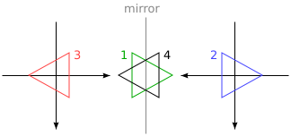
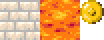
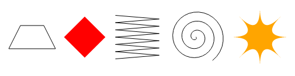

## Desenhando no canvas

> Desenhar é enganar.

> M.C. Escher, citado por Bruno Ernst em The Magic Mirror of M.C. Escher.

Os Browsers permitem de várias maneiras de mostrarem gráficos. A maneira mais simples é usar um estilos para posição e cor de elementos regulares do DOM. Isso pode ser impraticável, como ficou claro no jogo do capítulo anterior. Podemos adicionar parcialmente uma transparência no fundo das imagens e ainda girar ou inclinar algum usando o estilo de `transform`.

Mas estaríamos usando o DOM para algo que não foi originalmente projetado. Algumas tarefas, tais como desenhar uma linha entre pontos arbitrários são extremamente difíceis de fazer com elementos regulares em HTML.

Existem duas alternativas. O primeiro é baseado em DOM mas utiliza Scalable Vector Graphics(`SVG`) ao invés de elementos HTML. Pense em SVG como um dialeto para descrever documentos que se concentra em formas ao invés de texto. Você pode embutir um documento SVG em um documento HTML ou você pode incluí-lo através de uma tag ``.

A segunda alternativa é chamado de `canvas`. A tela é um único elemento DOM que encapsula uma imagem. Ele fornece uma interface de programação para desenhar formas para o espaço ocupado pelo nó. A principal diferença entre um `canvas` e uma imagem de `SVG`, é que em `SVG` a descrição original das formas é preservada de modo que eles podem ser movidos ou redimensionados em qualquer momento. O  `canvas` por outro lado, converte as formas para pixels(pontos coloridos em um rastro), logo eles são desenhados e não guardam informações do que estes pixels representam. A única maneira de mover uma forma em `canvas` é limpar a tela(ou a parte da tela em torno) e redesenhar uma forma em uma nova posição.

#### SVG

Este livro não vai entrar no assunto `SVG` em detalhes, mas vou explicar brevemente como ele funciona. No final do capítulo eu vou voltar para os `trade-offs` que você deve considerar ao decidir qual mecanismo de desenho é adequado para uma determinada aplicação.

Este é um documento HTML com uma imagem SVG simples:

````html
<p>Normal HTML here.</p>
<svg xmlns="http://www.w3.org/2000/svg">
	<circle r="50" cx="50" cy="50" fill="red"/>
	<rect x="120" y="5" width="90" height="90"
				stroke="blue" fill="none"/>
</svg>
````

O atributo `xmlns` muda um elemento(e seus filhos) a um namespace diferente de XML. Este namespace é identificado por um URL, especificando o dialeto que estamos falando no momento. As *tags* `<circle>` e `<rect>` que não existem em HTML não têm um significado em SVG para desenhar formas usando o estilo e posição especificada para seus atributos.

Essas *tags* criam elementos no DOM assim como as *tags* em HTML. Por exemplo, isso muda a cor para ciano do elemento `<circle>`:

````js
var circle = document.querySelector("circle");
circle.setAttribute("fill", "cyan");
````

#### O elemento canvas

Gráfico em *canvas* pode ser desenhado com a tag `<canvas>`. Você pode dar a um elemento a largura e altura em pixel para determinar o seu tamanho.

A nova tela esta vazia, o que significa que é totalmente transparente e portanto simplesmente mostra-se com um espaço vazio no documento.

A *tag* `<canvas>` destina-se a apoiar os diferentes estilos de desenho. Para ter acesso a uma verdadeira interface de desenho primeiro precisamos criar um contexto que é um objeto, cujos métodos fornecem a interface de desenho. Atualmente existem dois estilos de desenho amplamente suportados: *"2d"* para gráficos bidimensionais e *"WebGL"* para gráficos tridimensionais através da interface `OpenGL`.

Este livro não vai discutir *WebGL*. Nós esturemos as duas dimensões. Mas se você estiver interessado em gráficos tridimensionais eu encorajo-vos a olhar para *WebGL*, que fornece uma interface muito direta com o hardware com gráfico moderno e permite que você processe cenas eficientemente complicadas utilizando JavaScript.

Um contexto é criado através do método `getContext` sobre o elemento `<canvas>`.

````html
<p>Before canvas.</p>
<canvas width="120" height="60"></canvas>
<p>After canvas.</p>
<script>
	var canvas = document.querySelector("canvas");
	var context = canvas.getContext("2d");
	context.fillStyle = "red";
	context.fillRect(10, 10, 100, 50);
</script>
````

Depois de criar o objeto de contexto, o exemplo desenha um retângulo vermelho de 100 pixels de largura e 50 pixels de altura em relação ao seu canto superior esquerdo nas coordenadas (10,10).

Assim como em HTML e SVG o sistema que a tela usa puts(0,0) no canto superior esquerdo de coordenadas, e o eixo y positivo vai para baixo. Então (10,10) é de 10 pixels abaixo e a direita do canto superior esquerdo.

#### Preenchimento e traçado

Na interface uma forma pode ser cheia ou seja, sua área é dada uma determinada cor padrão; ou pode ser riscada o que significa que uma linha é desenhada ao longo de sua borda. A mesma terminologia é utilizada por SVG.

O método `fillRect` preenche um retângulo. É preciso ter as coordenadas `x` e `y` do canto superior esquerdo do retângulo, em seguida a sua largura e a sua altura. Um método semelhante `strokeRect` desenha o contorno de um retângulo.

Nenhum dos métodos tem parâmetros. A cor do preenchimento e a espessura do traçado não são determinados por argumento do método(como você espera), mas sim pelas propriedades do contexto do objecto.

As definições de `fillStyle` pode alterar o jeito que as formas são preenchidas. Ele pode ser definido como uma `string` que especifica uma cor de qualquer modo que é compreendido por CSS.

A propriedade `strokeStyle` funciona de forma semelhante, mas determina a cor usada para uma linha. A largura da linha é determinada pela propriedade `lineWidth` que pode conter qualquer número positivo.

```html
<canvas></canvas>
<script>
	var cx = document.querySelector("canvas").getContext("2d");
	cx.strokeStyle = "blue";
	cx.strokeRect(5, 5, 50, 50);
	cx.lineWidth = 5;
	cx.strokeRect(135, 5, 50, 50);
</script>
```

Quando nenhuma largura ou altura é especificado como atributo, como no exemplo anterior um elemento de tela adquire uma largura padrão de 300 pixels e altura de 150 pixels.

#### Paths

Um `path` é uma sequência de linhas. A interface de uma tela 2D tem uma abordagem peculiar de descrever esse `path`. Isso é feito inteiramente através dos efeitos colaterais. Os `paths` não constituem valores que podem ser armazenados ou repassados. Se você deseja fazer algo com um `path`, você faz uma sequência de chamadas de método para descrever sua forma.

```html
<canvas></canvas>
<script>
	var cx = document.querySelector("canvas").getContext("2d");
	cx.beginPath();
	for (var y = 10; y < 100; y += 10) {
		cx.moveTo(10, y);
		cx.lineTo(90, y);
	}
	cx.stroke();
</script>
```

Este exemplo cria um `path` com um número de segmentos de linha horizontal e faz traços usando o método `stroke`. Cada segmento criado com `lineTo` começa na posição atual do `path`. Esta posição é normalmente o fim do último segmento a não ser que `moveTo` seja chamado. Nesse caso, o próximo segmento começara na posição passada para `moveTo`.

Ao preencher um `path`(usando o método `fill`) cada forma é preenchido separadamente. Um `path` pode conter várias formas, cada movimento com `moveTo` inicia um novo. Mas o `path` tem de ser fechado(ou seja o seu início e fim devem ficar na mesma posição) antes de ser preenchido. 
Se o `path` não estiver fechado a linha é adicionada a partir de sua extremidade para o começo da forma delimitada pelo `path` como completado e preenchido.

```html
<canvas></canvas>
<script>
	var cx = document.querySelector("canvas").getContext("2d");
	cx.beginPath();
	cx.moveTo(50, 10);
	cx.lineTo(10, 70);
	cx.lineTo(90, 70);
	cx.fill();
</script>
```

Este exemplo estabelece um triângulo cheio. Note que apenas dois dos lados do triângulo são explicitamente desenhados. A terceira é a partir do canto inferior direito ate o topo; é implícito e não estará lá quando você traçar o `path`.

Você também pode usar o método `closePath` para fechar explicitamente um `path` através da adição de um segmento da linha atual de volta ao início do `path`. Este segmento é desenhado traçando o `path`.

#### Curvas

Um `path` também pode conter linhas com curvas. Estes infelizmente é um pouco mais complexo do que desenhar linhas retas.
O método `quadraticCurveTo` desenha uma curva ate um ponto considerado. Para determinar a curvatura da linha é dado no método um ponto de controle e um ponto de destino. Imagine o seguinte, ponto de controle é uma atração a linha, o que da a ela sua curvatura. A linha não passa pelo ponto de controle. Ao contrário disso a direção da linha nos seus pontos de início e fim fica alinhado, com a linha puxando para o ponto de controle. O exemplo a seguir ilustra isso:

```html
<canvas></canvas>
<script>
	var cx = document.querySelector("canvas").getContext("2d");
	cx.beginPath();
	cx.moveTo(10, 90);
	// control=(60,10) goal=(90,90)
	cx.quadraticCurveTo(60, 10, 90, 90);
	cx.lineTo(60, 10);
	cx.closePath();
	cx.stroke();
</script>
```

Nós desenharemos uma curva quadrática a partir da esquerda para a direita com (60,10) no ponto de controle e depois colocamos dois segmentos da linha passando por esse ponto de controle de volta para o início da linha. O resultado lembra um pouco uma insígnia do Star Trek. Você pode ver o efeito do ponto de controle: as linhas que saem dos cantos inferiores começam na direção do ponto de controle e em seguida se curva em direção a seu alvo.

O método `bezierCurve` desenha um tipo semelhante de uma curva. Em vez de um único ponto de controle este tem dois, um para cada um dos pontos das extremidades da linha. Aqui é um esboço semelhante para ilustrar o comportamento de uma tal curva:

```html
<canvas></canvas>
<script>
	var cx = document.querySelector("canvas").getContext("2d");
	cx.beginPath();
	cx.moveTo(10, 90);
	// control1=(10,10) control2=(90,10) goal=(50,90)
	cx.bezierCurveTo(10, 10, 90, 10, 50, 90);
	cx.lineTo(90, 10);
	cx.lineTo(10, 10);
	cx.closePath();
	cx.stroke();
</script>
```

Os dois pontos de controle especificam a direção em ambas as extremidades da curva. Quanto mais eles estão longe de seu ponto correspondente, maior a curva que vai nesse sentido.

Tais curvas pode ser difícil de trabalhar, nem sempre é evidente encontrar a forma dos pontos de controle que proporcionam a forma que você está procurando. Às vezes você pode calcular, e às vezes você apenas tem que encontrar um valor apropriado por tentativa e erro.

Fragmentos `arcs` de um círculo são mais fáceis de se trabalhar. O método `arcTo` não leva menos de cinco argumentos. Os quatro primeiros argumentos agem um pouco como os argumentos para `quadraticCurveTo`. O primeiro par fornece uma espécie de ponto de controle e o segundo par da o destino a linha. O quinto argumento fornece o raio do arco. O método vai conceitualmente projetar um canto da linha que vai para o ponto de controle e em seguida volta ao ponto de destino para que ele faça parte de um círculo com o raio dado. O método `arcTo` chega então a uma parte arredondada bem como uma linha a partir da posição de partida ate o início de uma parte arredondada.

```html
<canvas></canvas>
<script>
	var cx = document.querySelector("canvas").getContext("2d");
	cx.beginPath();
	cx.moveTo(10, 10);
	// control=(90,10) goal=(90,90) radius=20
	cx.arcTo(90, 10, 90, 90, 20);
	cx.moveTo(10, 10);
	// control=(90,10) goal=(90,90) radius=80
	cx.arcTo(90, 10, 90, 90, 80);
	cx.stroke();
</script>
```

O método `arcTo` não vai desenhar a linha a partir da parte final do arredondamento para a posição do objetivo, embora a palavra no seu nome sugere o que ele faz. Você pode acompanhar com uma chamada de `lineTo` com o mesmo objetivo de coordena e acrescentar uma parte da linha.

Para desenhar um círculo você poderia usar quatro chamadas para `arcTo`(cada um que giram 90 graus). Mas o método `arcTo` fornece uma maneira mais simples. É preciso um par de coordenadas para o centro do arco, um raio e em seguida um ângulo de início e fim.

Esses dois últimos parâmetros tornam possível desenhar apenas uma parte do círculo. Os ângulos são medidos em radianos não em graus. Isso significa que um círculo completo tem um ângulo de `2π` ou `2 * Math.PI` que é de cerca de `6,28`. O ângulo começa a contar a partir do ponto da direita do centro do círculo e vai a partir do sentido horário. Você pode usar um começo de `0` e um fim maior do que `2π`(digamos 7) para desenhar um círculo completo.

```html
<canvas></canvas>
<script>
	var cx = document.querySelector("canvas").getContext("2d");
	cx.beginPath();
	// center=(50,50) radius=40 angle=0 to 7
	cx.arc(50, 50, 40, 0, 7);
	// center=(150,50) radius=40 angle=0 to ½π
	cx.arc(150, 50, 40, 0, 0.5 * Math.PI);
	cx.stroke();
</script>
```

A imagem resultante contém uma linha no círculo(primeira chamada de `arc`) a esquerda do quarto do círculo(segunda chamada). Como outros métodos estão ligados ao desenho de um `path`, uma linha traçada é ligado ao segmento do arco anterior por padrão. Se você quiser evitar isso teria que chamar `moveTo` ou iniciar um novo `path`.

#### Desenho de um gráfico de pizza

Imagine que você acabou de conseguir um emprego na EconomiCorp Inc. e sua primeira missão é desenhar um gráfico de pizza dos resultados da pesquisa de satisfação do cliente.

A variável dos resultados contém uma matriz de objetos que representam as respostas da pesquisa.

```js
var results = [
	{name: "Satisfied", count: 1043, color: "lightblue"},
	{name: "Neutral", count: 563, color: "lightgreen"},
	{name: "Unsatisfied", count: 510, color: "pink"},
	{name: "No comment", count: 175, color: "silver"}
];
```

Para desenhar um gráfico de pizza, traçamos um número de fatias, cada um é composto por um arco e um par de linhas para o centro desse arco. Podemos calcular o ângulo ocupado por cada arco dividindo um círculo completo(2π) pelo número total de respostas, em seguida multiplicamos esse número(o ângulo por resposta) pelo número de pessoas que fizeram determinadas escolhas.

```html
<canvas width="200" height="200"></canvas>
<script>
	var cx = document.querySelector("canvas").getContext("2d");
	var total = results.reduce(function(sum, choice) {
		return sum + choice.count;
	}, 0);
	// Start at the top
	var currentAngle = -0.5 * Math.PI;
	results.forEach(function(result) {
		var sliceAngle = (result.count / total) * 2 * Math.PI;
		cx.beginPath();
		// center=100,100, radius=100
		// from current angle, clockwise by slice's angle
		cx.arc(100, 100, 100,
					 currentAngle, currentAngle + sliceAngle);
		currentAngle += sliceAngle;
		cx.lineTo(100, 100);
		cx.fillStyle = result.color;
		cx.fill();
	});
</script>
```

Mas um gráfico que não nos diz o que significa não é útil. Nós precisamos de uma maneira para desenhar o texto na tela.

#### Texto

Um contexto de desenho em canvas 2D fornece os métodos `fillText` e `strokeText`. Este último pode ser útil para delinear as letras mas geralmente `fillText` é o que você precisa. Ele vai encher o texto com a cor atual de `fillColor`.

```html
<canvas></canvas>
<script>
	var cx = document.querySelector("canvas").getContext("2d");
	cx.font = "28px Georgia";
	cx.fillStyle = "fuchsia";
	cx.fillText("I can draw text, too!", 10, 50);
</script>
```

Você pode especificar o tamanho, estilo e tipo da letra do texto com a propriedade `font`. Este exemplo apenas dá um tamanho de fonte e nome da família. Você pode adicionar o itálico ou negrito para o início de uma sequência de caracteres.

Os dois últimos argumentos para `fillText`(e `strokeText`) fornecem a posição em que a fonte é desenhado. Por padrão a posição do início da linha indica a base alfabética do texto, que é a linha que as letras ficam não tendo partes penduradas; em letras como `j` ou `p` você pode mudar a posição horizontal definindo a propriedade `textAlign` para `end` ou `center` ou posicionamento vertical definindo `textBaseline` para `top`, `middle` ou `bottom`.

Vamos voltar ao nosso gráfico de pizza para corrigir o problema de rotular as fatias nos exercícios no final do capítulo.

#### Imagens

Na computação gráfica uma distinção é feita frequentemente entre gráficos vetoriais e bitmap. O primeiro é como iremos fazer neste capítulo; a especificação de uma imagem dando uma descrição lógica de formas. Os gráficos de bitmap não especificam formas reais, mas sim trabalham com dados de pixel (rastros de pontos coloridos).

O método `drawImage` nos permite desenhar dados de pixel em `canvas`. Estes dados de pixel pode ter origem a partir de uma tag `` ou `<canvas>`, e nem todos são visíveis no documento atual. O exemplo a seguir cria um elemento `` e carrega um arquivo de imagem nele. Mas não é iniciado imediatamente; a elaboração desta imagem não ocorreu porque o browser ainda não buscou por isso. Para lidar com tal situação registramos um manipulador de eventos(`"load"`)  para fazer o desenho depois que a imagem for carregada.

```html
<canvas></canvas>
<script>
	var cx = document.querySelector("canvas").getContext("2d");
	var img = document.createElement("img");
	img.src = "img/hat.png";
	img.addEventListener("load", function() {
		for (var x = 10; x < 200; x += 30)
			cx.drawImage(img, x, 10);
	});
</script>
```

Por padrão, `drawImage` vai desenhar a imagem em seu tamanho original. Você também pode dar-lhe dois argumentos adicionais para ditar uma largura e altura diferentes.

`drawImage` recebe nove argumentos, ele pode ser utilizado para desenhar apenas um fragmento de uma imagem. Do segundo ao quinto argumento indicam o retângulo(x, y, largura e altura) na imagem de origem que deve ser copiado, do sexto ao nono argumentos indica o retângulo(na tela) em que deve ser copiado.

Isso pode ser usado para embalar várias sprites(elementos de imagem) em um único arquivo de imagem, em seguida desenhar apenas a parte que você precisa. Por exemplo, nós temos esta imagem contendo uma personagem do jogo em várias poses:


Ao alternar a pose que traçamos, podemos mostrar uma animação que que simula o movimento de andar do personagem.

Para animar a imagem em uma tela o método `clearRect` é útil. Assemelha-se a `fillRect` mas ao invés de colorir o retângulo, torna-se transparente removendo os pixels previamente desenhados.

Sabemos que a cada sprite são sub-imagens de 24 pixels de largura por 30 pixels de altura. O código a seguir carrega as imagens, e em seguida define um intervalo(temporizador de repetição) para desenhar os quadros seguintes:

```html
<canvas></canvas>
<script>
	var cx = document.querySelector("canvas").getContext("2d");
	var img = document.createElement("img");
	img.src = "img/player.png";
	var spriteW = 24, spriteH = 30;
	img.addEventListener("load", function() {
		var cycle = 0;
		setInterval(function() {
			cx.clearRect(0, 0, spriteW, spriteH);
			cx.drawImage(img,
									 // source rectangle
									 cycle * spriteW, 0, spriteW, spriteH,
									 // destination rectangle
									 0,               0, spriteW, spriteH);
			cycle = (cycle + 1) % 8;
		}, 120);
	});
</script>
```

A variável `cycle` mapeia nossa posição na animação. A cada quadro ele é incrementado e em seguida cortado de volta para o intervalo de 0 a 7 usando o operador restante. Esta variável é usada para calcular a coordenada `x` que o sprite tem para a pose atual da imagem.

#### Transformações

Mas e se queremos que o nosso personagem ande para a esquerda em vez de para a direita? Poderíamos acrescentar um outro conjunto de sprites, é claro. Mas também podemos instruir a tela para desenhar a imagem de outra maneira.

Chamar o método `scale` fará com que qualquer coisa desenhada depois possa ser escalado. Este método tem dois parâmetros, um para definir uma escala horizontal e um para definir uma escala vertical.

```html
<canvas></canvas>
<script>
	var cx = document.querySelector("canvas").getContext("2d");
	cx.scale(3, .5);
	cx.beginPath();
	cx.arc(50, 50, 40, 0, 7);
	cx.lineWidth = 3;
	cx.stroke();
</script>
```

`scaling` fará tudo sobre a imagem desenhada incluindo: a largura da linha a ser esticado ou espremido, conforme especificado. Dimensionamento por um valor negativo vai inverter a imagem ao redor. A inversão acontece em torno do ponto(0,0); o que significa que tudo irá virar a direção do sistema de coordenadas. Quando uma escala horizontal de -1 é aplicada, a forma desenhada em x na posição 100 vai acabar na posição -100.

Então para transformar uma imagem em torno não podemos simplesmente adicionar `cx.scale (-1, 1)` antes da chamada `drawImage` pois ira mover a nossa imagem fora da tela onde não será mais possível vê-la. Você pode ajustar as coordenadas dadas a `drawImage` para compensar esse desenho da imagem em x na posição -50 em vez de 0. Outra solução que não exige que o código faça o desenho para saber sobre a mudança de escala, é ajustar o eixo em torno do qual a escala acontece.

Há vários outros métodos além de `scale` que influenciam no sistema de coordenadas para o `canvas`. Você pode girar formas posteriormente desenhados com o método de `rotation` e movê-los com o método de `translate`. É interessante e confuso saber que estas transformações são realizados no estilo de pilha, o que significa que cada uma acontece em relação às transformações anteriores.

Então se nós fizermos um `translate` de 10 pixels na horizontal por duas vezes, tudo será desenhada 20 pixels para a direita. Se primeiro mover o centro do sistema de coordenadas de (50,50) e em seguida girar 20 graus(0.1π em radianos) a rotação vai acontecer em torno do ponto (50,50).


Mas se nós primeiro girarmos 20 graus e em seguida aplicarmos um `translate` de (50,50), o `translate` ira acontecer na rotação do sistema de coordenadas e assim produzir uma orientação diferente. A ordem em que as transformações são aplicadas sera assunto nos próximos tópicos.

Para inverter uma imagem em torno da linha vertical em uma determinada posição x podemos fazer o seguinte:

```js
function flipHorizontally(context, around) {
	context.translate(around, 0);
	context.scale(-1, 1);
	context.translate(-around, 0);
}
```

Nós deslocamos o `eixo-y` para onde queremos que o nosso espelho fique e aplicamos, finalmente deslocamos o `eixo-y` de volta ao seu lugar adequado no universo espelhado. O quadro a seguir explica por que isso funciona:



Isto mostra o sistemas de coordenadas antes e após o espelhamento do outro lado da linha central. Se desenharmos um triângulo em uma posição positiva x, estaria por padrão no lugar onde triângulo 1 esta. Uma chamada para `flipHorizontally` faz primeiro um `translate` para a direita, o que nos leva ao triângulo 2. Em seguida `scale` é lançado e o triângulo volta para a posição 3. Este não é o lugar onde ele deveria estar se fosse espelhada na linha dada. O segundo `translate` para correções da chamadas esta cancelando o `translate` inicial e faz triângulo 4 aparecer exatamente onde deveria.

Agora podemos desenhar um personagem espelhado na posição (100,0) rodando o mundo em torno do centro vertical do personagem.

```html
<canvas></canvas>
<script>
	var cx = document.querySelector("canvas").getContext("2d");
	var img = document.createElement("img");
	img.src = "img/player.png";
	var spriteW = 24, spriteH = 30;
	img.addEventListener("load", function() {
		flipHorizontally(cx, 100 + spriteW / 2);
		cx.drawImage(img, 0, 0, spriteW, spriteH,
								 100, 0, spriteW, spriteH);
	});
</script>
```

#### Armazenar e limpando transformações

Tudo sobre transformações fica por aqui. Qualquer outra coisa que desenhar depois desse personagem espelhado também ficara espelhado. Isso pode ser um problema.

É possível salvar a transformação atual, fazer algum desenho e transformar e em seguida restaurar a velho transformação. Isso geralmente é a coisa certa a fazer para uma função que necessita se transformar temporariamente o sistema de coordenadas. Em primeiro lugar vamos salvar qualquer que seja a transformação do código que chamou a função que estava utilizando. Em seguida a função faz a sua parte(no topo da transformação existente) possivelmente adicionando mais transformações. E finalmente revertemos a transformação que nós fizemos.

Os salvar e o restaurar nos métodos em contexto `canvas` 2D realizam um tipo de gerenciamento na transformação. Eles conceitualmente mantém uma pilha de estados de transformação. Quando você chama o salvar o estado atual é colocado na pilha, e quando você chama o restaurar, o estado no topo da pilha é retirado e utilizado a transformação atual do contexto.

A função de ramificação no exemplo a seguir ilustra o que você pode fazer com uma função que altera a transformação e em seguida chama outra função que continua a desenhar com a transformação dada no desenho anterior.

Esta função desenha uma forma que lembra um desenho de uma árvore com linhas; movendo o sistema de coordenadas do centro para o fim da linha, e chamando ele novamente. A primeiro `rotate` acontece para a esquerda e depois para a direita. Cada chamada reduz o comprimento do ramo desenhado e a recursividade para quando o comprimento cai abaixo de 8.

```html
<canvas width="600" height="300"></canvas>
<script>
	var cx = document.querySelector("canvas").getContext("2d");
	function branch(length, angle, scale) {
		cx.fillRect(0, 0, 1, length);
		if (length < 8) return;
		cx.save();
		cx.translate(0, length);
		cx.rotate(-angle);
		branch(length * scale, angle, scale);
		cx.rotate(2 * angle);
		branch(length * scale, angle, scale);
		cx.restore();
	}
	cx.translate(300, 0);
	branch(60, 0.5, 0.8);
</script>
```

Se as chamadas para salvar e restaurar não estivessem lá, a segunda chamada recursiva dos galho acabariam com a mesma posição de rotação criado pela primeira chamada. Não estariam ligados ao ramo atual, mas estaria a direita do ramo desenhado pela primeira chamada. A forma resultante também poderia ser interessante mas não é definitivamente uma árvore.

#### De volta para o jogo

Agora sabemos o suficiente sobre desenho no `canvas` para começarmos a trabalhar em um sistema de visualização baseada em `canvas` para o jogo a partir do capítulo anterior. O novo visual não será apenas mostrando caixas coloridas. Mas vamos usar `drawImage` para desenhar imagens que representam os elementos do jogo.

Vamos definir um tipo de objeto `CanvasDisplay`, suportando a mesma interface que `DOMDisplay` a partir do capítulo 15, ou seja os métodos `drawFrame` e `clear`.

Este objeto mantém um pouco mais de informação do que `DOMDisplay`. Ao invés de usar a posição de rolagem do seu elemento DOM, ele controla o seu próprio visor, que nos diz qual parte do nível atualmente que estamos olhando. Ele também rastreia o tempo e usa isso para decidir qual quadro da animação deve ser usado. E finalmente ele mantém uma propriedade `flipPlayer` de modo que mesmo quando o jogador ainda está de pé ele continua voltada para a direção do último movimento.

```js
function CanvasDisplay(parent, level) {
	this.canvas = document.createElement("canvas");
	this.canvas.width = Math.min(600, level.width * scale);
	this.canvas.height = Math.min(450, level.height * scale);
	parent.appendChild(this.canvas);
	this.cx = this.canvas.getContext("2d");

	this.level = level;
	this.animationTime = 0;
	this.flipPlayer = false;

	this.viewport = {
		left: 0,
		top: 0,
		width: this.canvas.width / scale,
		height: this.canvas.height / scale
	};

	this.drawFrame(0);
}

CanvasDisplay.prototype.clear = function() {
	this.canvas.parentNode.removeChild(this.canvas);
};
```

O contador `animationTime` é a razão pela qual passou o tamanho do passo para `drawFrame` no Capítulo 15 embora `DOMDisplay` não utilizasse. Nossa nova função `drawFrame` iremos utilizar para controlar o tempo de modo que possa alternar entre quadros de animação com base no tempo atual.

```js
CanvasDisplay.prototype.drawFrame = function(step) {
	this.animationTime += step;

	this.updateViewport();
	this.clearDisplay();
	this.drawBackground();
	this.drawActors();
};
```

Diferente do controle de tempo, o método atualiza a janela de exibição para a posição atual do jogador, preenche toda a tela com uma cor de fundo, desenha o fundo e os atores. Note que que é diferente da abordagem no capítulo 15 onde traçamos o plano de fundo toda vez que movemos qualquer elemento do DOM envolvido.

Como as formas em uma tela são apenas pixels, depois que atraído, não há nenhuma maneira de removê-los. A única maneira de atualizar a exibição de tela é limpar e redesenhar a cena.

O método `updateViewport` é semelhante ao método de `scrollPlayerIntoView` no `DOMDisplay`. Ele verifica se o jogador está demasiado perto da borda da tela e move a janela de exibição quando for o caso.

```js
CanvasDisplay.prototype.updateViewport = function() {
	var view = this.viewport, margin = view.width / 3;
	var player = this.level.player;
	var center = player.pos.plus(player.size.times(0.5));

	if (center.x < view.left + margin)
		view.left = Math.max(center.x - margin, 0);
	else if (center.x > view.left + view.width - margin)
		view.left = Math.min(center.x + margin - view.width,
												 this.level.width - view.width);
	if (center.y < view.top + margin)
		view.top = Math.max(center.y - margin, 0);
	else if (center.y > view.top + view.height - margin)
		view.top = Math.min(center.y + margin - view.height,
												this.level.height - view.height);
};
```

As chamadas para `Math.max` e `Math.min` garantem que a janela de exibição não acabe mostrando espaço fora do nível. `Math.max(x, 0)` tem o efeito de assegurar que o número resultante não seja inferior a zero. `Math.min` da mesma forma, garante que um valor permaneça abaixo de um dado vinculado.

Ao limpar a tela vamos usar uma cor ligeiramente diferente dependendo se o jogo for ganho(mais claro) ou perdido(mais escura).

```js
CanvasDisplay.prototype.clearDisplay = function() {
	if (this.level.status == "won")
		this.cx.fillStyle = "rgb(68, 191, 255)";
	else if (this.level.status == "lost")
		this.cx.fillStyle = "rgb(44, 136, 214)";
	else
		this.cx.fillStyle = "rgb(52, 166, 251)";
	this.cx.fillRect(0, 0,
									 this.canvas.width, this.canvas.height);
};
```

Para desenhar o plano de fundo, corremos por entre as telhas que são visíveis na janela de exibição atual, usando o mesmo truque usado em `obstacleAt` no capítulo anterior.

```js
var otherSprites = document.createElement("img");
otherSprites.src = "img/sprites.png";

CanvasDisplay.prototype.drawBackground = function() {
	var view = this.viewport;
	var xStart = Math.floor(view.left);
	var xEnd = Math.ceil(view.left + view.width);
	var yStart = Math.floor(view.top);
	var yEnd = Math.ceil(view.top + view.height);

	for (var y = yStart; y < yEnd; y++) {
		for (var x = xStart; x < xEnd; x++) {
			var tile = this.level.grid[y][x];
			if (tile == null) continue;
			var screenX = (x - view.left) * scale;
			var screenY = (y - view.top) * scale;
			var tileX = tile == "lava" ? scale : 0;
			this.cx.drawImage(otherSprites,
												tileX,         0, scale, scale,
												screenX, screenY, scale, scale);
		}
	}
};
```

Azulejos que não estão vazias(null) são desenhados com `drawImage`. A imagem `otherSprites` contém os outros elementos do jogo. Como os azulejos da parede, a telha de lava, e o sprite para uma moeda.



Azulejos de fundo são 20 por 20 pixels, usaremos a mesma escala que usamos no `DOMDisplay`. Assim o deslocamento para telhas de lava é de 20(o valor da variável de escala) e o deslocamento para paredes é 0.

Nós não nos incomodamos em esperar a imagem do sprite carregar. Chamando `drawImage` com uma imagem que não foi carregado e simplesmente ele não ira fazer nada. Assim não chamaremos o jogo corretamente para os primeiros frames enquanto a imagem ainda está sendo carregado, mas isso não é um problema grave, desde que mantenhamos a atualização da tela na cena correta, assim que carregamento terminar.

O carácter para caminhar que foi utilizado, sera usado para representar o jogador. O código que chama ele precisa pegar a posição da sprite com base no movimento atual do jogador. Os primeiros oito sprites contém uma animação curta. Quando o jogador está se movendo ao longo de um chão os ciclos são alternados entre as propriedades de `animationTime` da tela. Este é medido em segundos, e queremos mudar os quadros 12 vezes por segundo, assim que o tempo é multiplicado por 12. Quando o jogador está parado, vamos traçar a nona Sprite. Durante saltos que são reconhecidos pelo fato de que a velocidade vertical não é zero, nós usamos o décimo elemento que esta na sprite mais a direita.

Porque os sprites são ligeiramente mais largo do que o jogador? 
24 ao invés de 16 pixels? Isso é para permitir algum espaço para os pés e braços em movimento, o método tem de ajustar a coordenada x e largura por um determinado montante(`playerXOverlap`).

```js
var playerSprites = document.createElement("img");
playerSprites.src = "img/player.png";
var playerXOverlap = 4;

CanvasDisplay.prototype.drawPlayer = function(x, y, width,
	var sprite = 8, player = this.level.player;
	width += playerXOverlap * 2;
	x -= playerXOverlap;
	if (player.speed.x != 0)
		this.flipPlayer = player.speed.x < 0;

	if (player.speed.y != 0)
		sprite = 9;
	else if (player.speed.x != 0)
		sprite = Math.floor(this.animationTime * 12) % 8;

	this.cx.save();
	if (this.flipPlayer)
		flipHorizontally(this.cx, x + width / 2);

	this.cx.drawImage(playerSprites, sprite * width, 0, width, height, x, y, width, height);
	this.cx.restore();
};
```

O método `drawPlayer` é chamado por `drawActors`, que é responsável pela elaboração de todos os atores no jogo.

```js
CanvasDisplay.prototype.drawActors = function() {
	this.level.actors.forEach(function(actor) {
		var width = actor.size.x * scale;
		var height = actor.size.y * scale;
		var x = (actor.pos.x - this.viewport.left) * scale;
		var y = (actor.pos.y - this.viewport.top) * scale;
		if (actor.type == "player") {
			this.drawPlayer(x, y, width, height);
		} else {
			var tileX = (actor.type == "coin" ? 2 : 1) * scale;
			this.cx.drawImage(otherSprites,
												tileX, 0, width, height,
												x,     y, width, height);
		}
	}, this);
};
```

Ao desenhar algo que não é o jogador, verificamos o seu tipo para encontrar o deslocamento correto na sprite. A telha de lava é encontrado no deslocamento 20 o sprite moeda é encontrada em 40(duas vezes escala).

Nós temos que subtrair a posição da janela de exibição ao computar a posição do ator, (0,0) corresponde ao canto superior esquerdo da janela da exibição do nosso `canvas` na parte superior esquerda do `level`. Nós também poderíamos ter usado o `translate` para isso. De qualquer maneira funcionaria.

O documento minúsculo mostrado a seguir conecta o novo `display` em `runGame`:

```js
<body>
	<script>
		runGame(GAME_LEVELS, CanvasDisplay);
	</script>
</body>
```

#### Escolhendo uma interface gráfica

Sempre que você precisar gerar gráficos no navegador, você pode escolher entre HTML, SVG, e `canvas`. Não há uma abordagem melhor que funciona em todas as situações. Cada opção tem pontos fortes e fracos.

HTML tem a vantagem de ser simples. Ele se integra bem com textos. Ambos SVG e Canvas permitem que você desenhe texto mas eles não ajudam no posicionamento ou envolvimento quando ocupam mais de uma linha. Em uma imagem baseada em HTML é fácil incluir blocos de texto.

SVG pode ser usado para produzir gráficos nítidos que ficam bem em qualquer nível de zoom. É mais difícil de usar do que HTML mas também é muito mais potente.

Ambos SVG e HTML podem construírem uma estrutura de dados(DOM) que represente uma imagem. Isto torna possível modificar os elementos depois de serem desenhados. Se você precisa mudar várias vezes uma pequena parte de um grande desenho em resposta ao que o usuário está fazendo ou como parte de uma animação em `canvas` isso pode ser extremamente caro. O DOM também nos permite registrar manipuladores de eventos de mouse sobre cada elemento da imagem(mesmo em formas desenhadas com SVG). E isso não pode ser feito em `canvas`.

Mas a abordagem orientada a pixel da tela pode ser uma vantagem quando o desenho usa uma enorme quantidade de elementos minúsculos. O fato de não se criar uma estrutura de dados, mas de apenas chamá-los repetidamente sobre a mesma superfície de pixel, `canvas` dá um menor custo em performance.

Há também efeitos, como renderizar uma cena de um pixel de cada vez(por exemplo, fazer um desenho de raios) ou pós-processamento de uma imagem com JavaScript(com efeito de embaçado ou distorcida) que só pode ser realisticamente manipulados por uma técnica baseada em pixel.

Em alguns casos, você pode querer combinar várias destas técnicas. Por exemplo, você pode desenhar um gráfico com SVG ou `canvas`, mas mostrar a informação textual posicionando um elemento HTML em cima da imagem.

Para aplicações que não exigem muito, não importa muito por qual interface você ira escolher. A segunda exibição feita para o nosso jogo neste capítulo poderia ter sido implementado com qualquer uma dessas três tecnologias de gráficos, uma vez que não precisamos desenhar texto nem lidar com a interação do mouse ou trabalhar com um número extraordinariamente grande de elementos.

#### Sumário

Neste capítulo, discutimos as técnicas para desenhar gráficos no navegador, com foco no elemento `<canvas>`.

Um nó `canvas` representa uma área em um documento que o nosso programa pode desenhar. Este desenho é feito através do contexto do objeto de desenho, criado com o método `getContext`.

A interface de desenho em 2D nos permite preencher e traçar várias formas. Propriedade `fillStyle` do contexto determina como as formas são preenchidas. As propriedades `strokeStyle` e `lineWidth` controlam a forma de como as linhas são desenhadas.

Retângulos e pedaços de texto podem ser tiradas com uma única chamada de método. Os métodos `fillRect` e `strokeRect` desenham retângulos e os métodos `fillText` e `strokeText` desenham texto. Para criar formas personalizadas é preciso primeiro construir um `path`.

Chamando `beginPath` inicia um novo caminho. Uma série de outros métodos podem adicionar linhas e curvas para o `path` atual. Por exemplo `lineTo` pode adicionar uma linha reta. Quando um caminho é terminado ele pode ser preenchido com o método `fill` ou traçado com o método `stroke`.

Mover os pixels de uma imagem ou de outra tela no nosso `canvas` é realizado com o método `drawImage`. Por padrão esse método desenha a imagem da origem por inteiro, mas passando mais parâmetros você pode copiar uma área específica da imagem. Usamos isso para o nosso jogo onde copiamos poses individuais do personagem do jogo a partir de uma imagem que tinha muitas cenas.

Transformações permitem que você desenhe uma forma de múltiplas orientações. Um contexto de desenho em 2D tem uma transformação em curso que pode ser alterado com os métodos `translate`, `scale` e `rotate`. Estes irão afetar todas as operações dos desenhos subsequentes. Um estado de transformação podem ser salvas com o método `save` e restaurado com o método `restore`.

Ao desenhar uma animação sobre uma tela, o método `clearRect` pode ser usado para limpar parte da tela antes de redesenhá-la novamente.

## Exercícios

#### Shapes

Escreva um programa que tira as seguintes formas de uma tela:

- Um trapézio(um retângulo que é mais largo de um lado)
- Um diamante vermelho(um retângulo rotacionado em 45 graus ou ¼π radianos)
- A linha em ziguezague
- Uma espiral composta de 100 segmentos de linha reta
- Uma estrela amarela



Ao desenhar os dois últimos, você pode querer referir-se a explicação do `Math.cos` e `Math.sin` do capítulo 13 que descreve como obter coordenadas em um círculo usando essas funções.

Eu recomendo a criação de uma função para cada forma. Passar a posição e outras propriedades como algo opcional tais como o tamanho ou o número de pontos. A alternativa é para tirar o hard-code do seu código, tende tornar o código fácil de ler e modificar.

```js
<canvas width="600" height="200"></canvas>
<script>
	var cx = document.querySelector("canvas").getContext("2d");

	// Your code here.
</script>
```

**Dicas**

O trapézio(1) é fácil desenhar usando um `path`. Escolha as coordenadas do centro adequado e adicione cada um dos quatro cantos em torno dele. 

O diamante(2) pode ser desenhado de forma fácil com um `path`, uma maneira interessante pode ser feito com `transform` e `ratation`. Para usar `rotation` você terá que aplicar um truque semelhante ao que fizemos na função `flipHorizontally`. Você pode girar em torno do centro do seu retângulo e não em torno do ponto (0,0), primeiro você deve utilizar o `translate` em seguida `rotation` e então `translate` para voltar. 

Para o ziguezague(3) torna-se impraticável escrever uma novo `path` para cada `lineTo` do segmento de uma linha. Em vez disso você deve usar um loop. Você pode desenhar com dois segmentos de linha(à direita e depois à esquerda). Use a regularidade(2%) do índice de loop para decidir se vai para a esquerda ou direita. 

Você também vai precisar de um loop para a espiral(4). Se você desenhar uma série de pontos com cada ponto que se move mais ao longo de um círculo e ao redor do centro do espiral, você começara a fazer um círculo. Se durante o loop você variar o raio do círculo em que você está colocando o ponto atual o resultado sera um espiral. 

A estrela(5) representado é construída a partir de linhas `quadraticCurveTo`. Você também pode tirar uma com linhas retas. Divida um círculo em oito pedaços, ou um pedaço para cada ponto que você quer que sua estrela tenha. Desenhar linhas entre estes pontos, tornam as curvas na direção do centro da estrela. Com `quadraticCurveTo`, você pode usar o centro como o ponto de controle.

#### Gráfico de pizza

No início do capítulo vimos um exemplo de programa que desenhou um gráfico de pizza. Modifique este programa para que o nome de cada categoria seja mostrado e fique ao lado de cada fatia que representa. Tente encontrar uma maneira agradável de mostrar e posicionar automaticamente este texto. Você pode assumir que as categorias não são menores do que 5 por cento.

Você pode precisar de novo do `Math.sin` e `Math.cos` conforme descrito no exercício anterior.

```html
<canvas width="600" height="300"></canvas>
<script>
	var cx = document.querySelector("canvas").getContext("2d");
	var total = results.reduce(function(sum, choice) {
		return sum + choice.count;
	}, 0);

	var currentAngle = -0.5 * Math.PI;
	var centerX = 300, centerY = 150;
	// Add code to draw the slice labels in this loop.
	results.forEach(function(result) {
		var sliceAngle = (result.count / total) * 2 * Math.PI;
		cx.beginPath();
		cx.arc(centerX, centerY, 100,
					 currentAngle, currentAngle + sliceAngle);
		currentAngle += sliceAngle;
		cx.lineTo(centerX, centerY);
		cx.fillStyle = result.color;
		cx.fill();
	});
</script>
```

**Dicas**

Você vai precisar chamar `fillText`, definir `textAlign` e `textBaseline` para as propriedades do contexto de tal forma que o texto acabe onde quiser.

Uma forma sensata para posicionar os rótulos seria colocar o texto na linha que vai do centro de uma fatia ate o meio. Você não quer colocar o texto diretamente de encontro ao lado da fatia mas sim mover o texto para o lado da fatia por um determinado número de pixels.

O ângulo desta linha é `currentAngle + 0,5 * sliceAngle`. O código a seguir encontra-se em uma posição sobre esta linha de `120 pixels` para centro:

```js
var middleAngle = currentAngle + 0.5 * sliceAngle;
var textX = Math.cos(middleAngle) * 120 + centerX;
var textY = Math.sin(middleAngle) * 120 + centerY;
```

Para `textBaseline` o valor `"middle"` é provavelmente uma abordagem a ser utilizada. O que for usado para `textAlign` depende do lado do círculo em que estamos. À esquerda deve ser `"center"`, a direita deve usar `"rigth"`, e `left` para texto que estiver posicionado longe do pedaço.

Se você não tem certeza de como descobrir qual lado do círculo um determinado ângulo esta, olhe para a explicação de `Math.cos` no exercício anterior. O cosseno de um ângulo nos diz qual coordenada x corresponde, que por sua vez nos diz exatamente que lado do círculo em que estamos.

#### Quicando a bola

Use a técnica `requestAnimationFrame` que vimos no Capítulo 13 e no Capítulo 15 para desenhar uma caixa com uma bola quicando dentro. A bola se move a uma velocidade constante e rebate nos lados da caixa quando é tocada.

```js
<canvas width="400" height="400"></canvas>
<script>
	var cx = document.querySelector("canvas").getContext("2d");

	var lastTime = null;
	function frame(time) {
		if (lastTime != null)
			updateAnimation(Math.min(100, time - lastTime) / 1000);
		lastTime = time;
		requestAnimationFrame(frame);
	}
	requestAnimationFrame(frame);

	function updateAnimation(step) {
		// Your code here.
	}
</script>
```

**Dicas**

A caixa é fácil de desenhar com `strokeRect`. Definir uma variável que contém o seu tamanho e definir duas variáveis da largura e altura da sua caixa. Para criar uma bola redonda, inicie um `path` chamando `arc(x, y, raio, 0, 7)` que cria um arco que vai de zero pra cima para um círculo completo, e depois preencha.

Para modelar a posição da bola e velocidade, você pode usar o tipo vetor a partir do capítulo 15. Dê uma velocidade de partida de preferência um que não é puramente vertical ou horizontal, e a cada quadro multiplique a velocidade com a quantidade de tempo que decorreu. Quando a bola fica muito perto de uma parede vertical inverta o componente x em sua velocidade. Da mesma forma inverta o componente y quando ela atinge uma parede na horizontal.

Depois de encontrar a nova posição e velocidade da bola, use `clearRect` para excluir a cena e redesenhá-lo usando a nova posição.

#### Espelhamento pre computado

Uma coisa ruim sobre `transformation` é que eles diminuem a qualidade do desenho de bitmaps. Para gráficos vectoriais o efeito é menos grave uma vez que apenas alguns pontos(por exemplo, o centro de um círculo) precisam de ser transformado, após ser desenhado normalmente. Para uma imagem de bitmap a posição de cada pixel tem que ser transformado, embora seja possível que os navegadores vão ficar mais inteligente sobre isso no futuro, atualmente este provoca um aumento considerável no tempo em que leva para desenhar um bitmap.

Em um jogo como o nosso, onde estamos desenhando apenas uma única entidade gráfica e transformando, isto não é um problema. Mas imagine que precisamos desenhar centenas de personagens ou milhares de partículas em rotação de uma explosão.

Pense em uma maneira que nos permite desenhar um personagem invertido sem carregar arquivos de imagem e sem ter que ficar transformando `drawImage` a cada frame que se chama.

**Dica**

A chave para a solução é o fato de que nós podemos usar um elemento de tela como uma imagem de origem ao usar `drawImage`. É possível criar um elemento extra de `<canvas>` sem adicioná-lo ao documento e colocar nossas sprites invertidas. Ao desenhar um quadro real, nós apenas copiamos as sprites já invertidos para a tela principal.

Alguns cuidados seria necessária porque as imagens não são carregadas instantaneamente. Fazemos o desenho invertido apenas uma vez e se fizermos isso antes do carregamento das imagens ele não vai chamar nada. Um manipulador `"load"` sobre a imagem pode ser usada para desenhar as imagens invertidas para o `canvas` extra. Esta área pode ser usado como uma fonte de desenho imediatamente(ele vai simplesmente ficar em branco até que desenhar o personagem apareça).
